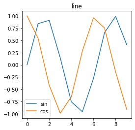
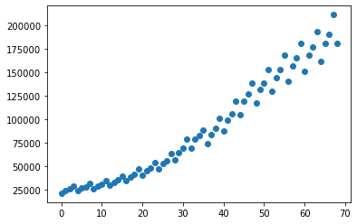
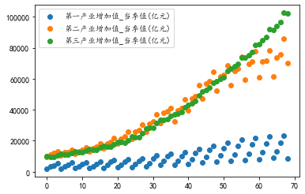
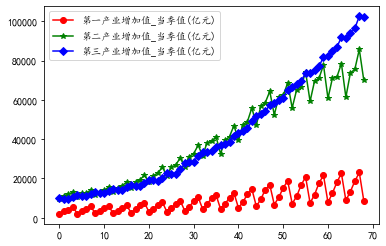
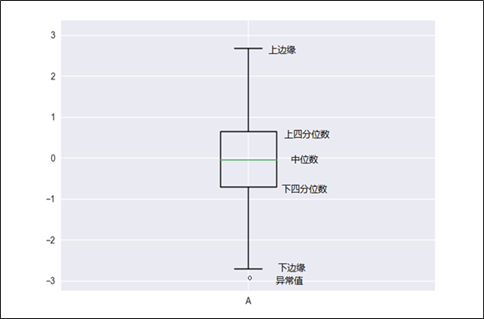

# Matplotlib数据可视化基础


>         python语言想要在图片的横纵坐标上显示中文，出来的图片上中文字被方框替代，并且抱有警告：`RuntimeWarning: Glyph XXXXX missing from current font. font.set_text(s, 0.0, flags=flags)`
>
>       只需加一句话：
>
>     ```
>     python
>     
>     #设置字体为楷体
>     
>       plt.rcParams['font.sans-serif'] = ['KaiTi']
>     
>     # 可以通过此操作显示出所有的可用字体
>     
>       from matplotlib.font_manager import FontManager
>       fm = FontManager()
>       mat_fonts = set(f.name for f in fm.ttflist)
>       print(mat_fonts)
>     ```
>
>     
>
>     

## 1. pyplot基础语法

1. 创建画布与创建子图

   构建出一张空白的画布，并可以选择是否将整个画布划分为多个部分，方便在同一幅图上绘制多个图形的情况。最简单的绘图可以省略第一部分，而后直接在默认的画布上进行图形绘制。

   | **函数名称**       | **函数作用**                                               |
   | ------------------ | ---------------------------------------------------------- |
   | plt.figure         | 创建一个空白画布，可以指定画布大小，像素。                 |
   | figure.add_subplot | 创建并选中子图，可以指定子图的行数，列数，与选中图片编号。 |

   ```python
   import matplotlib.pyplot as plt
   plt.figure(figsize=(4, 4))# 设置画布大小
   ```

2. 添加画布内容

   绘图的主体部分。其中添加标题，坐标轴名称，绘制图形等步骤是并列的，没有先后顺序，可以先绘制图形，也可以先添加各类标签。但是添加图例一定要在绘制图形之后。

   | **函数名称** | **函数作用**                                                 |
   | ------------ | ------------------------------------------------------------ |
   | plt.title    | 在当前图形中添加标题，可以指定标题的名称、位置、颜色、字体大小等参数。 |
   | plt.xlabel   | 在当前图形中添加x轴名称，可以指定位置、颜色、字体大小等参数。 |
   | plt.ylabel   | 在当前图形中添加y轴名称，可以指定位置、颜色、字体大小等参数。 |
   | plt.xlim     | 指定当前图形x轴的范围，只能确定一个数值区间，而无法使用字符串标识。 |
   | plt.ylim     | 指定当前图形y轴的范围，只能确定一个数值区间，而无法使用字符串标识。 |
   | plt.xticks   | 指定x轴刻度的数目与取值。                                    |
   | plt.yticks   | 指定y轴刻度的数目与取值。                                    |
   | plt.legend   | 指定当前图形的图例，可以指定图例的大小、位置、标签。         |

   ```python
   plt.figure(figsize=(4, 4))# 设置画布大小
   x = np.arange(10)
   plt.title("line")
   plt.plot(x, np.sin(x)) # 绘制x对应的sin折线
   plt.plot(x, np.cos(x)) # 绘制x对应的cos折线
   plt.legend(['sin','cos']) # 绘制图例（添加图例一定要在绘制图形之后）
   ```

   输出：

3. 保存与展示图形

   | **函数名称** | **函数作用**                                             |
   | ------------ | -------------------------------------------------------- |
   | plt.savafig  | 保存绘制的图片，可以指定图片的分辨率、边缘的颜色等参数。 |
   | plt.show     | 在本机显示图形。                                         |

## 2. 分析特征间关系

### 2.1 绘制散点图

> 散点图（scatter diagram）又称为散点分布图，是以一个特征为横坐标，另一个特征为纵坐标，利用坐标点（散点）的分布形态反映特征间的统计关系的一种图形。

- `matplotlib.pyplot.scatter(x, y, s=None, c=None, marker=None, alpha=None, **kwargs)`

- | **参数名称** | **说明**                                                     |
  | ------------ | ------------------------------------------------------------ |
  | x，y         | 接收array。表示x轴和y轴对应的数据。无默认。                  |
  | s            | 接收数值或者一维的array。指定点的大小，若传入一维array则表示每个点的大小。默认为None。 |
  | c            | 接收颜色或者一维的array。指定点的颜色，若传入一维array则表示每个点的颜色。默认为None |
  | marker       | 接收特定string。表示绘制的点的类型。默认为None。             |
  | alpha        | 接收0-1的小数。表示点的透明度。默认为None。                  |

```python
data = np.load('./data/国民经济核算季度数据.npz',allow_pickle=True) #读取文件中数据
```


```python
data.files #列出数据集
```


```text
输出：['columns', 'values']
```


```python
data['columns'] #读取数据集
```


    array(['序号', '时间', '国内生产总值_当季值(亿元)', '第一产业增加值_当季值(亿元)', '第二产业增加值_当季值(亿元)',
           '第三产业增加值_当季值(亿元)', '农林牧渔业增加值_当季值(亿元)', '工业增加值_当季值(亿元)',
           '建筑业增加值_当季值(亿元)', '批发和零售业增加值_当季值(亿元)', '交通运输、仓储和邮政业增加值_当季值(亿元)',
           '住宿和餐饮业增加值_当季值(亿元)', '金融业增加值_当季值(亿元)', '房地产业增加值_当季值(亿元)',
           '其他行业增加值_当季值(亿元)'], dtype=object)


```python
data['values']
```


    array([[1, '2000年第一季度', 21329.9, ..., 1235.9, 933.7, 3586.1],
           [2, '2000年第二季度', 24043.4, ..., 1124.0, 904.7, 3464.9],
           [3, '2000年第三季度', 25712.5, ..., 1170.4, 1070.9, 3518.2],
           ...,
           [67, '2016年第三季度', 190529.5, ..., 15472.5, 12164.1, 37964.1],
           [68, '2016年第四季度', 211281.3, ..., 15548.7, 13214.9, 39848.4],
           [69, '2017年第一季度', 180682.7, ..., 17213.5, 12393.4, 42443.1]],
          dtype=object)


```python
plt.scatter(range(69), data['values'][:, 2])# 绘制x为1~69，y为表中数据values第二列的数据
plt.show()
```



```python
for i in [3,4,5]:
    plt.scatter(range(69), data['values'][:, i])
plt.legend(['第一产业增加值_当季值(亿元)','第二产业增加值_当季值(亿元)','第三产业增加值_当季值(亿元)' ])
plt.show()
```



### 2.2绘制折线图

> 折线图的主要功能是查看因变量y随着自变量x改变的趋势，最适合用于显示随时间（根据常用比例设置）而变化的连续数据。同时还可以看出数量的差异，增长趋势的变化。

- matplotlib.pyplot.plot(*args, **kwargs) 

- plot函数在官方文档的语法中只要求填入不定长参数，实际可以填入的主要参数主要如下。

  | **参数名称** | **说明**                                         |
  | ------------ | ------------------------------------------------ |
  | x，y         | 接收array。表示x轴和y轴对应的数据。无默认。      |
  | color        | 接收特定string。指定线条的颜色。默认为None。     |
  | linestyle    | 接收特定string。指定线条类型。默认为“-”。        |
  | marker       | 接收特定string。表示绘制的点的类型。默认为None。 |
  | alpha        | 接收0-1的小数。表示点的透明度。默认为None。      |

  | **颜色缩写** | **代表的颜色** | **颜色缩写** | **代表的颜色** |
  | ------------ | -------------- | ------------ | -------------- |
  | b            | 蓝色           | m            | 品红           |
  | g            | 绿色           | y            | 黄色           |
  | r            | 红色           | k            | 黑色           |
  | c            | 青色           | w            | 白色           |

  ```python
  color = ['r', 'g', 'b'] #颜色
  mar = ['o', '*', 'D']# o代表圆点，*代表五星，D代表菱形
  for j, i in enumerate([3,4,5]):
      plt.plot(range(69), data['values'][:, i], c = color[j], marker = mar[j])
  plt.legend(['第一产业增加值_当季值(亿元)','第二产业增加值_当季值(亿元)','第三产业增加值_当季值(亿元)' ])
  plt.show()
  ```

  

## 3. 分析特征内部数据分布与分散情况

### 3.1 绘制直方图

> 用直方图可以比较直观地看出产品质量特性的分布状态，便于判断其总体质量分布情况。直方图可以发现分布表无法发现的数据模式、样本的频率分布和总体的分布。

- `matplotlib.pyplot.bar（left，height，width = 0.8，bottom = None，hold = None，data = None，** kwargs ）`

- | **参数名称** | **说明**                                                     |
  | ------------ | ------------------------------------------------------------ |
  | left         | 接收array。表示x轴数据。无默认。                             |
  | height       | 接收array。表示x轴所代表数据的数量。无默认。                 |
  | width        | 接收0-1之间的float。指定直方图宽度。默认为0.8。              |
  | color        | 接收特定string或者包含颜色字符串的array。表示直方图颜色。默认为None。 |


### 3.2 饼图

> 饼图可以比较清楚地反映出部分与部分、部分与整体之间的比例关系，易于显示每组数据相对于总数的大小，而且显现方式直观。

- `matplotlib.pyplot.pie(x, explode=None, labels=None, colors=None, autopct=None, pctdistance=0.6, shadow=False, labeldistance=1.1, startangle=None, radius=None, … )`

- | **参数名称** | **说明**                                                     | **参数名称**  | **说明**                                                     |
  | ------------ | ------------------------------------------------------------ | ------------- | ------------------------------------------------------------ |
  | x            | 接收array。表示用于绘制撇的数据。无默认。                    | autopct       | 接收特定string。指定数值的显示方式。默认为None。             |
  | explode      | 接收array。表示指定项离饼图圆心为n个半径。默认为None。       | pctdistance   | 接收float。指定每一项的比例和距离饼图圆心n个半径。默认为0.6。 |
  | labels       | 接收array。指定每一项的名称。默认为None。                    | labeldistance | 接收float。指定每一项的名称和距离饼图圆心多少个半径。默认为1.1。 |
  | color        | 接收特定string或者包含颜色字符串的array。表示饼图颜色。默认为None。 | radius        | 接收float。表示饼图的半径。默认为1。                         |

### 3.3 箱线图

> - 箱线图（boxplot）也称箱须图，其绘制需使用常用的统计量，能提供有关数据位置和分散情况的关键信息，尤其在比较不同特征时，更可表现其分散程度差异。
> - 箱线图利用数据中的五个统计量（最小值、下四分位数、中位数、上四分位数和最大值）来描述数据，它也可以粗略地看出数据是否具有对称性、分布的分散程度等信息，特别可以用于对几个样本的比较。
> - 

- `matplotlib.pyplot.boxplot(x, notch=None, sym=None, vert=None, whis=None, positions=None, widths=None, patch_artist=None,meanline=None, labels=None, … )`

- | **参数名称** | **说明**                                              | **参数名称** | **说明**                                              |
  | ------------ | ----------------------------------------------------- | ------------ | ----------------------------------------------------- |
  | x            | 接收array。表示用于绘制箱线图的数据。无默认。         | positions    | 接收array。表示图形位置。默认为None。                 |
  | notch        | 接收boolean。表示中间箱体是否有缺口。默认为None。     | widths       | 接收scalar或者array。表示每个箱体的宽度。默认为None。 |
  | sym          | 接收特定sting。指定异常点形状。默认为None。           | labels       | 接收array。指定每一个箱线图的标签。默认为None。       |
  | vert         | 接收boolean。表示图形是横向纵向或者横向。默认为None。 | meanline     | 接收boolean。表示是否显示均值线。默认为False。        |

