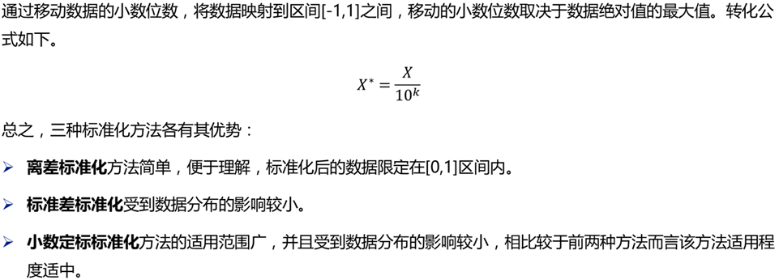
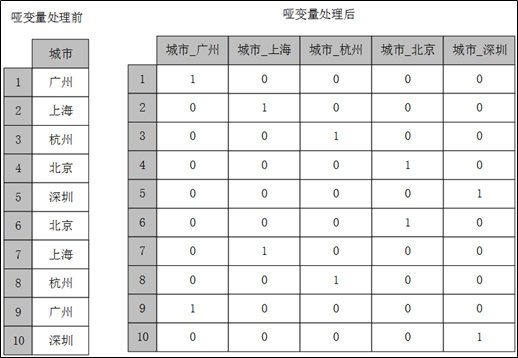
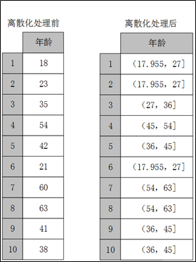

# 使用Pandas进行数据预处理

## 1. 合并数据

### 1.1 堆叠合并数据

#### 1.1.1 横向表堆叠

- 横向堆叠，即将两个表在X轴向拼接在一起，可以使用concat函数完成，concat函数的基本语法如下。
  `pandas.concat(objs, axis=0, join='outer', join_axes=None, ignore_index=False, keys=None, levels=None, names=None, verify_integrity=False, copy=True)`

  | **参数名称** | **说明**                                                     |
  | ------------ | ------------------------------------------------------------ |
  | objs         | 接收多个Series，DataFrame，Panel的组合。表示参与链接的pandas对象的列表的组合。无默认。 |
  | axis         | 接收0或1。表示连接的轴向，默认为0。                          |
  | join         | 接收inner或outer。表示其他轴向上的索引是按**交集（inner）还是并集（outer）**进行合并。默认为outer。 |
  | join_axes    | 接收Index对象。表示用于其他n-1条轴的索引，不执行并集／交集运算。 |

  | **参数名称**     | **说明**                                                     |
  | ---------------- | ------------------------------------------------------------ |
  | ignore_index     | 接收boolean。表示是否不保留连接轴上的索引，产生一组新索引range(total_length)。默认为False。 |
  | keys             | 接收sequence。表示与连接对象有关的值，用于形成连接轴向上的层次化索引。默认为None。 |
  | levels           | 接收包含多个sequence的list。表示在指定keys参数后，指定用作层次化索引各级别上的索引。默认为None。 |
  | names            | 接收list。表示在设置了keys和levels参数后，用于创建分层级别的名称。默认为None。 |
  | verify_integrity | 接收boolearn。表示是否检查结果对象新轴上的重复情况，如果发现则引发异常。默认为False。 |

- 当axis=1的时候，concat做行对齐，然后将不同列名称的两张或多张表合并。当两个表索引不完全一样时，可以使用join参数选择是内连接还是外连接。在内连接的情况下，仅仅返回索引重叠部分。在外连接的情况下，则显示索引的并集部分数据，不足的地方则使用空值填补。

- 当两张表完全一样时，不论join参数取值是inner或者outer，结果都是将两个表完全按照X轴拼接起来。


#### 1.1.2 **纵向堆叠**——concat函数

- 使用concat函数时，在默认情况下，即axis=0时，concat做列对齐，将不同行索引的两张或多张表纵向合并。在两张表的列名并不完全相同的情况下，可join参数取值为inner时，返回的仅仅是列名交集所代表的列，取值为outer时，返回的是两者列名的并集所代表的列，其原理示意如图。
- 不论join参数取值是inner或者outer，结果都是将两个表完全按照Y轴拼接起来


#### 1.1.3 纵向堆叠——append方法

- append方法也可以用于纵向合并两张表。但是append方法实现纵向表堆叠有一个前提条件，那就是**两张表的列名需要完全一致**。append方法的基本语法如下
  `pandas.DataFrame.append(self, other, ignore_index=False, verify_integrity=False)`

  | **参数名称**     | **说明**                                                     |
  | ---------------- | ------------------------------------------------------------ |
  | other            | 接收DataFrame或Series。表示要添加的新数据。无默认。          |
  | ignore_index     | 接收boolean。如果输入True，会对新生成的DataFrame使用新的索引（自动产生）而忽略原来数据的索引。默认为False。 |
  | verify_integrity | 接收boolean。如果输入True，那么当ignore_index为False时，会检查添加的数据索引是否冲突，如果冲突，则会添加失败。默认为False。 |


### 1.2 主键合并数据

- 主键合并，即通过一个或多个键将两个数据集的行连接起来，类似于SQL中的JOIN。针对同一个主键存在两张包含不同字段的表，将其根据某几个字段一一对应拼接起来，结果集列数为两个元数据的列数和减去连接键的数量。

#### 1.2.1 merge函数

- 和数据库的join一样，merge函数也有左连接（left）、右连接（right）、内连接（inner）和外连接（outer），但比起数据库SQL语言中的join和merge函数还有其自身独到之处，例如可以在合并过程中对数据集中的数据进行排序等。
  `pandas.merge(left, right, how='inner', on=None, left_on=None, right_on=None, left_index=False, right_index=False, sort=False, suffixes=('_x', '_y'), copy=True, indicator=False)`

- 可根据merge函数中的参数说明，并按照需求修改相关参数，就可以多种方法实现主键合并。

  | **参数名称** | **说明**                                                     |
  | ------------ | ------------------------------------------------------------ |
  | left         | 接收DataFrame或Series。表示要添加的新数据。无默认。          |
  | right        | 接收DataFrame或Series。表示要添加的新数据。无默认。。        |
  | how          | 接收inner，outer，left，right。表示数据的连接方式。默认为inner。 |
  | on           | 接收string或sequence。表示两个数据合并的主键（必须一致）。默认为None。 |
  | left_on      | 接收string或sequence。表示left参数接收数据用于合并的主键。默认为None。 |
  | right_on     | 接收string或sequence。表示right参数接收数据用于合并的主键。默认为None。 |
  | left_index   | 接收boolean。表示是否将left参数接收数据的index作为连接主键。默认为False。 |
  | right_index  | 接收boolean。表示是否将right参数接收数据的index作为连接主键。默认为False。 |
  | sort         | 接收boolean。表示是否根据连接键对合并后的数据进行排序。默认为False。 |
  | suffixes     | 接收接收tuple。表示用于追加到left和right参数接收数据重叠列名的尾缀默认为('_x',  '_y')。 |


#### 1.2.2 join函数

- join方法也可以实现部分主键合并的功能，但是join方法使用时，两个主键的名字必须相同。
  `pandas.DataFrame.join(self, other, on=None, how='left', lsuffix='', rsuffix='', sort=False)`

  | **参数名称** | **说明**                                                     |
  | ------------ | ------------------------------------------------------------ |
  | other        | 接收DataFrame、Series或者包含了多个DataFrame的list。表示参与连接的其他DataFrame。无默认。 |
  | on           | 接收列名或者包含列名的list或tuple。表示用于连接的列名。默认为None。 |
  | how          | 接收特定string。inner代表内连接；outer代表外连接；left和right分别代表左连接和右连接。默认为inner。 |
  | lsuffix      | 接收sring。表示用于追加到左侧重叠列名的末尾。无默认。        |
  | rsuffix      | 接收string。表示用于追加到右侧重叠列名的末尾。无默认。       |
  | sort         | 根据连接键对合并后的数据进行排序，默认为True。               |


### 1.3 重叠数据合并

- 数据分析和处理过程中若出现两份数据的内容几乎一致的情况，但是某些特征在其中一张表上是完整的，而在另外一张表上的数据则是缺失的时候，可以用combine_first方法进行重叠数据合并。

- `pandas.DataFrame.combine_first(other)`

  | **参数名称** | **说明**                                                   |
  | ------------ | ---------------------------------------------------------- |
  | **other**    | 接收DataFrame。表示参与重叠合并的另一个DataFrame。无默认。 |


## 2. 清洗数据

### 2.1 检测与处理重复值

#### 2.1.1 记录重复

> 记录重复，即一个或者多个特征某几个记录的值完全相同

- 方法一是利用列表（list）去重，自定义去重函数：

  ```python
  def delRep(list1):
      list2=[]
      for i in list1:
          if i not in list2:
              list2.append(i)
      return list2 
  ```

- 方法二是利用集合（set）的元素是唯一的特性去重，如dish_set = set(dishes)

- 比较上述两种方法可以发现，方法一代码冗长。方法二代码简单了许多，但会导致数据的排列发生改变。

- pandas提供了一个名为drop_duplicates的去重方法。该方法只对DataFrame或者Series类型有效。这种方法不会改变数据原始排列，并且兼具代码简洁和运行稳定的特点。该方法不仅支持单一特征的数据去重，还能够依据DataFrame的其中一个或者几个特征进行去重操作。
  `pandas.DataFrame(Series).drop_duplicates(self, subset=None, keep='first', inplace=False)`

  | **参数名称** | **说明**                                                     |
  | ------------ | ------------------------------------------------------------ |
  | subset       | 接收string或sequence。表示进行去重的列。默认为None，表示全部列。 |
  | keep         | 接收特定string。表示重复时保留第几个数据。First：保留第一个。Last：保留最后一个。False：只要有重复都不保留。默认为first。 |
  | inplace      | 接收boolean。表示是否在原表上进行操作。默认为False。         |

#### 2.1.2 特征重复

- 结合相关的数学和统计学知识，去除连续型特征重复可以利用特征间的相似度将两个相似度为1的特征去除一个。在pandas中相似度的计算方法为corr，使用该方法计算相似度时，默认为“pearson”法 ，可以通过“method”参数调节，目前还支持“spearman”法和“kendall”法。
- 但是通过相似度矩阵去重存在一个弊端，该方法只能对数值型重复特征去重，类别型特征之间无法通过计算相似系数来衡量相似度。
- 除了使用相似度矩阵进行特征去重之外，可以通过DataFrame.equals的方法进行特征去重。

### 2.2 检测与处理缺失值

#### 2.2.1 检测缺失值——利用isnull或notnul

- 数据中的某个或某些特征的值是不完整的，这些值称为缺失值。
- pandas提供了识别缺失值的方法isnull以及识别非缺失值的方法notnull，这两种方法在使用时返回的都是布尔值True和False。
- 结合sum函数和isnull、notnull函数，可以检测数据中缺失值的分布以及数据中一共含有多少缺失值。
- isnull和notnull之间结果正好相反，因此使用其中任意一个都可以判断出数据中缺失值的位置。

#### 2.2.2 处理缺失值

##### (1)删除法

- 删除法分为删除观测记录和删除特征两种，它属于利用减少样本量来换取信息完整度的一种方法，是一种最简单的缺失值处理方法。

- pandas中提供了简便的删除缺失值的方法dropna，该方法既可以删除观测记录，亦可以删除特征。
  `pandas.DataFrame.dropna(self, axis=0, how='any', thresh=None, subset=None, inplace=False)`

  | **参数名称** | **说明**                                                     |
  | ------------ | ------------------------------------------------------------ |
  | axis         | 接收0或1。表示轴向，0为删除观测记录（行），1为删除特征（列）。默认为0。 |
  | how          | 接收特定string。表示删除的形式。any表示只要有缺失值存在就执行删除操作。all表示当且仅当全部为缺失值时执行删除操作。默认为any。 |
  | subset       | 接收类array数据。表示进行去重的列∕行。默认为None，表示所有列/行。 |
  | inplace      | 接收boolean。表示是否在原表上进行操作。默认为False。         |

##### (2) 替换法

- 替换法是指用一个特定的值替换缺失值。

- 特征可分为数值型和类别型，两者出现缺失值时的处理方法也是不同的。

  - 缺失值所在特征为数值型时，通常利用其均值、中位数和众数等描述其集中趋势的统计量来代替缺失值。
  - 缺失值所在特征为类别型时，则选择使用众数来替换缺失值。

- pandas库中提供了缺失值替换的方法名为fillna，其基本语法如下。
  `pandas.DataFrame.fillna(value=None, method=None, axis=None, inplace=False, limit=None)`

  | **参数名称** | **说明**                                                     |
  | ------------ | ------------------------------------------------------------ |
  | value        | 接收scalar，dict，Series或者DataFrame。表示用来替换缺失值的值。无默认。 |
  | method       | 接收特定string。backfill或bfill表示使用下一个非缺失值填补缺失值。pad或ffill表示使用上一个非缺失值填补缺失值。默认为None。 |
  | axis         | 接收0或1。表示轴向。默认为1。                                |
  | inplace      | 接收boolean。表示是否在原表上进行操作。默认为False。         |
  | limit        | 接收int。表示填补缺失值个数上限，超过则不进行填补。默认为None。 |

##### (3) 插值法

- 删除法简单易行，但是会引起数据结构变动，样本减少；替换法使用难度较低，但是会影响数据的标准差，导致信息量变动。
- 常用的插值法有线性插值、多项式插值和样条插值等：
  - 线性插值是一种较为简单的插值方法，它针对已知的值求出线性方程，通过求解线性方程得到缺失值。
  - 多项式插值是利用已知的值拟合一个多项式，使得现有的数据满足这个多项式，再利用这个多项式求解缺失值，常见的多项式插值法有拉格朗日插值和牛顿插值等。
  - 样条插值是以可变样条来作出一条经过一系列点的光滑曲线的插值方法，插值样条由一些多项式组成，每一个多项式都是由相邻两个数据点决定，这样可以保证两个相邻多项式及其导数在连接处连续。
- 从拟合结果可以看出多项式插值和样条插值在两种情况下拟合都非常出色，线性插值法只在自变量和因变量为线性关系的情况下拟合才较为出色。
- 而在实际分析过程中，自变量与因变量的关系是线性的情况非常少见，所以在大多数情况下，多项式插值和样条插值是较为合适的选择。
- SciPy库中的interpolate模块除了提供常规的插值法外，还提供了例如在图形学领域具有重要作用的重心坐标插值（BarycentricInterpolator）等。在实际应用中，需要根据不同的场景，选择合适的插值方法。


### 2.3 检测与处理异常值

- 异常值是指数据中个别值的数值明显偏离其余的数值，有时也称为离群点，检测异常值就是检验数据中是否有录入错误以及是否含有不合理的数据。
- 异常值的存在对数据分析十分危险，如果计算分析过程的数据有异常值，那么会对结果会产生不良影响，从而导致分析结果产生偏差乃至错误。
- 常用的异常值检测主要为3σ原则和箱线图分析两种方法。

#### 2.3.1 3σ原则(仅适用于对正态或近似正态分布)

- 3σ原则又称为拉依达法则。该法则就是先假设一组检测数据只含有随机误差，对原始数据进行计算处理得到标准差，然后按一定的概率确定一个区间，认为误差超过这个区间的就属于异常值。

- 这种判别处理方法**仅适用于对正态或近似正态分布的样本数据进行处理**，如下表所示，其中**σ代表标准差，μ代表均值**，x=μ为图形的对称轴。

- 数据的数值分布几乎全部集中在区间(μ-3σ,μ+3σ)内，超出这个范围的数据仅占不到0.3%。故根据小概率原理，可以认为超出3σ的部分数据为异常数据。

  | **数值分布** | **在数据中的占比** |
  | ------------ | ------------------ |
  | (μ-σ,μ+σ)    | 0.6827             |
  | (μ-2σ,μ+2σ)  | 0.9545             |
  | (μ-3σ,μ+3σ)  | 0.9973             |


#### 2.3.2 箱线图分析

- 箱型图提供了识别异常值的一个标准，即异常值通常被定义为小于QL-1.5IQR或大于QU+1.5IQR的值。
  - QL称为下四分位数，表示全部观察值中有四分之一的数据取值比它小。
  - QU称为上四分位数，表示全部观察值中有四分之一的数据取值比它大。
  - IQR称为四分位数间距，是上四分位数QU与下四分位数QL之差，其间包含了全部观察值的一半。
- 箱线图依据实际数据绘制，真实、直观地表现出了数据分布的本来面貌，且没有对数据做任何限制性要求，其判断异常值的标准以四分位数和四分位数间距为基础。
- 四分位数给出了数据分布的中心、散布和形状的某种指示，具有一定的鲁棒性，即25%的数据可以变得任意远而不会很大地扰动四分位数，所以异常值通常不能对这个标准施加影响。鉴于此，箱线图识别异常值的结果比较客观，因此在识别异常值方面具有一定的优越性。

## 3. 标准化数据

### 3.1 离差标准化


- 数据的整体分布情况并不会随离差标准化而发生改变，原先取值较大的数据，在做完离差标准化后的值依旧较大。
- 当数据和最小值相等的时候，通过离差标准化可以发现数据变为0。
  若数据极差过大就会出现数据在离差标准化后数据之间的差值非常小的情况。
- 同时，还可以看出离差标准化的缺点：若数据集中某个数值很大，则离差标准化的值就会接近于0，并且相互之间差别不大。若将来遇到超过目前属性[min,max]取值范围的时候，会引起系统出错，这时便需要重新确定min和max。


### 3.2 标准差标准化


### 3.3 小数定标标准化



## 4. 转换数据

### 4.1 哑变量处理类别数据

- 数据分析模型中有相当一部分的算法模型都要求输入的特征为数值型，但实际数据中特征的类型不一定只有数值型，还会存在相当一部分的类别型，这部分的特征需要经过哑变量处理才可以放入模型之中。哑变量处理的原理示例如图。



- Python中可以利用pandas库中的get_dummies函数对类别型特征进行哑变量处理。
  `pandas.get_dummies(data, prefix=None, prefix_sep='_', dummy_na=False, columns=None, sparse=False, drop_first=False)`

  | **参数名称** | **说明**                                                     |
  | ------------ | ------------------------------------------------------------ |
  | data         | 接收array、DataFrame或者Series。表示需要哑变量处理的数据。无默认。 |
  | prefix       | 接收string、string的列表或者string的dict。表示哑变量化后列名的前缀。默认为None。 |
  | prefix_sep   | 接收string。表示前缀的连接符。默认为‘_’。                    |
  | dummy_na     | 接收boolean。表示是否为Nan值添加一列。默认为False。          |
  | columns      | 接收类似list的数据。表示DataFrame中需要编码的列名。默认为None，表示对所有object和category类型进行编码。 |
  | sparse       | 接收boolean。表示虚拟列是否是稀疏的。默认为False。           |
  | drop_first   | 接收boolean。表示是否通过从k个分类级别中删除第一级来获得k-1个分类级别。默认为False。 |

- 对于一个类别型特征，若其取值有m个，则经过哑变量处理后就变成了m个二元特征，并且这些特征互斥，每次只有一个激活，这使得数据变得稀疏。

- 对类别型特征进行哑变量处理主要解决了部分算法模型无法处理类别型数据的问题，这在一定程度上起到了扩充特征的作用。由于数据变成了稀疏矩阵的形式，因此也加速了算法模型的运算速度。

### 4.2 离散化连续型数据

- 某些模型算法，特别是某些分类算法如ID3决策树算法和Apriori算法等，要求数据是离散的，此时就需要将连续型特征（数值型）变换成离散型特征（类别型）。
- 连续特征的离散化就是在数据的取值范围内设定若干个离散的划分点，将取值范围划分为一些离散化的区间，最后用不同的符号或整数值代表落在每个子区间中的数据值。
- 因此离散化涉及两个子任务，即确定分类数以及如何将连续型数据映射到这些类别型数据上。其原理如图。



#### 4.2.1 等宽法

- 将数据的值域分成具有相同宽度的区间，区间的个数由数据本身的特点决定或者用户指定，与制作频率分布表类似。pandas提供了cut函数，可以进行连续型数据的等宽离散化，其基础语法格式如下。
  `pandas.cut(x, bins, right=True, labels=None, retbins=False, precision=3, include_lowest=False)`

  | **参数名称**  | **说明**                                                     |
  | ------------- | ------------------------------------------------------------ |
  | **x**         | 接收数组或Series。代表需要进行离散化处理的数据。无默认。     |
  | **bins**      | 接收int，list，array，tuple。若为int，代表离散化后的类别数目；若为序列类型的数据，则表示进行切分的区间，每两个数间隔为一个区间。无默认。 |
  | **right**     | 接收boolean。代表右侧是否为闭区间。默认为True。              |
  | **labels**    | 接收list，array。代表离散化后各个类别的名称。默认为空。      |
  | **retbins**   | 接收boolean。代表是否返回区间标签。默认为False。             |
  | **precision** | 接收int。显示的标签的精度。默认为3。                         |

- 使用等宽法离散化的缺陷为：等宽法离散化对数据分布具有较高要求，若数据分布不均匀，那么各个类的数目也会变得非常不均匀，有些区间包含许多数据，而另外一些区间的数据极少，这会严重损坏所建立的模型。

#### 4.2.2 等频法

- cut函数虽然不能够直接实现等频离散化，但是可以通过定义将相同数量的记录放进每个区间。
- 等频法离散化的方法相比较于等宽法离散化而言，避免了类分布不均匀的问题，但同时却也有可能将数值非常接近的两个值分到不同的区间以满足每个区间中固定的数据个数。


#### 4.2.3 基于聚类分析的方法

- 一维聚类的方法包括两个步骤：

  - 将连续型数据用聚类算法（如K-Means算法等）进行聚类。
  - 处理聚类得到的簇，将合并到一个簇的连续型数据做同一标记。

- 聚类分析的离散化方法需要用户指定簇的个数，用来决定产生的区间数。
- k-Means聚类分析的离散化方法可以很好地根据现有特征的数据分布状况进行聚类，但是由于k-Means算法本身的缺陷，用该方法进行离散化时依旧需要指定离散化后类别的数目。此时需要配合聚类算法评价方法，找出最优的聚类簇数目。

