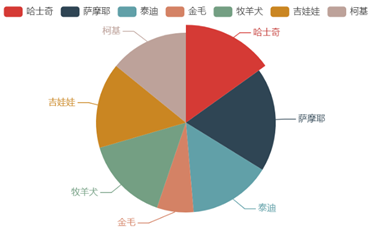

# Pyecharts 可视化

## 1. 绘图逻辑

- 选择图表类型

  - `from pyecharts.charts import *`

  - | **函数**  | **说明**    | **函数** | **说明**   |
    | --------- | ----------- | -------- | ---------- |
    | Scatter   | 散点图      | Funnel   | 漏斗图     |
    | Bar       | 柱状图      | Gauge    | 仪表盘     |
    | Pie       | 饼图        | Graph    | 关系图     |
    | Line      | 折线/面积图 | Liquid   | 水球图     |
    | Radar     | 雷达图      | Parallel | 平行坐标系 |
    | Sankey    | 桑基图      | Polar    | 极坐标系   |
    | WordCloud | 词云图      | HeatMap  | 热力图     |

    

- 添加数据

  - 散点图、折线图等二维图形：`.add_xaxis(xaxis_data=x)`, `.add_yaxis(series_name='', y_axis=y)`
  - 饼图等一维图形：`.add(series_name='', data_pair=[(i, j ) for i,j in zip(lab, num)])`
  - pyecharts 所有方法均支持链式调用

- 设置全局变量`set_global_options`

- 显示及保存图像

  - .render()：默认将会在当前目录下生成一个 render.html 的文件，支持 path 参数，设置文件保存位置，如 render(r"e:\my_first_chart.html")，文件用浏览器打开。
  - .Jupyter Notebook() 直接调用  render_notebook ()随时随地渲染图表


## 2. echarts基本绘图

### 2.1 散点图

```python
x = np.linspace(0, 10, 50)
y = np.sin(x)
point = (
	Scatter(init_opts=opts.InitOpts(width="720px", height="320px")
	).add_xaxis(xaxis_data=x)
     	 .add_yaxis(series_name='', y_axis=y)
     	 )
point.render_notebook()

```


### 2.2 折线图

```python
line = (Line(init_opts=opts.InitOpts(width="720px", height="320px"))
         .add_xaxis(xaxis_data=x)
         .add_yaxis(series_name='', y_axis=y, label_opts=opts.LabelOpts(is_show=False))  # 是否显示散点对应的数据值（默认显示）
        )
line.render_notebook()
```

  


### 2.3 饼图

```python
from pyecharts.charts import Pie
import pyecharts.options as opts

num = [110, 136, 108, 48, 111, 112, 103]
lab = ['哈士奇', '萨摩耶', '泰迪', '金毛', '牧羊犬', '吉娃娃', '柯基']
pie = (Pie(init_opts=opts.InitOpts(width='720px', height='320px'))
    .add(series_name='', data_pair=[(i, j)for i,  j in zip(lab, num)])
      #如需环图，可以加入参数：radius = ['40%', '75%'] ,两个百分比分别代表内外半径的比例
       # 另外有玫瑰图参数，按比例调整半径：rosetype='radius'
      )
pie.render_notebook()

```




### 2.4 柱状图

```python
from pyecharts.charts import Bar
import pyecharts.options as opts

num = [110, 136, 108, 48, 111, 112, 103]
num2 = [90, 110, 101, 70, 90, 120, 99]
lab = ['哈士奇', '萨摩耶', '泰迪', '金毛', '牧羊犬', '吉娃娃', '柯基']
bar = (
	Bar(init_opts=opts.InitOpts(width='720px', height='320px'))
                    .add_xaxis(xaxis_data=lab)
                  .add_yaxis(series_name='商家A', yaxis_data=num)
                  .add_yaxis(series_name='商家B', yaxis_data=num2)
    )
bar.render_notebook()

```


### 2.5 全局配置

- 使用 options 配置项，在 pyecharts 中，一切皆 Options。
- 比如可设置标题副标题
- 


### 2.6 多图组合

- 上下布局

  ```
  grid = ( 
  	Grid() 
  		.add(bar, grid_opts=opts.GridOpts(pos_bottom="60%"))
  		.add(line, grid_opts=opts.GridOpts(pos_top="60%")) 
  	)
  ```

  

- 左右布局

  ```
  grid = (
  	Grid()
     		     .add(scatter, grid_opts=opts.GridOpts(pos_left="55%"))
   		       .add(line, grid_opts=opts.GridOpts(pos_right="55%")) 
   	 )
  
  ```

  

- 重叠

  ```python
  bar = (
  	Bar( )
  )
  line = (
  	Line()
  )
  bar.overlap(line)
  bar.render_notebook()
  
  ```

  


## 3. pyecharts地理图表

```python
from pyecharts.charts import Geo

Geo()  # Pyecharts地理图表绘制
# 地图模式设置
.add_schema(
maptype=“china“  # 地图类型
)
.add(series_name='', data_pair= [('广州', 105), ('成都', 70), ('北京', 99), ('西安', 80)])  # 添加数据
.set_global_opts()  # 设置全局配置项
```

- 区域图

  ```
  from pyecharts.charts import Map
  
  guangdong_city = ["汕头市", "汕尾市", "揭阳市", "阳江市", "肇庆市", "广州市", "惠州市"]
  def values(start: int = 20, end: int = 150) -> list:
          return [random.randint(start, end) for _ in range(7)]
          
  (
      Map()
      .add('', [(i, j) for i, j in zip(guangdong_city, values())], '广东')
      .set_global_opts(visualmap_opts=opts.VisualMapOpts())
  ).render_notebook()
  ```

  

