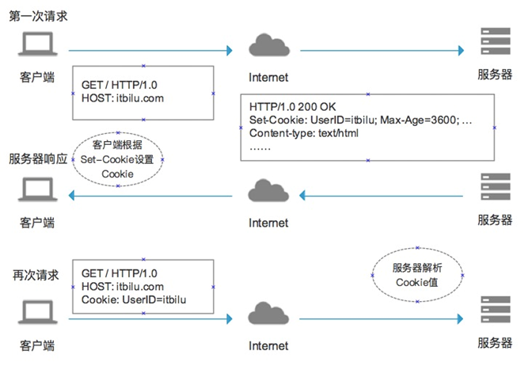
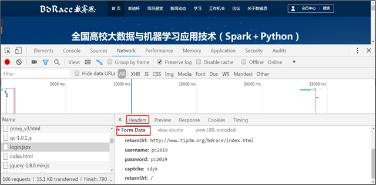
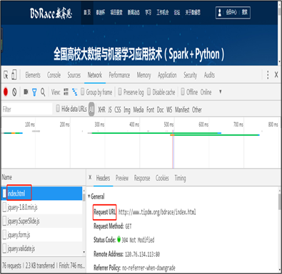
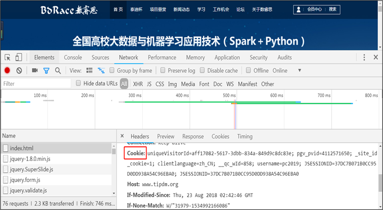
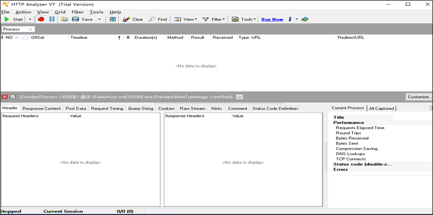
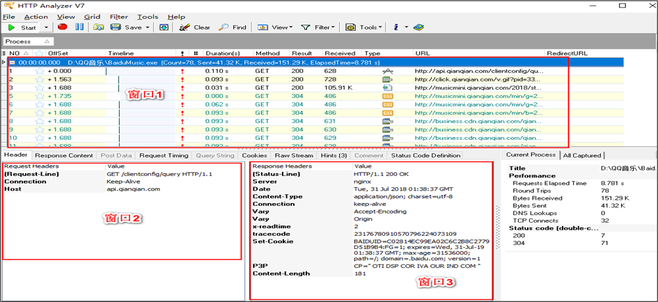
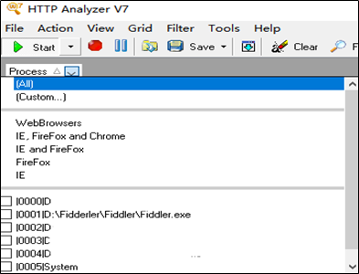
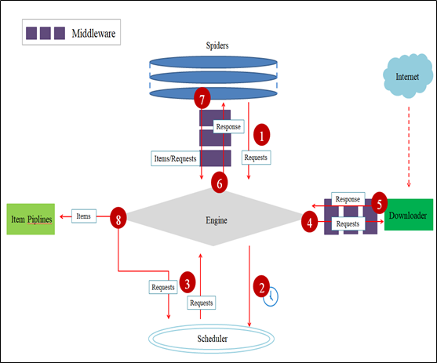
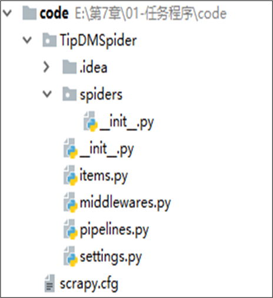

# Python 爬虫实战

[TOC]


## 1. 爬虫综述

### 1.1 分类

- 通用网络爬虫

  > 其爬行对象由一批种子URL扩充至整个Web，该类爬虫比较适合为搜索引擎搜索广泛的主题，主要由搜索引擎或大型Web服务提供商使用。
  >
  > - 深度优先
  > - 广度优先

- 聚焦网络爬虫

  > 聚焦网络爬虫又被称作主题网络爬虫，其最大的特点是只选择性地爬行与预设的主题相关的页面。
  >
  > - 基于内容（如用户的查询词）
  > - 基于链接结构评价，如PageRank算法
  > - 基于增强学习，利用贝叶斯分类器对超链接进行分类，计算出每个链接的重要性
  > - 基于语境图，通过建立语境图学习网页之间的相关度，计算当前页面到相关页面的距离

- 增量式网络爬虫

  > 只对已下载网页采取增量式更新或只爬行新产生的及已经发生变化的网页
  >
  > - 统一更新法
  > - 个体更新法
  > - 基于分类的更新（按照网页变化频率）

- 深层网络爬虫

  > Web页面可分为表层页面（可直接索引到的页面）和深层页面（无法静态链接获取）两类。
  >
  > 深层爬虫的核心为表单填写：
  >
  > - 基于领域知识的表单填写，维持一个本体库，语义分析选区合适关键词填写。
  > - 基于网页结构分析的表单填写


### 1.2 合法性

- 多数仅可用于个人或科学研究

- 不可转截或商业用途

- 两种数据不可爬取

  - 个人隐私数据
  - 明确进制他人访问的数据

- 注意版权问题

### 1.3 robots协议

- robots协议也称作爬虫协议、机器人协议，它的全名叫作网络爬虫排除标准（ Robots Exclusion Protocol ），当使用一个爬虫爬取一个网站的数据时，需要遵守网站所有者针对所有爬虫所制定的协议。

- 无法律约束

- 它通常是一个叫作robots.txt的文本文件，该协议通常存放在网站根目录下，里面规定了此网站哪些内容可以被爬虫获取，及哪些网页是不允许爬虫获取的。

  例子：

  ```
  User-agent: *  
  # User-agent描述了搜索爬虫的名称，这里将其设置为＊则代表该协议对任何爬取爬虫有效，如User-agent: Baiduspider 
  Disallow: /
  # 设置为／则代表不允许抓取所有页面
  Allow: /public/
  # 设置为/public／，则表示所有页面不允许抓取，但可以抓取public目录
  
  ```

  ```
  禁止所有爬虫访问任何目录的代码如下： 
  	User-agent: * 
  	Disallow: /
  允许所有爬虫访问任何目录的代码如下： 
  	User-agent: * 
  	Disallow: 
  
  ```

  常见爬虫名称：

  | **爬虫名称** | **名 称** | **网 站**         |
  | ------------ | --------- | ----------------- |
  | BaiduSpider  | 百度      | www.baidu.com     |
  | Googlebot    | 谷歌      | www.google.com    |
  | 360Spider    | 360搜索   | www.so.com        |
  | YodaoBot     | 有道      | www.youdao.com    |
  | Ia_archiver  | Alexa     | www.alexa.cn      |
  | Scooter      | altavista | www.altavista.com |

- 可以使用robotparser模块来解析robots.txt。 该模块提供了一个类RobotFileParser，它可以根据某网站的robots.txt文件来判断一个爬取爬虫是否有权限来爬取这个网页。 
  - 该类用起来非常简单，只需要在构造方法里传入robots.txt的链接即可。 首先看一下它的声明：`urllib.robotparser.RobotFileParser(url=’’)`，当然也可以在声明时不传入，默认为空，最后再使用` set_url()`方法设置一下也可。 
  - `set_url()`：用来设置robots.txt文件的链接。 如果在创建RobotFileParser对象时传入了链接，那么就不需要再使用这个方法设置了。 
  - `read()`：读取robots.txt文件并进行分析。 注意，这个方法执行一个读取和分析操作，如果不调用这个方法， 接下来的判断都会为False，所以一定记得调用这个方法。 这个方法不会返 回任何内容，但是执行了读取操作。 
  - `parse()`：用来解析robots.txt文件，传人的参数是robots.txt某些行的内容，它会按照robots.txt的语法规则来分析这些内容。 
  -  `can_fetch()`：该方法传入两个参数， 第一个是User-agent，第二个是要抓取的URL。 返回的内容是该搜索引擎是否可以抓取这个URL，返回结果是True或False。
  -  `mtime()`：返回的是上次抓取和分析robots.txt的时间，这对于长时间分析和抓取的搜索爬虫是很有必要的，你可能需要定期检查来抓取最新的robots.txt。 
  - `modified()` ：它同样对长时间分析和抓取的搜索爬虫很有帮助，将当前时间设置为上次抓取 和分析robots.txt的时间。

### 1.4 网站反爬虫

- 通过浏览器自带的User-Agent信息校验反爬
  - 可发送伪装的模拟User-Agent
- 通过访问频率反爬
  - 调整访问频度
- 通过验证码校验反爬
  - 使用ip代理，更换爬虫ip；
  - 通过算法识别验证码
  - 使用cookie绕过验证码
- 通过变换网页结构反爬
  - 使用脚本对网站结构进行监测
- 通过账号权限反爬
  - 模拟登陆（往往也包含验证码）
- 通过代理IP规避：通过代理进行IP更换可有效规避网站检测，需注意公用IP代理池是 网站重点监测对象。

### 1.5 Python爬虫相关库

| **类型**       | **库名**        | **简介**                                                     |
| -------------- | --------------- | ------------------------------------------------------------ |
| 通用           | urllib          | Python内置的HTTP请求库，提供一系列用于操作URL的功能          |
| 通用           | requests        | 基于urllib，采用Apache2  Licensed开源协议的HTTP库            |
| 通用           | urllib 3        | 提供很多Python标准库里所没有的重要特性：线程安全，连接池，客户端SSL/TLS验证，文件分部编码上传，协助处理重复请求和HTTP重定位，支持压缩编码，支持HTTP和SOCKS代理，100%测试覆盖率 |
| 框架           | scrapy          | 一个为了爬取网站数据，提取结构性数据而编写的应用框架         |
| HTML/XML解析器 | lxml            | C语言编写高效HTML/XML处理库。支持XPath                       |
| HTML/XML解析器 | BeautifulSoup 4 | 纯Python实现的HTML/XML处理库，效率相对较低                   |

### 1.6 可抓取的数据

- 网页文本：如HTML文档、Json格式文本等。
- 图片：获取到的是二进制文件，保存为图片格式。
- 视频：同为二进制文件，保存为视频格式即可。
- 其他：只要是能请求到的，都能获取。


## 2. 网页前端综述

> HTTP--Hyper Text Transfer Protocol，超文本传输协议，是一种建立在TCP上的**无状态连接**，整个基本的工作流程是客户端发送一个HTTP请求，说明客户端想要访问的资源和请求的动作，服务端收到请求之后，服务端开始处理请求，并根据请求做出相应的动作访问服务器资源，最后通过发送HTTP响应把结果返回给客户端。

> 客户端与服务器间的请求与响应的具体步骤如下。
>
> - 连接Web服务器：由一个HTTP客户端发起连接，与Web服务器的HTTP端口（默认为80）建立一个TCP套接字连接。
> - 发送HTTP请求：客户端经TCP套接字向Web服务器发送一个文本的请求报文。
> - 服务器接受请求并返回HTTP响应：Web服务器解析请求，定位该次的请求资源。之后将资源复本写至TCP套接字，由客户端进行读取。
> - 释放连接TCP连接：若连接的connection模式为close，则由服务器主动关闭TCP连接，客户端将被动关闭连接，释放TCP连接；若connection模式为keepalive，则该连接会保持一段时间。
> - 客户端解析HTML内容：客户端首先会对状态行进行解析，之后解析每一个响应头，最后读取响应数据。

### 2.1 HTTP状态码

- 种类

  | **状态码类型** | **状态码意义**                                               |
  | -------------- | ------------------------------------------------------------ |
  | **1XX**        | 表示请求已被接受，需接后续处理。这类响应是临时响应，只包含状态行和某些可选的响应头信息，并以空行结束 |
  | **2XX**        | 表示请求已成功被服务器接收、理解并接受                       |
  | **3XX**        | 表示需要客户端采取进一步的操作才能完成请求。通常用来重定向，重定向目标需在本次响应中指明 |
  | **4XX**        | 表示客户端可能发生了错误，妨碍了服务器的处理。               |
  | **5XX**        | 表示服务器在处理请求的过程中有错误或者异常状态发生，也有可能是服务器以当前的软硬件资源无法完成对请求的处理。 |

- 常见HTTP状态码

  | **常见状态码**                | **状态码含义**                                               |
  | ----------------------------- | ------------------------------------------------------------ |
  | **200 OK**                    | 请求成功，请求所希望的响应头或数据体将随此响应返回。         |
  | **400 Bad Request**           | 由于客户端的语法错误、无效的请求或欺骗性路由请求，服务器不会处理该请求 |
  | **403 Forbidden**             | 服务器已经理解该请求，但是拒绝执行，将在返回的实体内描述拒绝的原因，也可以不描述仅返回404响应 |
  | **404 Not Found**             | 请求失败，请求所希望得到的资源未被在服务器上发现，但允许用户的后续请求 |
  | **500 Internal Server Error** | 通用错误消息，服务器遇到了一个未曾预料的状况，导致了它无法完成对请求的处理，不会给出具体错误信息 |
  | **503 Service Unavailable**   | 由于临时的服务器维护或者过载，服务器当前无法处理请求。这个状况是暂时的，并且将在一段时间以后恢复 |

### 2.2 HTTP头部信息

- 爬虫需要利用头部信息模拟信息，伪装成一般的客户端。

- HTTP头部类型按用途可分为：通用头，请求头，响应头，实体头。
  - 通用头：既适用于客户端的请求头，也适用于服务端的响应头。与HTTP消息体内最终传输的数据是无关的，只适用于要发送的消息。
  - 请求头：提供更为精确的描述信息，其对象为所请求的资源或请求本身。新版HTTP增加的请求头不能在更低版本的HTTP中使用，但服务器和客户端若都能对相关头进行处理，则可以在请求中使用。
  - 响应头：为响应消息提供了更多信息。例如，关于资源位置的描述Location字段，以及关于服务器本身的描述使用Server字段等。与请求头类似，新版增加的响应头也不能在更低版本的HTTP版本中使用。
  - 实体头：提供了关于消息体的描述。如消息体的长度Content-Length，消息体的MIME类型Content-Type。新版的实体头可以在更低版本的HTTP版本中使用。

- 头部信息相关字段

  | **字段名**          | **说明**                                                     | **示例**                                                     |
  | ------------------- | ------------------------------------------------------------ | ------------------------------------------------------------ |
  | **Accept**          | 可接受的响应内容类型（Content-Types）                        | Accept: text/plain                                           |
  | **Accept-Charset**  | 可接受的字符集                                               | Accept-Charset:utf-8                                         |
  | **Accept-Encoding** | 可接受的响应内容的编码方式                                   | Accept-Encoding:gzip,deflate                                 |
  | **Accept-Language** | 可接受的响应内容语言列表                                     | Accept-Language:en-US                                        |
  | **Cookie**          | 由之前服务器通过Set-Cookie设置的一个HTTP协议Cookie           | Cookie:$Version=1;Skin=new;                                  |
  | **Referer**         | 设置前一个页面的地址，并且前一个页面中的连接指向当前请求，意思就是如果当前请求是在A页面中发送的，那么referer就是A页面的url地址 | Referer:http://zh.wikipedia.org/wiki/Main_Page               |
  | **User-Agent**      | 用户代理的字符串值                                           | User-Agent:Mozilla/5.0(X11;Linuxx86_64;rv:12.0)Gecko/20100101Firefox/21.0 |

### 2.3 Cookie

- 为解决HTTP的无状态性带来的负面作用。Cookie本质上是一段文本信息。

  - 当客户端请求服务器时，若服务器需要记录用户状态，就在响应用户请求时发送一段Cookie信息。

  - 客户端浏览器会保存该Cookie信息，当用户再次访问该网站时，浏览器会把Cookie做为请求信息的一部分提交给服务器。

  - 服务器对Cookie进行验证，以此来判断用户状态，当且仅当该Cookie合法且未过期时，用户才可直接登录网站。

    

- 实现过程：

  - 客户端请求服务器：客户端请求网站页面
  - 服务器响应请求：Cookie是一种字符串，为key=value形式，服务器需要记录这个客户端请求的状态，在响应头中增加一个Set-Cookie字段。
  - 客户端再次请求服务器：
    客户端会对服务器响应的Set-Cookie头信息进行存储。
    当再次请求时，将会在请求头中包含服务器响应的Cookie信息。

## 3. 简单静态网页爬取

> 静态网页是相对于动态网页而言，是指**没有后台数据库、不含程序和不可交互**的网页

- 基本流程：
  - 1、**发起请求**：通过HTTP库向目标站点发起请求，即发送一个Request，请求可以包含额外的headers等信息，等待服务器响应。
  - 2、**获取响应内容**：如果服务器能正常响应，会得到一个Response，Response的内容便是所要获取的页面内容，类型可能有HTML，Json字符串，二进制数据（如图片视频）等类型。
  - 3、**解析内容**：得到的内容可能是HTML，可以用正则表达式、网页解析库进行解析。可能是Json，可以直接转为Json对象解析，可能是二进制数据，可以做保存或者进一步的处理。
  - 4、**保存数据**：保存形式多样，可以存为文本，也可以保存至数据库，或者保存特定格式的文件。

  

### 3.1 实现HTTP请求

#### 3.1.1 使用urllib3实现http请求

- 通过request方法即可创建一个请求，返回一个http响应对象。

  `urllib3.request(method,url,fields=None,headers=None,**urlopen_kw)`

  | **参数**     | **说明**                                                     |
  | ------------ | ------------------------------------------------------------ |
  | method       | 接收string。表示请求的类型，如“GET”、“HEAD”、“DELETE”等。无默认值 |
  | url          | 接收string。表示字符串形式的网址。无默认值                   |
  | fields       | 接收dict。表示请求类型所带的参数。默认为None                 |
  | headers      | 接收dict。表示请求头所带参数。默认为None                     |
  | **urlopen_kw | 接收dict或其他Python中的类型的数据。依据具体需要及请求的类型可添加的参数，通常参数赋值为字典类型或为具体数据。无默认值 |

  ```
  import urllib3
  
  http = urllib3.PoolManager() # 获取一个urllib3实体
  
  rq = http.request('GET', url='https://www.bilibili.com/')
  
  print('服务器响应码：', rq.status)
  print('响应实体', rq.data)
  ```

- 在request方法中，如果需要传入headers参数，可通过定义一个字典类型实现。

  ```python
  # 定义一个包含User-Agent信息的字典，使用浏览器为火狐和chrome浏览器，操作系统为“Windows NT 6.1; Win64; x64”，向网站发送带headers参数的GET请求，hearders参数为定义的User-Agent字典。
  
  import urllib3
  http = urllib3.PoolManager()
  head= {'User-Agent':'Windows NT 6.1; Win64; x64'}
  rq = http.request('GET', url='https://www.bilibili.com/', headers=head)
  
  print('服务器响应码：', rq.status)
  print('响应实体', rq.data)
  
  ```
  
- 连接不稳定时的丢包，可以在请求中增加timeout参数设置，通常为浮点数。依据不同需求，timeout参数提供多种设置方法，可直接在URL后设置该次请求的全部timeout参数，也可分别设置该次请求的连接与读取timeout参数，在PoolManager实例中设置timeout参数可应用至该实例的全部请求中。
  
  ```
  # 方法一
  rq = http.request('GET', url='https://www.bilibili.com/',headers=head, 
                    timeout= 3.0)
  # 方法二
  rq = http.request('GET', url='https://www.bilibili.com/',headers=head, 
                    timeout=urllib3.Timeout(connect=1.0, read=2.0))
  
  # 方法三
  http = urllib3.PoolManager(timeout=4.0)
  
  ```
  
- urllib3库可以通过设置retries参数对重试进行控制。默认进行3次请求重试，并进行3次重定向。自定义重试次数通过赋值一个整型给retries参数实现，可通过定义retries实例来定制请求重试次数及重定向次数。若需要同时关闭请求重试及重定向则可以将retries参数赋值为False，仅关闭重定向则将redirect参数赋值为False。与Timeout设置类似，可以在PoolManager实例中设置retries参数控制全部该实例下的请求重试策略。

- 使用urllib3库实现生成一个完整的请求，该请求应当包含链接、请求头、超时时间和重试次数设置。

  ```
  import urllib3
  
  # 发送请求的实例
  http = urllib3.PoolManager()
  
  url= "https://www.baidu.com/"
  # 请求头
  head = {'User-Agent': 'Mozilla/5.0 (Windows NT 10.0; Win64; x64) AppleWebKit/537.36 (KHTML, like Gecko) Chrome/94.0.4606.54 Safari/537.36'}
  #超时时间
  tm = urllib3.Timeout(connect=1.0,read=3.0)
  # 重试次数和重定向次数
  rq = http.request('GET', url= url, headers=head, timeout=tm, retries=5, redirect=4)
  
  print('服务器响应码：', rq.status)
  print('响应实体: ',rq.data.decode('utf-8'))
  
  ```

  

#### 3.1.2 使用request库实现

- requests库发送原生的HTTP 1.1请求，无需手动为URL添加查询字串，也不需要对POST数据进行表单编码。

- 相对于urllib3库，requests库拥有完全自动化Keep-alive和HTTP连接池的功能。

- request请求生成：

  `requests.request.method(url,**kwargs)`

  | **参数** | **说明**                                                     |
  | -------- | ------------------------------------------------------------ |
  | method   | 接收string。表示请求的类型，如“GET”、“HEAD”、“DELETE”等。无默认值 |
  | url      | 接收string。表示字符串形式的网址。无默认值                   |
  | **kwargs | 接收dict或其他Python中的类型的数据。依据具体需要及请求的类型可添加的参数，通常参数赋值为字典类型或为具体数据 |

  ```python
  import requests
  
  url= "https://www.bilibili.com/"
  
  rqq = requests.get(url)
  
  print('响应码：',rqq.status_code)
  print('编码',rqq.encoding)
  print('请求头', rqq.headers)
  print('实体', rqq.text)
  print('实体', rqq.content)# 二进制的文本文件
  print('实体', rqq.content.decode('utf-8'))# 指定解码方式
  ```

- 可使用chardet库解析编码，chardet库使用detect方法检测给定字符串的编码。

  ```python
  import chardet
  chardet.detect(rqq.content)
  ```

  输出：

  ```tex
  {'encoding': 'utf-8', 'confidence': 0.99, 'language': ''}
  ```

- requests库中对请求头的处理与urllib3库类似，也使用headers参数在GET请求中上传参数，参数形式为字典。

  ```python
  head = {'User-Agent': 'Mozilla/5.0 (Windows NT 10.0; Win64; x64) 
  
  requests.get(url, headers = head, timeout =2.0)
  ```

- 在requests库中通过设置timeout这个参数实现响应超时等待时间，超过该参数设定的秒数后，程序会停止等待。

- ```python
  import requests
  import chardet
  
  url = 'https://www.bilibili.com/'
  
  head = {'User-Agent': 'Mozilla/5.0 (Windows NT 10.0; Win64; x64) 
  
  rqq = requests.get(url , headers = head, timeout = 2.0)
  
  rqq.encoding = chardet.detect(rqq.content)['encoding']
  ```

### 3.2 网页解析

#### 3.2.1 python中的正则表达式

- `import re`

  ```
  example_obj = "1. A small sentence. - 2. Another tiny sentence. "
  re.findall('sentence',example_obj) # 找全部符合的
  re.search('sentence',example_obj) # 找到一个就行
  re.sub('sentence','SENTENCE',example_obj# 替换
  re.match('.*sentence',example_obj) # 从对比串第一个字母进行比对
  
  ```

- 广义符号：

  - 英文句号“`.`”：能代表除换行符“\n”任意一个字符；
  - 字符类“`[]`”：被包含在中括号内部，任何中括号内的字符都会被匹配；
  - 管道“`|`”：该字符被视为OR操作；

- 部分特殊含义的符号

  | **部分有特殊含义的符号** |                             |
  | ------------------------ | --------------------------- |
  | **\w**                   | 数字和字母字符：[0-9a-zA-Z] |
  | **\W**                   | 与\w反义                    |
  | **\s**                   | 空白字符                    |
  | **\S**                   | 非空白字符                  |
  | **\d**                   | 数字：[0-9]                 |
  | **\D**                   | 非数字：`[^0-9]`            |
  | **\b**                   | 单词的边界                  |
  | **\B**                   | 非单词边界                  |

- 量化符

  | Python正则表达式里的量化符 |                                     |
  | -------------------------- | ----------------------------------- |
  | ？                         | 前面的元素是可选的，并且最多匹配1次 |
  | ＊                         | 前面的元素会被匹配0次或多次         |
  | ＋                         | 前面的元素会被匹配1次或多次         |
  | {n}                        | 前面的元素会正好被匹配n次           |
  | {n,}                       | 前面的元素至少会被匹配n次           |
  | {n,m}                      | 前面的元素至少匹配n次，至多匹配m次  |

  ```python
  # Python正则表达式：寻找字符串中的姓名和电话号码
  import pandas as pd
  
  rawdata = '555-1239Moe Szyslak(636) 555-0113Burns, C.Montgomery555-6542Rev. Timothy Lovejoy555 8904Ned Flanders636-555-3226Simpson,Homer5553642Dr. Julius Hibbert'
  
  names = re.findall('[A-Z][A-Za-z,. ]*', rawdata)
  
  tels = re.findall('\(?[0-9]{0,3}\)?[ \-]?[0-9]{3}[ \-]?[0-9]{4}', rawdata)
  
  pd.DataFrame({'Names': names, 'TelPhone': tels})
  
  ```

- 使用正则表达式解析网页标题：

  - `()`代表提取括号中的内容

  ```python
  import re
  re.findall('<title>(.+)</title>', rqq.text)
  ```

  ```text
  输出：
  ['哔哩哔哩 (゜-゜)つロ 干杯~-bilibili']
  ```

  

#### 3.2.2 使用Xpath解析网页

> XML路径语言（XML Path Language），它是一种基于XML的树状结构，在数据结构树中找寻节点，确定XML文档中某部分位置的语言。

- 使用Xpath需要从lxml库中导入etree模块，还需使用HTML类对需要匹配的HTML对象进行初始化（XPath只能处理文档的DOM表现形式）。

  `lxml.etree.HTML(text, parser=None, *, base_url=None)`

  | **参数名称** | **说明**                                                     |
  | ------------ | ------------------------------------------------------------ |
  | **text**     | 接收str。表示需要转换为HTML的字符串。无默认值                |
  | **parser**   | 接收str。表示选择的HTML解析器。无默认值                      |
  | **base_url** | 接收str。表示设置文档的原始URL，用于在查找外部实体的相对路径。默认为None |

- 若HTML中的节点没有闭合，etree模块也提供自动补全功能。调用tostring方法即可输出修正后的HTML代码，但是结果为bytes类型，需要使用decode方法转成str类型。

  ```python
  from lxml import etree
  
  html = etree.HTML(rqq.content, etree.HTMLParser())
  etree.tostring(html,encoding='utf-8').decode('utf-8')
  ```
  
- Xpath使用类似正则的表达式来匹配HTML文件中的内容，常用匹配表达式如下。

  | **表达式** | **说明**                     |
  | ---------- | ---------------------------- |
  | nodename   | 选取nodename节点的所有子节点 |
  | /          | 从当前节点选取直接子节点     |
  | //         | 从当前节点选取子孙节点       |
  | .          | 选取当前节点                 |
  | ..         | 选取当前节点的父节点         |
  | @          | 选取属性                     |
  | /text()    | 读取标签内的内容             |
  
  ```python
  etree.tostring(html.xpath('/html/head/title')[0],encoding='utf-8').decode('utf-8')
  ```
  
  ```text
  输出：
  '<title>哔哩哔哩 (゜-゜)つロ 干杯~-bilibili</title>'
  ```
  
- Xpath中的谓语用来查找某个特定的节点或包含某个指定的值的节点，谓语被嵌在路径后的方括号中

  | **表达式**                    | **说明**                                         |
  | ----------------------------- | ------------------------------------------------ |
  | /html/body/div[1]             | 选取属于body子节点下的第一个div节点              |
  | /html/body/div[last()]        | 选取属于body子节点下的最后一个div节点            |
  | /html/body/div[last()-1]      | 选取属于body子节点下的倒数第二个div节点          |
  | /html/body/div[positon()<3]   | 选取属于body子节点下的下前两个div节点            |
  | /html/body/div[@id]           | 选取属于body子节点下的带有id属性的div节点        |
  | /html/body/div[@id=”content”] | 选取属于body子节点下的id属性值为content的div节点 |
  | /html  /body/div[xx>10.00]    | 选取属于body子节点下的xx元素值大于10的节点       |

- Xpath中还提供功能函数进行模糊搜索，有时对象仅掌握了其部分特征，当需要模糊搜索该类对象时，可使用功能函数来实现，具体函数如下。

  | **功能函数** | **示例**                                        | **说明**                                                     |
  | ------------ | ----------------------------------------------- | ------------------------------------------------------------ |
  | starts-with  | //div[starts-with(@id,”co”)]                    | 选取id值以co开头的div节点                                    |
  | contains     | //div[contains(@id,”co”)]                       | 选取id值包含co的div节点                                      |
  | and          | //div[contains(@id,”co”) andcontains(@id,”en”)] | 选取id值包含co和en的div节点                                  |
  | text()       | //li[contains(text(),”first”)]                  | 选取节点文本包含first的div节点                               |
  |              | //*[@id=“topwords”]/li                          | 选取不知道是什么元素但其id属性为topwords的这样一个元素下面的li |

#### 3.2.3 使用beautiful Soup解析网页

- Beautiful Soup不仅支持Python标准库中的HTML解析器，还支持一些第三方的解析器，具体语法如下。

  | **解析器**      | **语法格式**                                                 | **优点**                                                     | **缺点**                                    |
  | --------------- | ------------------------------------------------------------ | ------------------------------------------------------------ | ------------------------------------------- |
  | Python标准库    | BeautifulSoup(markup,  "html.parser")                        | 1.Python的内置标准库  2.执行速度适中  3.文档容错能力强       | Python 2.7.3或3.2.2前的版本中文档容错能力差 |
  | lxml HTML解析器 | BeautifulSoup(markup,  "lxml")                               | 1.速度快  2.文档容错能力强                                   | 需要安装C语言库                             |
  | lxml XML解析器  | BeautifulSoup(markup,  ["lxml-xml"])  BeautifulSoup(markup,  "xml") | 1.速度快  2.唯一支持XML的解析器                              | 需要安装C语言库                             |
  | html5lib        | BeautifulSoup(markup,  "html5lib")                           | 1.最好的容错性  2.以浏览器的方式解析文档  3.生成HTML5格式的文档 | 速度慢  不依赖外部扩展                      |

- 要使用Beautiful Soup库解析网页首先需要创建BeautifulSoup对象，将字符串或HTML文件传入Beautiful Soup库的构造方法可以创建一个BeautifulSoup对象，使用格式如下。
  
  `BeautifulSoup("<html>data</html>")  `   #通过字符串创建
  `BeautifulSoup(open("index.html"))    `   #通过HTML文件创建

- Tag对象为HTML文档中的标签，通过Tag的名称属性可以很方便的在文档树中获取需要的Tag对象，**通过该方法只能获取文档树中第一个同名的Tag对象**，而通过多次调用可获取某个Tag对象下的分支Tag对象。**通过find_all方法可以获取文档树中的全部同名Tag对象。**

  
  ```python
  import requests
  from bs4 import BeautifulSoup
  
  rqq = requests.get('https://www.bilibili.com/')
  
  soup = BeautifulSoup(rqq.content, 'lxml')
  
  # Tag对象
  soup.head
  soup.li # 通过该方法只能获取文档树中第一个同名的li对象
  soup.find_all('li')# 可以获取文档树中的全部li
  
  a = soup.select('.channel-items >  a') # 属性里class使用.表示，id使用#表示
  [i.text for i in a.find_all('a')]
  [i.string for i in a.find_all('a')]
  ```
  
- Tag有两个非常重要的属性：name和attributes。name属性可通过name方法来获取和修改，修改过后的name属性将会应用至BeautifulSoup对象生成的HTML文档。

  ```python
  a = soup.link
  a.name #link
  a.attrs # 各个属性
  ```

- NavigableString对象为包含在Tag中的文本字符串内容，如“`<title>The Dormouse‘s story</title>`”中的“The Dormouse’s story”，使用string的方法获取，NavigableString对象无法被编辑，但可以使用replace_with的方法进行替换。

- BeautifulSoup对象表示的是一个文档的全部内容。大部分时候，可以把它当作Tag对象。 BeautifulSoup对象并不是真正的HTML或XML的tag，所以并没有tag的name和attribute属性，但其包含了一个值为“[document]”的特殊属性name。

- Tag、NavigableString、BeautifulSoup几乎覆盖了html和xml中的所有内容，但是还有一些特殊对象，文档的注释部分是最容易与Tag中的文本字符串混淆的部分。Beautiful Soup库中将文档的注释部分识别为Comment类型，Comment对象是一个特殊类型的NavigableString对象，但是当其出现在HTML文档中时，Comment对象会使用特殊的格式输出，需调用prettify方法。

  `BeautifulSoup.prettify(self, encoding=None, formatter='minimal')`

  | **参数**  | **说明**                                                     |
  | --------- | ------------------------------------------------------------ |
  | encoding  | 接收string。表示格式化时使用的编码。默认为None               |
  | formatter | 接收string。表示格式化的模式。默认为minimal，表示按最简化的格式化将字符串处理成有效的HTML∕XML |


### 3.3 数据存储

#### 3.3.1 存为JSON文件

- 将数据存储为JSON文件的过程为一个编码过程，编码过程常用dump函数, 将Python对象转换为JSON对象，并通过fp文件流将JSON对象写入文件内。

  `json.dump(obj,fp,skipkeys=False,ensure_ascii=True,check_circular=True,allow_nan=True,cls=None,indent=None,separators=None,encoding='utf-8', default=None, sort_keys=False, **kw)`

  | **参数**         | **说明**                                                     |
  | ---------------- | ------------------------------------------------------------ |
  | skipkeys         | 接收Built-in。表示是否跳过非Python基本类型的key，若dict的keys内的数据为非Python基本类型，即不是str、unicode、int、long、float、bool、None等类型，设置该参数为False时，会报TypeError错误。默认值为False，设置为True时，跳过此类key |
  | **ensure_ascii** | 接收Built-in。表示显示格式，若dict内含有非ASCII的字符，则会以类似“\uXXX”的格式显示。默认值为True，设置为False后，将会正常显示 |
  | indent           | 接收int。表示显示的行数，若为0或为None，则在一行内显示数据，否则将会换行且按照indent的数量显示前面的空白，将JSON内容格式化显示。默认为None |
  | separators       | 接收string。表示分隔符，实际上为（item_separator,dict_separator）的一个元组，默认为(',',':')，表示dictionary内的keys之间用“,”隔开，而key和value之间用“:”隔开。默认为None |
  | encoding         | 接收string。表示设置的JSON数据的编码形式，处理中文时需要注意此参数的值。默认为UTF-8 |
  | sort_keys        | 接收Built-in。表示是否根据keys的值进行排序。默认为False，为True时数据将根据keys的值进行排序 |


#### 3.3.2 存入mysql数据库

- pandas提供了读取与存储关系型数据库数据的函数与方法。除了pandas库外，还需要使用SQLAlchemy库建立对应的数据库连接。SQLAlchemy配合相应数据库的Python连接工具（例如MySQL数据库需要安装mysqlclient或者pymysql库），使用create_engine函数，建立一个数据库连接。
- creat_engine中填入的是一个连接字符串。在使用Python的SQLAlchemy时，MySQL和Oracle数据库连接字符串的格式如下
      ` 数据库产品名+连接工具名：//用户名:密码@数据库IP地址:数据库端口号/数据库名称？charset = 数据库数据编码`

- 数据存储用pandas的to_sql方法。
  `DataFrame.to_sql(name, con, schema=None, if_exists=’fail’, index=True, index_label=None, dtype=None)`

## 4. 常规动态网页爬取

### 4.1 逆向分析爬取动态网页

- 可以在浏览器开发者工具 - NetWork - All或者Fetch/XHR下的各项-Request URL中找到某些动态加载请求的内容。

  - 单击网络面板后，发现有很多响应。在网络面板中XHR是Ajax中的概念，表示XML-HTTP-request，一般Javascript加载的文件隐藏在JS或者XHR。
- 之后直接使用之前方式即可读取内容

### 4.2 使用Selenium库爬取动态网页

- 只要网页可在浏览器上显示，使用selenium都可以获取源码

#### 4.2.1 安装

- 安装selenium

  `pip install selenium`

- 根据浏览器版本下载chromedrive

  http://npm.taobao.org/mirrors/chromedriver

- •将下载好的chromedrive.exe文件，存放至python安装根目录（与python.exe文件同一目录）即可。（本机为C:\ProgramData\Anaconda3中）

- 可通过如下测试

  ```python
  from selenium import webdriver
  
  driver = webdriver.Chrome()
  driver.get('https://www.ptpress.com.cn/shopping/index')
  driver.page_source
  driver.close()
  ```

#### 4.2.2 Selenium 页面等待

- Selenium Webdriver提供两种类型的等待——隐式和显式。显式的等待使网络驱动程序在继续执行之前等待某个条件的发生。隐式的等待使WebDriver在尝试定位一个元素时，在一定的时间内轮询DOM。在爬取“http://www.ptpress.com.cn/shopping/index”网页搜索“Python编程”关键词过程中，用到了显示等待，本节主要介绍显示等待。**显式等待是指定某个条件，然后设置最长等待时间。**如果在这个时间还没有找到元素，那么便会抛出异常，在登录“http://www.ptpress.com.cn/shopping/index”网页等待10秒。

- WebDriverWait函数是默认每500毫秒调用一次ExpectedCondition，直到成功返回。ExpectedCondition的成功返回类型是布尔值，对于所有其他ExpectedCondition类型，则返回True或非Null返回值。如果在10秒内不能发现元素返回，就会在抛出TimeoutException异常。

- `WebDriverWait(driver, 等待时间)`

- 在自动化Web浏览器时，不需要手动编写期望的条件类，也不必为自动化创建实用程序包，Selenium库提供了一些便利的判断方法。如可以判断元素是否可以点击来判断等待

  | **方法**                            | **作用**                                  |
  | ----------------------------------- | ----------------------------------------- |
  | title_is                            | 标题是某内容                              |
  | title_contains                      | 标题包含某内容                            |
  | presence_of_element_located         | 元素加载出，传入定位元组，如(By.ID,  'p') |
  | visibility_of_element_located       | 元素可见，传入定位元组                    |
  | visibility_of                       | 传入元素对象                              |
  | presence_of_all_elements_located    | 所有元素加载出                            |
  | text_to_be_present_in_element       | 某个元素文本包含某文字                    |
  | text_to_be_present_in_element_value | 某个元素值包含某文字                      |
  | frame_to_be_available_and_switch_to_it  frame | 加载并切换                                        |
  | invisibility_of_element_located               | 元素不可见                                        |
  | element_to_be_clickable                       | 元素可点击                                        |
  | staleness_of                                  | 判断一个元素是否仍在DOM，可判断页面是否已经刷新   |
  | element_to_be_selected                        | 元素可选择，传元素对象                            |
  | element_located_to_be_selected                | 元素可选择，传入定位元组                          |
  | element_selection_state_to_be                 | 传入元素对象以及状态，相等返回True，否则返回False |
  | element_located_selection_state_to_be         | 传入定位元组以及状态，相等返回True，否则返回False |
  | alert_is_present                              | 是否出现Alert                                     |

- 元素选取：Selenium库提供了如表所示的方法来定位页面中的元素，使用find_element进行元素选取。在单元素查找中使用到了通过元素ID进行定位、通过XPath表达式进行定位、通过CSS选择器进行定位等操作。在多元素查找中使用到了通过CSS选择器进行定位等操作。

  | **定位一个元素**                  | **定位多个元素**                   | **含义**                   |
  | --------------------------------- | ---------------------------------- | -------------------------- |
  | find_element_by_id                | find_elements_by_id                | 通过元素ID进行定位         |
  | find_element_by_name              | find_elements_by_name              | 通过元素名称进行定位       |
  | find_element_by_xpath             | find_elements_by_xpath             | 通过XPath表达式进行定位    |
  | find_element_by_link_text         | find_elements_by_link_text         | 通过完整超链接文本进行定位 |
  | find_element_by_partial_link_text | find_elements_by_partial_link_text | 通过部分超链接文本进行定位 |
  | find_element_by_tag_name          | find_elements_by_tag_name          | 通过标记名称进行定位       |
  | find_element_by_class_name        | find_elements_by_class_name        | 通过类名进行定位           |
  | find_element_by_css_selector      | find_elements_by_css_selector      | 通过CSS选择器进行定位      |

```python
from selenium import webdriver
from selenium.webdriver.support import expected_conditions as EC

from selenium.webdriver.support.ui import WebDriverWait
from selenium.webdriver.common.by import By

driver = webdriver.Chrome()
driver.get('https://www.ptpress.com.cn/search')
# 设置等待时间
wait = WebDriverWait(driver , 30 )

print(driver.current_window_handle)

# 搜索“Python编程”获取相关图书信息

# 控制输入框
search_btn = driver.find_element_by_css_selector('#searchVal')
search_btn.send_keys('python编程')

# 控制搜索确认按钮
confirm_btn = wait.until(EC.element_to_be_clickable(
    (By.CSS_SELECTOR, '#searchBtn > i')
))
confirm_btn.click() # 点击搜索

print(driver.current_window_handle)

# 如搜索会跳转页面，则要进行页面的转换
driver.switch_to_window(driver.window_handles[0])
html = driver.page_source


# 使用BeautiSoup进行解析搜索结果
from bs4 import BeautifulSoup

soup = BeautifulSoup(html, 'lxml')
soup.select('#books_content > div > div > a > p')
[i.text for i in  soup.select('#books_content > div > div > a > p')]
# driver.close()

```


## 5. 模拟登录

### 5.1 使用表单登录模拟

- **（1）查找提交入口**

  - 出于安全需要，提交入口可能会被设计成其他地址。找到表单数据的提交入口是表单登录的前提。
  - 打开Chrome开发者工具后打开网络面板，勾选Preserve log（保持日志）。按“F5”键刷新网页显示各项资源，如图所示。
  - 在登录网页输入账号、秘密、验证码，单击“登录”按钮，提交表单数据，此时Chrome开发者工具会加载新的资源。
  - 观察Chrome开发者工具左侧的资源，找到“login.jspx”资源并单击，观察右侧的Headers标签下的General信息，如图 5-3所示，发现Request Method信息为POST，即请求方法为POST，可以判断Request URL信息即为提交入口。

- **（2）查找并获取需要提交的表单数据**

  - 使用Chrome开发者工具获取到的提交入口，观察Headers标签，Form Data信息为服务器端接收到的表单数据，如图 5-4所示。其中，username表示账号；password表示密码；captcha表示验证码；returnUrl表示跳转网址。returnUrl系自动生成，在登录网页时无需输入。

    

- **（3）处理验证码**

  - 人工识别验证码分为3个步骤：①获取生成验证码的图片地址；②将验证码图片下载到本地；③人工识别验证码。

  - 观察Chrome开发者工具左侧的资源，找到“captcha.svl”资源并单击，观察右侧的Preview标签，若显示验证码图片如左图所示，则“captcha.svl”资源的Request URL信息为验证码图片的地址，如右图所示。

  - 获取验证码图片地址后，下一步对图片地址发送请求，将图片下载到本地，最后人工打开图片识别验证码。

    ```python
    import requests
    
    rqq = requests.get('验证码地址')
    # 验证码图片写入文件
    with.open('./cap.jpg', 'wb') as f:
        f.write(rqq.content)
    #展示图片 
    import matplotlib.pyplot as plt
    
    pic = plt.imread('./cap.jpg')
    plt.imshow(pic)        
    plt.show()
    
    a= input('请输入验证码')
    ```
  
- **（4）代理IP**
  
  - 很多时候在登录后爬取过程中也会弹出验证码，当使用同一个IP长时间高频率爬取网页时，该网站的服务器可能会判定该IP在爬取数据，触发网站的安全机制，在客户端弹出验证码，只有输入验证码后，客户端的访问请求才能继续被接受和处理。使用代理IP的方法，使用多个IP切换跳过验证码，成为应对反爬虫的主要手段。
    
  - 获取代理ip
    
      - VPN：是Virtual Private Network的简称，指专用虚拟网络。国内外很多厂商都提供VPN服务，可自动更换IP，实时性高，速度快，但价格较高，适合商用。
      - IP代理池：指大量IP地址集。国内外很多厂商将IP做成代理池，提供API接口，允许用户使用程序调用，但价格也较高。
      - ADSL宽带拨号：是一种宽带上网方式。特点是断开重连会更换IP，爬虫使用这个原理更换IP，但效率低，实时性差。
      - 百度上搜索“高匿ip”
      
    - Requests库为各个发送请求的函数（get、post、put等）配置代理IP的参数是proxies，它接收dict。为保障安全性，一些代理服务器设置了用户名和密码，使用它的IP时需要带上用户名和密码，IP地址的基本格式如下
    
      `http://用户名:密码@服务器地址`
    
      ```python
      proxies = {'http':"http://120.120.219.74:8080" }
      requests.get('http://baidu.com', proxies = proxies)
      # 如果response为200即为不可用状态
      ```
  
- **（5）使用Post方法登录**

    - Requests库的post函数能够以POST请求方法向服务器端发送请求，它返回一个`Response <Response>`对象。post函数的基本语法格式如下

      `requests.post(url, data=None, json=None, **kwargs) `

      | **参数** | **说明**                                       |
      | -------- | ---------------------------------------------- |
      | **url**  | 接收string。表示提交入口。无默认值             |
      | **data** | 接收dict字典。表示需要提交的表单数据。无默认值 |

      ```python
      url =" "#网址
      login = {
          'username':'name'
          'password':'pw'
      }
      requests.post(url, login)
      ```

    - 对于某些需要输入验证码的页面，**需要保持同一个会话才能保证验证码输入的同步性**。Requests库的会话对象Session能够跨请求地保持某些参数，比如Cookie，它令发送请求的客户端享有相同的Cookie，保证表单数据的匹配。以POST请求方法为例，通过Session发送请求的基本语法格式如下。

      ```python
      s = requests.Session()
      s.post(url, data=None, json=None, **kwargs)
      ```

      

### 5.2 使用Cookie登录方式模拟登陆

#### 5.2.1 使用浏览器Cookie登录

- **（1）获取Cookies**

  - 登录网站。输入账号、密码、验证码，保证成功登录网站。

  - 找到登录成功后返回的页面地址的Cookie。

    - 打开Chrome开发者工具后打开网络面板，按“F5”键刷新网页，出现资源。找到左侧的“index.html”资源，它代表的是本网页地址，可以看到Request URL信息与本网页地址相吻合，如图所示。

      

    - 观察右侧Headers标签，查看Request Headers信息，找到Cookie信息，它即为登录成功后的Cookie，将其保存下来，如图所示。

      

- **（2）携带Cookie发送请求**

  - 设置发送请求时携带Cookie的参数是cookies，它接收dict或CookieJar。从浏览器获取的Cookie为str类型，需要处理成dict。以GET请求方法为例，携带Cookie发送请求的基本语法格式如下。

  - 注意最好也同时传输一下头部信息

    `requests.get(url, cookies, **kwargs)`

#### 5.2.2 基于表单登录的Cookie登录

- （1）存储Cookie

  - 存储和加载Cookie需要用到http库的cookiejar模块，它提供可存储Cookie的对象。cookiejar模块下的FileCookieJar用于将Cookie保存到本地磁盘和从本地磁盘加载Cookie文件，LWPCookieJar是FileCookieJar的子类。LWPCookieJar对象存储和加载的Cookie文件格式为Set-Cookie3，是比较常用的一种，也是本小节需要用的。创建LWPCookieJar对象的函数是LWPCookieJar，其基本语法格式如下。

    `http.cookiejar.LWPCookieJar(filename,delayload = None)`

    | **参数**     | **说明**                                         |
    | ------------ | ------------------------------------------------ |
    | **filename** | 接收string，表示需要打开或保存的文件名，无默认值 |

  - LWPCookieJar对象的save方法用于保存Cookie，其基本语法格式如下。

    `http.cookiejar.LWPCookieJar.save(filename=None, ignore_discard=False, ignore_expires=False)`

    | **参数**           | **说明**                                                     |
    | ------------------ | ------------------------------------------------------------ |
    | **filename**       | 接收string。需要保存的文件名。默认为空                       |
    | **ignore_discard** | 接收bool。表示即使Cookie将被丢弃也将它保存下来。默认为False  |
    | **ignore_expires** | 接收bool。表示如果在该文件中Cookie已经存在，则覆盖原文件写入。默认为False |

  - ```python
    # 登录后一般网站会生成记录下一个cookie
    # 
    url =" "#网址
    login = { #登录用的用户名密码
        'username':'name'
        'password':'pw'
    }
    
    s = requests.Session()
    
    from http.cookiejar import LWPCookieJar
    s.cookies= LWPCookieJar('cookie') # 创建LWPCookieJar对象,目录里生成一个cookie文件
    
    s.post(url, data=login, json=None, **kwargs) # 登录操作
    
    # 将成功登录后留下的cookie存储：
    s.cookies.save(ignore_discard=True, ignore_expires=True)
    
    # 加载cookie
    
    s.cookies.load(ignore_discard=True, ignore_expires=True)
    
    #再通过get、request等方法即可访问
    
    ```

    

- （2）加载Cookie

  - LWPCookieJar对象的load方法用于加载Cookie，其基本语法格式如下。
  
    http.cookiejar.LWPCookieJar.load(filename=None, ignore_discard=False, ignore_expires=False)
  
    | **参数**           | **说明**                                           |
    | ------------------ | -------------------------------------------------- |
    | **filename**       | 接受string。表示需要加载的Cookie文件名。默认为None |
    | **ignore_discard** | 接受bool。表示即使Cookie不存在也加载。默认为False  |
    | **ignore_expires** | 接受bool。表示覆盖原有Cookie。默认为False          |

## 6. 终端协议分析

### 6.1 HTTP Analyzer

- HTTP Analyzer工具的主界面如下图所示。单击图左上方“Start”按钮，即可开始记录当前处于会话状态的所有应用程序的HTTP流量。如果当前没有正在进行网络会话的应用程序，可以在单击“start”按钮后，使用浏览器打开任意一个网页，即可看到相应的HTTP的流量信息。

  

- 窗口1显示所有的HTTP连接的流量信息，并可以根据进程和时间进行归类排序。
  窗口2以选项卡的形式显示出选中的HTTP连接的详细信息。其中包括HTTP头部信息、响应内容、表单数据、请求计时、查询字符串、Cookies、原始数据流、提示信息、注释、响应状态码的解释信息。
  窗口3显示当前连接的所属进程的相关信息。
  单击“Start”按钮下面的“Process”下拉框，可以根据进程来过滤数据，左边选择进程，右边显示的是内容，可以清楚地看到一个进程对应内容，如右图所示。
  
  
  
  


## 7. Scrapy爬虫

- scrapy 并不包含在anoconda环境中，需要自己手动在控制台安装

  `pip install scrapy`

> Scrapy是一个爬虫框架而非功能函数库，简单地说，它是一个半成品，可以帮助用户简单快速地部署一个专业的网络爬虫。Scrapy爬虫框架主要由引擎（Engine）、调度器（Scheduler）、下载器（Downloader）、Spiders、Item Pipelines、下载器中间件（Downloader Middlewares）、Spider中间件（Spider Middlewares）这7个组件构成。

- 引擎（Engine）

  - 引擎负责控制数据流在系统所有组件中的流向，并在不同的条件时触发相对应的事件。这个组件相当于爬虫的“大脑”，是整个爬虫的调度中心。

- 调度器（Scheduler）

  - 调度器从引擎接受请求并将它们加入队列，以便之后引擎需要它们时提供给引擎。初始爬取的URL和后续在网页中获取的待爬取的URL都将放入调度器中，等待爬取，同时调度器会自动去除重复的URL。如果特定的URL不需要去重也可以通过设置实现，如post请求的URL。

- 下载器（Downloader）

  - 下载器的主要功能是获取网页内容，提供给引擎和Spiders。

- Spiders

  - Spiders是Scrapy用户编写用于分析响应，并提取Items或额外跟进的URL的一个类。每个Spider负责处理一个（一些）特定网站。

- Item Pipelines

  - Item Pipelines主要功能是处理被Spiders提取出来的Items。典型的处理有清理、验证及持久化（例如存取到数据库中）。当网页被爬虫解析所需的数据存入Items后，将被发送到项目管道（Pipelines），并经过几个特定的次序处理数据，最后存入本地文件或数据库

- 下载器中间件（Downloader Middlewares）

  - 下载器中间件是一组在引擎及下载器之间的特定钩子（specific hook），主要功能是处理下载器传递给引擎的响应（response）。下载器中间件提供了一个简便的机制，通过插入自定义代码来扩展Scrapy功能。通过设置下载器中间件可以实现爬虫自动更换user-agent、IP等功能。

- Spider中间件（Spider Middlewares）

  - Spider中间件是一组在引擎及Spiders之间的特定钩子（specific hook），主要功能是处理Spiders的输入（响应）和输出（Items及请求）。Spider中间件提供了一个简便的机制，通过插入自定义代码来扩展Scrapy功能。各组件之间的数据流向如图所示。

    

  

### 7.1 Scrapy基本流程

1. 引擎打开一个网站，找到处理该网站的Spiders，并向该Spiders请求第一个要爬取的URL。
2. 引擎将爬取请求转发给调度器，调度指挥进行下一步。
3. 引擎向调度器获取下一个要爬取的请求。
4. 调度器返回下一个要爬取的URL给引擎，引擎将URL通过下载中间件（请求方向）转发给下载器
5. 一旦网页下载完毕，下载器生成一个该网页的响应，并将其通过下载中间件（返回响应方向）发送给引擎。
6. 引擎从下载器中接收到响应并通过Spider中间件（输入方向）发送给Spiders处理。
7. Spiders处理响应并返回爬取到的Items及（跟进）新的请求给引擎。
8. 引擎将（Spiders返回的）爬取到的Items给Item Pipeline，将（Spiders返回的）请求给调度器。
9. 从第2步重复直到调度器中没有更多的URL请求，引擎关闭该网站。


### 7.2 scrapy常用命令

- Scrapy通过命令行进行控制，Scrapy提供了多种命令，用于多种目的，并且每个命令都接收一组不同的参数和选项。

- | **全局命令** | **主要功能**                                            |
  | ------------ | ------------------------------------------------------- |
  | startproject | 创建Scrapy项目                                          |
  | genspider    | 基于预定义模板创建Scrapy爬虫                            |
  | settings     | 查看Scrapy的设置                                        |
  | runspider    | 运行一个独立的爬虫Python文件                            |
  | shell        | （以给定的URL）启动Scrapy  shell                        |
  | fetch        | 使用Scrapy下载器下载给定的URL，并将内容输出到标准输出流 |
  | view         | 以Scrapy爬虫所“看到”的样子在浏览器中打开给定的URL       |
  | version      | 打印Scrapy版本                                          |

- 除了全局命令外，Scrapy还提供了专用于项目的项目命令。

  | **项目命令** | **主要功能**                                   |
  | ------------ | ---------------------------------------------- |
  | crawl        | 启动爬虫                                       |
  | check        | 协议（contract）检查                           |
  | list         | 列出项目中所有可用爬虫                         |
  | edit         | 使用EDITOR环境变量或设置中定义的编辑器编辑爬虫 |
  | parse        | 获取给定的URL并使用爬虫处理它的方式解析它      |
  | bench        | 运行benchmark测试                              |

### 7.3 Scrapy爬取文本信息

#### 7.3.1 创建Scrapy项目

- 使用Scrapy提供的startprject命令即可创建一个爬虫项目(控制台中)

  `scrapy startproject <project_name> [project_dir]`

  | **参数名称** | **说明**                                                     |
  | ------------ | ------------------------------------------------------------ |
  | project_name | 表示创建的Scrapy爬虫的项目名称。指定了参数后会在project_dir参数指定的目录下创建一个名为project_name的Scrapy爬虫项目 |
  | project_dir  | 表示创建Scrapy爬虫项目的路目录。指定参数后，project_dir目录下将会多出一个project_name文件夹，整个文件夹统称为一个Scrapy爬虫项目，如若不指定则会在当前的工作路径下创建一个名为project_name的Scrapy爬虫项目 |

- 目录结构

  

  | **目录或文件名** | **作用**                                                     |
  | ---------------- | ------------------------------------------------------------ |
  | spiders          | 创建Scrapy项目后自动创建的一个文件夹，用于存放用户编写的爬虫脚本 |
  | items.py         | 表示项目中的Items。在items脚本中定义了一个Item类，能够保存爬取到的数据的容器。使用方法和python字典类似，并且提供了额外保护机制来避免拼写错误导致的未定义字段错误 |
  | middlewares.py   | 表示项目中的中间件。在middlewares脚本中用户可以根据需要自定义中间件，实现代理、浏览器标识等的转换 |
  | piplines.py      | 表示项目中的piplines。在piplines脚本中定义了一个piplines类，主要用于爬取数据的存储，可以根据需求保存至数据库、文件等 |
  | settings.py      | 表示项目的设置                                               |

#### 7.3.2 修改items和piplines脚本

- 爬虫的主要目标就是从网页这一非结构化的数据源中提取结构化的数据。TipDMSpider项目最终的目标是解析出文章的标题（title）、时间（time）、正文（text）、浏览数（view_count）等数据。Scrapy提供Item对象来完成解析数据转换为结构化数据的功能。
  
- 需要手动完成items.py中的内容，将爬取需要存储的内容定义下来。
  
- TipDMSpider项目提取的信息最终将存储至csv文件与数据库。在piplines文件中可使用pandas库将Items中的数据转换为DataFrame会更方便处理。
  pandas库的DataFrame函数的语法格式如下。

  `class pandas.DataFrame(data=None, index=None, columns=None, dtype=None, copy=False)`

  | **参数名称** | **说明**                                                     |
  | ------------ | ------------------------------------------------------------ |
  | **data**     | 接收ndarray，dict。表示DataFrame的数据。当取值为dict时，该dict的值不能包含Series，arrays，constants，或类似list的对象。无默认值 |
  | **index**    | 接收index，array。表示行索引。无默认值                       |
  | **columns**  | 接收index，array。表示列索引。无默认值                       |
  | **dtype**    | 接收dtype。表示强制转换后的类型，仅支持单独一种转换。默认为None |

- 转换为DataFrame后即可使用to_csv方法轻松地将数据存储至csv文件。to_csv方法的语法格式如下。

  `DataFrame.to_csv(path_or_buf=None, sep=’,’, na_rep=”, columns=None, header=True, index=True,index_label=None,mode=’w’,encoding=None)`

  | **参数名称** | **说明**                                             |
  | ------------ | ---------------------------------------------------- |
  | path_or_buf  | 接收string。表示文件路径。无默认值                   |
  | sep          | 接收string。表示分隔符。默认为“,”                    |
  | na_rep       | 接收string。表示缺失值。默认为“”                     |
  | columnss     | 接收list。表示写出的列名。默认为None                 |
  | header       | 接收boolearn，表示是否将列名写出。默认为True         |
  | index        | 接收boolearn，表示是否将行名（索引）写出。默认为True |
  | index_labels | 接收sequence。表示索引名。默认为None                 |
  | mode         | 接收特定string。表示数据写入模式。默认为w            |
  | encoding     | 接收特定string。表示存储文件的编码格式。默认为None   |

- 使用to_sql方法能够轻松地将数据存储至数据库，其语法格式如下。

  `DataFrame.to_sql(name, con, schema=None, if_exists=’fail’, index=True, index_label=None, dtype=None)`

  | **参数名称**    | **说明**                                                     |
  | --------------- | ------------------------------------------------------------ |
  | **name**        | 接收string。代表数据库表名。无默认值                         |
  | **con**         | 接收数据库连接。无默认值                                     |
  | **if_exists**   | 接收fail，replace，append。fail表示如果表名存在则不执行写入操作；replace表示如果存在，将原数据库表删除，再重新创建；append则表示在原数据库表的基础上追加数据。默认为fail |
  | **index**       | 接收bool。表示是否将行索引作为数据传入数据库。默认True       |
  | **index_label** | 接收string或sequence。表示是否引用索引名称，若index参数为True，此参数为None，则使用默认名称。若为多重索引则必须使用数列形式。默认为None |
  | **dtype**       | 接收dict。表示写入的数据类型（列名为key，数据格式为values）。默认为None |

#### 7.3.3 编写spider脚本

- 创建TipDMSpider项目后，爬虫模块的代码都放置于spiders文件夹中。创建之初，目录下仅有一个“`__init__.py`”文件，并无其它文件，对于初学者而言极有可能无从下手。使用genspider命令，可以解决这一问题，其语法格式如下

  `scrapy genspider [-t template] <name> <domain>`

  | **参数名称** | **说明**                                                     |
  | ------------ | ------------------------------------------------------------ |
  | name         | 表示创建的爬虫的名称。指定了name参数后会在spiders目录下创建一个名为以该参数为名的spider爬虫脚本模板 |
  | template     | 表示创建模板的类型。指定不同类型会产生不同的模板类型         |
  | domain       | 表示爬虫的域名称。domain用于生成脚本中的allowed_domains和start_urls |

- 此时，一个爬虫模块的基本结构已经搭好，其功能类似于网页下载。在TipDMSpider项目目录下运行crawl命令即可启动爬虫，crawl命令的语法格式如下。

  `scrapy crawl <spider>`

- parse方法负责解析返回的数据并提取数据，以及生成需要进一步处理的URL的Reponse对象。在此之前，需要根据爬取目标，设计网页爬取的逻辑。

- 在TipDMSpider类的prase方法中，其中一个参数是response，对传入的响应直接使用XPath和css方法即可根据对应的规则解析网页。在TipDMSpider项目中使用XPath进行网页解析，首先需要分析摘要网页网址的规律。通过规律能够较快获得所有的摘要网页的网址，如第二页的网页URL后面部分是index_2.html，第3页则是index_3.html。故只需获得总共的网页数目，就可以知道所有摘要网页的网址。

- 由于prase方法默认响应srart_urls中的网址，同时不同网页需要解析的内容也不同，所以后续的解析需要通过调用其他方法来实现，使用Scrapy库中的http模块下的Request函数用于回调。

  `class scrapy.http.Request(url[, callback, method='GET', headers, body, cookies, meta, encoding='utf-8', priority=0, dont_filter=False, errback, flags])`
  
  | **参数名称** | **说明**                                                     |
  | ------------ | ------------------------------------------------------------ |
  | **url**      | 接收string。表示用于请求的网址。无默认值                     |
  | **callback** | 接收同一个对象中方法。表示用于回调用于响应的处理的方法，未指定则继续使用prase。无默认值 |
  | **method**   | 接收string。表示请求的方式。默认为“GET”                      |
  | **headers**  | 接收string，dict，list。表示请求的头信息，string表示单个头信息，list则表示多个头信息，如果为None，那么将不发送HTTP请求头信息。无默认值 |
  | **meta**     | 接收dict。表示Request.meta属性的初始值。如果给了该参数，dict将会浅拷贝。无默认值 |
  | **cookies**  | 接收list，dict。表示请求的cookies。无默认值                  |
  
#### 7.3.4 修改settings脚本

- Scrapy设置允许自定义所有Scrapy组件，包括核心、扩展、管道和爬虫本身。设置的基础结构提供键值映射的全局命名空间，代码可以使用它从中提取配置值。用户可以通过不同的机制来填充设置，这些设置也是选择当前活动的Scrapy项目的机制之一。

- | **设置名称**        | **说明**                                                     |
  | ------------------- | ------------------------------------------------------------ |
  | BOT_NAME            | 此Scrapy项目实施的bot的名称（也称为项目名称）。这将用于默认情况下构造User-Agent，也用于日志记录。默认为项目名称 |
  | SPIDER_MODULES      | Scrapy将使用的Spiders列表。默认为项目spiders目录，可存在多个目录 |
  | NEWSPIDER_MODULE    | 新的Spider位置。默认为项目spiders目录，仅接收string          |
  | ROBOTSTXT_OBEY      | 是否启用robot.txt政策。默认为True                            |
  | CONCURRENT_REQUESTS | Scrapy下载程序执行的并发（即同时）请求的最大数量。默认为16   |
  | DOWNLOAD_DELAY                 | 下载器在从同一网站下载连续网页之前应等待的时间，主要用于限制爬取的速度。默认为3 |
  | CONCURRENT_REQUESTS_PER_DOMAIN | 任何单个域执行的并发（同时）请求的最大数量。默认为16         |
  | CONCURRENT_REQUESTS_PER_IP     | 将对任何单个IP执行的并发（即同时）请求的最大数量。如果非零，则忽略CONCURRENT_REQUESTS_PER_DOMAIN设置，而改为使用此设置，表示并发限制将应用于每个IP，而不是每个域。默认为16 |
  | COOKIES_ENABLED                | 是否启用Cookie中间件，如果禁用，则不会将Cookie发送至Web服务器。默认为True |
  | TELNETCONSOLE_ENABLED          | 是否启用telnet控制台。默认为True                             |
  | DEFAULT_REQUEST_HEADERS        | 用于Scrapy的HTTP请求的默认标头。默认为{'Accept':'text/html,application/xhtml+xml,application/xml;q=0.9,*/*;q=0.8','Accept-Language':  'en',} |
  | SPIDER_MIDDLEWARES              | 项目中启用的Spider中间件的字典及其顺序。默认为{}             |
  | DOWNLOADER_MIDDLEWARES          | 项目中启用的下载器中间件的字典及其顺序。默认为{}             |
  | EXTENSIONS                      | 项目中启用的扩展名及其顺序的字典。默认为{}                   |
  | ITEM_PIPELINES                  | 使用的项目管道及其顺序的字典。默认为{}                       |
  | AUTOTHROTTLE_ENABLED            | 是否启用AutoThrottle扩展。默认为False                        |
  | AUTOTHROTTLE_START_DELAY        | 最初的下载延迟（以秒为单位）。默认为5.0                      |
  | AUTOTHROTTLE_MAX_DELAY          | 在高延迟情况下设置的最大下载延迟（以秒为单位）。默认为60.0   |
  | AUTOTHROTTLE_TARGET_CONCURRENCY | Scrapy应平行发送到远程网站的平均请求数量。默认为1.0          |
  | AUTOTHROTTLE_DEBUG              | 是否启用AutoThrottle调试模式，该模式将显示收到的每个响应的统计数据，以便用户实时调整调节参数。默认为False |
  | HTTPCACHE_ENABLED               | 是否启用HTTP缓存。默认为False                                |
  | HTTPCACHE_ENABLED           | 是否启用HTTP缓存。默认为False                                |
  | HTTPCACHE_EXPIRATION_SECS   | 缓存请求的到期时间，以秒为单位。默认为0                      |
  | HTTPCACHE_DIR               | 用于存储（低级别）HTTP缓存的目录，如果为空，则HTTP缓存将被禁用，提供的应该是基于.Scrapy目录的相对路径 |
  | HTTPCACHE_IGNORE_HTTP_CODES | 禁用缓存列表中的HTTP代码响应。默认为[  ]                     |
  | HTTPCACHE_STORAGE           | 实现高速缓存存储后端的类。默认为“crapy.extensions.httpcache.FilesystemCacheStorage” |

#### 7.3.5 定制中间件

##### 7.3.5.1 定制下载器中间件

1. 编写下载器中间件脚本

   - 每个中间件组件都是一个Python类，下载器中间件定义了process_request、process_response、process_exception中的一种或多种方法。

   - process_request方法将会被所有通过下载器中间件的每一个请求调用。它具有request和spider两个参数，这两个参数的说明如表所示。

     | **参数名称** | **说明**                                         |
     | ------------ | ------------------------------------------------ |
     | request      | 接收request。表示被处理的请求。无默认值          |
     | spider       | 接收Spiders。表示上述请求对应的Spiders。无默认值 |

   - process_request方法返回值则有4种，每种返回值的作用说明如表所示。

     | **返回值类型**      | **说明**                                                     |
     | ------------------- | ------------------------------------------------------------ |
     | None                | Scrapy将继续处理该请求，执行其他中间件的相应方法，直到合适的下载器处理函数被调用，该请求被执行 |
     | Response            | Scrapy不会调用其他的process_request、process_exception方法，或相应的下载方法，将返回该响应。已安装的中间件的process_response方法则会在每个响应返回时被调用 |
     | Request             | Scrapy停止调用process_request方法并重新调度返回的请求        |
     | Raise IgnoreRequest | 下载中间件的process_exeption方法会被调用。如果没有任何一个方法处理该返回值，那么Request的errback方法会被调用。如果没有代码处理抛出的异常，那么该异常被忽略且无记录 |

   - 下载器中间件常用于防止反爬虫机制识别。

   - 除了定制的下载器中间件，在Scrapy框架中已经默认提供并开启了众多下载器中间件，内置的下载器中间件设置DOWNLOADER_MIDDLEWARES_BASE中的各中间件说明及其顺序如表所示。

     | **中间件名称**            | **说明**                                                     | **顺序** |
     | ------------------------- | ------------------------------------------------------------ | -------- |
     | CookiesMiddleware         | 该中间件使得爬取需要cookie（例如使用session）的网站成为了可能。其追踪了Web  server发送的cookie，并在之后的请求中发送回去，就如浏览器所做的那样 | 900      |
     | DefaultHeadersMiddleware  | 该中间件设置DEFAULT_REQUEST_HEADERS指定的默认request  header | 550      |
     | DownloadTimeoutMiddleware | 该中间件设置DOWNLOAD_TIMEOUT  指定的request下载超时时间      | 350      |
     | HttpAuthMiddleware        | 该中间件完成某些使用HTTP认证的Spiders生成的请求的认证过程    | 300      |
     | HttpCacheMiddleware       | 该中间件为所有HTTP  request及response提供了底层（low-level）缓存支持，由cache存储后端及cache策略组成 | 900      |
     | HttpCompressionMiddleware | 该中间件允许从网站接收和发送压缩（gzip，deflate）数据        | 590      |
     | HttpProxyMiddleware       | 该中间件提供了对request设置HTTP代理的支持。用户可以通过在Request对象中设置proxy元数据以开启代理 | 750      |
     | RedirectMiddleware        | 该中间件根据响的状态处理重定向的请求                         | 600      |
     | MetaRefreshMiddleware     | 该中间件根据meta-refresh  html标签处理请求的重定向           | 580      |
     | RetryMiddleware           | 该中间件将重试可能由于临时的问题，例如连接超时或HTTP  500错误导致失败的网页 | 500      |
     | RobotsTxtMiddleware       | 该中间件过滤所有robots.txt  eclusion  standard中禁止的请求   | 100      |
     | DownloaderStats           | 保存所有通过的request、response及exception的中间件           | 850      |
     | **UserAgentMiddleware**   | 用于指定Spiders的默认user  agent的中间件                     | 400      |
     
     

2. 激活中间件

- 激活下载器中间件组件，需要将其加入到settings脚本下的DOWNLOADER_MIDDLEWARES设置中。这个设置是一个字典（dict），键为中间件类的路径，值为其中间件的顺序（order），同时会根据顺序值进行排序，最后得到启用中间件的有序列表：第一个中间件最靠近引擎，最后一个中间件最靠近下载器。
- 在settings脚本中，对DOWNLOADER_MIDDLEWARES设置进行修改后，会与Scrapy内置的下载器中间件设置DOWNLOADER_MIDDLEWARES_BASE合并，但并不会覆盖。若要取消Scrapy默认在DOWNLOADER_MIDDLEWARES_BASE打开的下载器中间件，可在DOWNLOADER_MIDDLEWARES中将该中间件的值设置为0。


##### 7.3.5.2 定制spider中间件

1. Scrapy自带的Spider中间件

   - Spider中间件是介入到Scrapy中的Spiders处理机制的钩子框架，可以插入自定义功能来处理发送给Spiders的响应，以及Spiders产生的Items和请求。根据Spider中间件的功能不同，需要用到的方法不同，很多时候Scrapy默认提供并开启的Spider中间件就已经能够满足多数需求。内置的下载器中间件设置SPIDER_MIDDLEWARES_BASE中的各中间件说明及其顺序如表所示。

     | **中间件名称**          | **说明**                                                     | **顺序** |
     | ----------------------- | ------------------------------------------------------------ | -------- |
     | **DepthMiddleware**     | 用于跟踪被抓取站点内每个请求的深度。这个中间件能够用于限制爬取的最大深度，同时还能以深度控制爬取优先级 | 900      |
     | **HttpErrorMiddleware** | 筛选出未成功的HTTP响应，可以让Spider不必处理这些响应，减少性能开销，资源消耗，降低逻辑复杂度 | 50       |
     | **OffsiteMiddleware**   | 过滤Spider允许域外的URL请求，同时允许域清单的子域也被允许通过 | 500      |
     | **RefererMiddleware**   | 根据生成响应的URL填充请求的referer头信息                     | 700      |
     | **UrlLengthMiddleware** | 筛选出URL长度超过URLLENGTH_LIMIT的请求                       | 800      |

2. 激活Spider中间件

- 激活Spider中间件组件基本与激活下载器中间件相同，需要将定制的Spider中间件加入到settings脚本下的SPIDER_MIDDLEWARES设置中。这个设置是一个字典（dict），键为中间件类的路径，值为其中间件的顺序（order），同时会根据顺序值进行排序，最后得到启用中间件的有序列表：第一个中间件最靠近引擎，最后一个中间件最靠近Spiders。
- 另外，针对Spider中间件，Scrapy同样内置了中间件配置SPIDER_MIDDLEWARES_BASE，该设置也不能覆盖，在启用时还是会结合SPIDER_MIDDLEWARES设置。若要取消Scrapy默认在SPIDER_MIDDLEWARES_BASE打开的Spider中间件，同样需要在SPIDER_MIDDLEWARES设置中将中间件的值设置为0。
