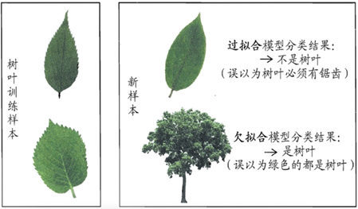
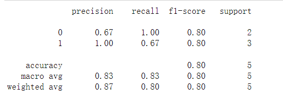
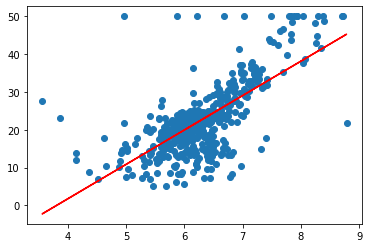

# Python机器学习

[TOC]


## 1. 绪论

- 基本术语

  

  - 学习（训练）：从数据中学得模型的过程
  - 训练集：参与模型训练的样本集合
  - 测试：学得模型后，使用其样本进行预测的过程
  - 测试集：被预测的样本集合
  - 假设：学得模型对应的关于数据的某种潜在规律
  - 分类：输出结果是离散值
  - 回归：输出结果是连续值
  - 监督学习：训练样本有标记
  - 无监督学习：训练样本无标记
  - 泛化能力：学得模型适用于新样本的能力
  - 独立同分布：样本空间的全体样本都服从一个未知的分布，且相互独立

- 假设空间

  - 归纳：
    - 从特殊到一般的“泛化”：从样例（训练样本）中学习
  - 演绎：
    - 从一半到特殊的“特化”：从数学公理推导出定理

- 归纳偏好

  - 对新样本，不同假设可能输出不同结果。问题：该相信哪条假设？
  - 模型（学习器）应该有偏好
  - 学习算法必有偏好
  - 归纳偏好原则一：奥卡姆剃刀（简单优先）
  
## 2. 模型评估与选择

  ### 2.1 经验误差与过拟合

- 误差：模型输出与样本真实值之间的差异

  - 错误率：分类错误样本数占总样本数比例
  - 精度：1－错误率
  - 训练误差：模型在训练集上的误差
  - 泛化误差：模型在新样本上的误差

- 目标：得到泛化误差小的模型／学习器

- 新样本**永远**处于未知，我们能得到的样本都不属于新样本，于是泛化误差将无从得知，故我们将以 **经验误差**代表泛化误差。

- 过拟合：模型在训练过程中过多关注了样本的细节特征，如在训练一个分辨树叶的模型中，误认为树叶必须有锯齿（过分关注细节特征）。

- 欠拟合：学习和训练不够充分，如在训练一个分辨树叶的模型中，模型认为绿色的都是树叶。

  

### 2.2 评估方法

- 我们一般会把整个数据集划分为训练集和测试集。

  - 目的：对于模型／学习器的泛化误差进行评估。
  - 训练集和测试集都要求满足独立同分布和互斥的条件。
  - 我们会将测试集的**测试误差**近似表示泛化误差。

- 得到测试误差的方法（怎么划分训练集和测试集）

  - 留出法

    - 训练集＋测试集：互斥互补
    - 训练集训练模型，测试集测试模型
    - 合理划分、保持比例
    - 单次留出与多次留出
    - 多次留出法：如对专家样本随机进行100次训练集／测试集划分，评估结果取平均

  - 交叉验证法

    - K折交叉验证：将专家样本等份划分为K个数据集，轮流用K－1个用于训练，1个用于测试

      

    - P次K折交叉验证

  - 自助法

    - 留出法与交叉验证法的训练集数据少于样本数据(因为样本数据被划分为训练集和测试集)
    - 给定m个样本的数据集D，从D中有放回随机取m次数据，形成训练集D’
    - 用D中不包含D’的样本作为测试集
    - D中某个样本不被抽到的概率：$(1-\frac{1}{m})^m$
    - 测试集数据量：$\lim_{m\to\infty}(1-\frac{1}{m})^m=\frac{1}{e}$
    - 缺点：改变了初始数据集的分布（某个样本可能会被抽到多次）

### 2.3 性能度量

#### 2.3.1 回归任务的评价标准

- 均方误差：$E(f ; D)=\frac{1}{m} \sum_{i=1}^{m}\left(f\left(\boldsymbol{x}_{i}\right)-y_{i}\right)^{2}$

#### 2.3.2 分类任务的评价标准

1. 错误率与精度

   - 错误率：分类错误样本数占总样本数比例

     $E(f ; D)=\frac{1}{m} \sum_{i=1}^{m} \mathbb{I}\left(f\left(\boldsymbol{x}_{i}\right) \neq y_{i}\right)$

     

   - 精度：1－错误率，分类正确样本数占总样本数比例

     $\begin{aligned}
     \operatorname{acc}(f ; D) &=\frac{1}{m} \sum_{i=1}^{m} \mathbb{I}\left(f\left(\boldsymbol{x}_{i}\right)=y_{i}\right) \\
     &=1-E(f ; D)
     \end{aligned}$

   - 有时候犯错的代价很大，实际中不能以简单的错误率或精度来评价。

2. 查准率和查全率

   - TP：正例的准确数
   - FP：正例的错误数
   - FN：反例的错误啥
   - TN：反例的正确数

   - 查准率／准确率（precision）： P = TP/(TP+FP)
   - 查全率／召回率／灵敏度（recall）：R = TP/(TP+FN)
   - “1”代表正例，“0”代表反例
   - 需要根据实际需要选择查准率或查全率。

   ```python
   from sklearn.metrics import precision_score
   from sklearn.metrics import confusion_matrix
   
   y_true = [1, 0, 1, 1, 0] #样本实际值
   y_pred = [1, 0, 1, 0, 0] # 模型预测值
   
   res = precision_score(y_true, y_pred, average=None)
   # 可以得到正例和反例的查准率
   
   confusion_matrix(y_true, y_pred) # 可以得到混淆矩阵
   #array([[2, 0],
                   [1, 2]])
       
   res = classification_report(y_true,y_pred)# 完整的有关这个模型性能的报告
   print(res)
   
   ```

   输出：

   

   

   

3. F1系数

   - 综合查准率和查全率：$F_1=\frac{2 \times P \times R}{P+R}=\frac{2 \times T P}{\text { 样例总数 }+T P-T N}$

     

   - 更一般的形式：$F_{\beta}=\frac{\left(1+\beta^{2}\right) \times P \times R}{\left(\beta^{2} \times P\right)+R}$

     - 其中β为正数，度量了查全率对查准率的相对重要性
     - β= 1：标准的F1系数
     - β>1：查全率有更大影响
     - β<1：查准率有更大影响

   - 多次训练／测试时的F1系数

     - 先分后总：先分别计算各混淆矩阵的查准率和查全率，再以均值汇总

       - $\text { macro- } P=\frac{1}{n} \sum_{i=1}^{n} P_{i}$

       - $\text { macro- } R=\frac{1}{n} \sum_{i=1}^{n} R_{i}$

       - $\text { macro- } F 1=\frac{2 \times \text { macro- } P \times \text { macro- }R}{\text { macro- } P+\text { macro- } R}$

         

     - 先总后分：先将各混淆矩阵的对应元素（TP、FP、TN、FN）进行汇总平均，再求P、R、F1值

       - $\text { micro- } P=\frac{\overline{T P}}{\overline{T P}+\overline{F P}}$
       - $\text { micro- } R=\frac{\overline{T P}}{\overline{T P}+\overline{F N}}$
       - $\text { micro- } F 1=\frac{2 \times \text { micro- } P \times \text { micro- }R}{\text { micro- } P+\text { micro- }R}$

   ```
   from sklearn.model_selection import cross_val_score
   from sklearn.datasets import load_iris 
   from sklearn.svm import SVC
   
   iris = load_iris()
   clf = SVC(kernel='linear', C=1)# 构建支持向量机模型
   scores = cross_val_score(clf, iris.data, iris.target, cv=5)
   print(scores)
   ```

   ```
   输出：
   [0.96666667 1.         0.96666667 0.96666667 1.        ]
   ```


## 3. 回归分析（Regression Analysis）

### 3.1 线性模型Linear model

- 线性模型试图学得一个通过属性的线性组合来进行预测（目标属性）的函数

- 形式简单，易于建模

  $y=w^{T} x+b$

- 蕴含机器学习的基本思想

- 是其他非线性模型的基础

- 权重体现出各属性重要性，可解释性强

### 3.2 线性回归

  - 线性回归试图学得$f\left(x_{i}\right)=w x_{i}+b$使得$f\left(x_{i}\right) \approx y_{i}$

  - 如何确定w，b , 关键在于如何减小$f\left(x_{i}\right) $与y的差别

- 目标函数（单变量）

  - **均方误差最小化(最小二乘法)**：找到一条直线，使所有样本到直线上的欧式距离之和最小

    $\begin{array}{l}
    \min \sum_{i=1}^{m}\left(f\left(x_{i}\right)-y_{i}\right)^{2} =\min \sum_{i=1}^{m}\left(y_{i}-w x_{i}-b\right)^{2}
    \end{array}$

    - 令目标函数对w和b的偏导为零可解得：
      - $w=\frac{\sum_{i=1}^{m} y_{i}\left(x_{i}-x\right)}{\sum_{i=1}^{m} x_{i}^{2}-\frac{1}{m}\left(\sum_{i=1}^{m} x_{i}\right)^{2}}$
      - $b=\frac{1}{m} \sum_{i=1}^{m}\left(y_{i}-w x_{i}\right)$

    > - 一个自变量和一个应变量，两者之间的关系可以用一条直线近似表示，这种回归被称为**简单线性回归**。
    > - 最小二乘法：一种求解线性回归的方法，可使估计值和实际值之间的差的平方和最小的方法

- 目标函数（多变量）

  - $f\left(x_{i}\right)=w^{T} x_{i}+b$
  - $X=\left(\begin{array}{llll}
    x_{11} & x_{12} & \ldots & 1 \\
    x_{21} & x_{22} & \ldots & 1 \\
    \ldots & \ldots & \ldots & 1 \\
    x_{m 1} & x_{m 2} & \ldots & 1
    \end{array}\right)=\left(\begin{array}{cc}
    x_{1}^{T} & 1 \\
    x_{2}^{T} & 1 \\
    \ldots & \ldots \\
    x_{m}^{T} & 1
    \end{array}\right)$
  - $\hat{w}^{*}=\underset{\hat{w}}{\arg \min }(y-X \hat{w})^{T}(y-X \hat{w})$

#### 回归实现

- sklearn.linear_model中的LinearRegression可实现线性回归：

  - LinearRegression 的构造方法： 

    ```python
    LinearRegression(
        fit_intercept=True, #默认值为 True，表示 计算随机变量，False 表示不计算随机变量
        normalize=False,  #默认值为 False，表示在回归前是否对回归因子X进行归一化True 表示是 ,
        copy_X=True
    )
    ```

  - LinearRegression 的常用方法有： 

    - decision_function(X) #返回 X 的预测值 y 
    - fit(X,y[,n_jobs]) #拟合模型 
    - get_params([deep]) #获取 LinearRegression 构造方法的参数信息 
    - predict(X) #求预测值 #同 decision_function 

  - ```python
    # 输入：[[0, 0], [1, 1], [2, 2]]——两个输入 
    # 输出：[0, 1, 2]
    # 预测：[3, 3]
    
    from sklearn.linear_model import LinearRegression
    
    clf = LinearRegression()
    clf.fit([[0, 0], [1, 1], [2, 2]],[0, 1, 2] )# 模型训练
    pre = clf.predict([[3, 3]]) # 模型预测
    print(pre)
    # 输出：[3.]
    
    clf.coef_ 
    # 输出系数 array([0.5, 0.5])
    
    clf.intercept_
    # 输出截距项2.220446049250313e-16（接近0）
    
    #所以这个模型应该基本为
    # y = 0.5*x1 +0.5*x2
    
    ```

#### 波士顿房价预测

- 数据说明：

  - 波士顿房价数据集（Boston House Price Dataset）包含对房价的预测，以千美元计，给定的条件是房屋及其相邻房屋的详细信息。
  - 该数据集是一个回归问题。每个类的观察值数量是均等的，共有 506 个观察，13 个输入变量和1个输出变量。
  - sklearn库的datasets包含该数据集（ load_boston）
  - 变量名：
    - CRIM：城镇人均犯罪率。
    - ZN：住宅用地超过 25000 sq.ft. 的比例。
    - INDUS：城镇非零售商用土地的比例。
    - CHAS：查理斯河空变量（如果边界是河流，则为1；否则为0）。
    - NOX：一氧化氮浓度。
    - RM：住宅平均房间数。
    - AGE：1940 年之前建成的自用房屋比例。
    - DIS：到波士顿五个中心区域的加权距离。
    - RAD：辐射性公路的接近指数。
    - TAX：每 10000 美元的全值财产税率。
    - PTRATIO：城镇师生比例。
    - B：1000（Bk-0.63）^ 2，其中 Bk 指代城镇中黑人的比例。
    - LSTAT：人口中地位低下者的比例。
    - MEDV：自住房的平均房价，以千美元计。

- 直觉告诉我们：数据第6列（住宅平均房间数）与最终房价一般是成正比的，具有某种线性关系。我们利用线性回归来验证想法。
  同时，作为一个二维的例子，可以在平面上绘出图形，进一步观察图形。
  
- ```
  from sklearn.datasets import load_boston
  from sklearn.linear_model import LinearRegression
  
  
  boston = load_boston() # 实例化
  
  #boston.data[:, 5:6] # 取出所有行的第6列数据（5:6只取第6行、第7行不取）
  clf.fit(boston.data[:, 5:6], boston.target)# 模型训练
  
  print('系数：',clf.coef_)
  
  print('截距：',clf.intercept_)
  
  
  
  # 输出：
  # 系数： [9.10210898]
  # 截距： -34.67062077643857
  
  
  ```

  ```
  import matplotlib.pyplot as plt
  
  x = boston.data[:, 5:6]
  y_pre = clf.predict(x) 
  
  plt.scatter(x, boston.target) # 样本实际分布
  
  plt.plot(x, y_pre, color = 'red') # 绘制拟合直线
  plt.show()
  ```

  输出：

  

### 3.3 逻辑回归Logistic Regression

- 分类和回归二者不存在不可逾越的鸿沟。就波士顿房价预测作为例子：如果将房价按高低分为“高级”、“中级”和“普通”三个档次，那么这个预测问题也属于分类问题。

- **逻辑回归（Logistic Regression）是对数几率回归**，属于广义线性模型（GLM），它的因变量一般只有0或1。

- 需要明确一件事情：线性回归并没有对数据的分布进行任何假设，而逻辑回归隐含了一个基本假设 ：每个样本均独立服从于伯努利分布（0-1分布）。

  > 假设一个事件只有发生或者不发生两种可能，并且这两种可能是固定不变的。那么，如果假设它发生的概率是p，那么它不发生的概率就是1-p。这就是伯努利分布。

- 伯努利分布属于指数分布族，这个大家庭还包括：高斯（正态）分布、多项式分布、泊松分布、伽马分布、Dirichlet分布等。

- > - 逻辑回归是用来解决二分类问题
  >
  > -  逻辑回归 = 线性回归+ sigmoid函数
  >
  >   - 线性回归：$z= w\times x+ b$
  >
  >   - sigmoid函数：$y = \frac{1}{1+e^{-z}}$
  >
  >     
  >
  >   - 逻辑回归：$y = \frac{1}{1+e^{-wx+b}}$

- $\ln \frac{y}{1-y}=w^{T} x+b$
  - $\frac{y}{1-y}$称为几率，表示样本取正例的可能性比例，$\ln\frac{y}{1-y}$称为对数几率。

- 目标：寻找合适的w,b ，使函数输出y逼近真实类别。

  - $y=\frac{1}{1+e^{-\left(w^{T} x+b\right)}}$
  - $\ln \frac{y}{1-y}=w^{T} x+b$

- 将*y*视为类别取值为1或0的概率，可得：

  - $\ln \frac{y}{1-y}=w^{T} x+b$

  - =>   $\ln \frac{p(y=1 \mid x)}{p(y=0 \mid x)}=w^{T} x+b$

  - => 

    - 正例的概率 $p(y=1 \mid x)=\frac{e^{w^{T} x+b}}{1+e^{w^{T} x+b}}$

    - 反例的概率$p(y=0 \mid x)=\frac{1}{1+e^{{w}^{T} x+b}}$

    - 试想：我们可以将样本中为正例的样本数值放入第一个式子，反例的样本数值放入第二个式子，取w、b值应使p尽可能接近1。

  - 则目标函数变为：$\max \ell(w, b)=\sum_{i=1}^{m} \ln p\left(y_{i} \mid x_{i} ; w, b\right)$

    即需要调整w和b，使得所有p值的和最大，即可得到二分类问题解决的模型。

  - 目标函数求解方法：梯度下降法、牛顿法

- 对于多分类问题，可以拆解为多层级的二分类问题。

#### 研究生录取预测的实现

- 数据：

  |       | **admit** | **gre** | **gpa** | **rank** |
  | ----- | --------- | ------- | ------- | -------- |
  | **0** | 0         | 380     | 3.61    | 3        |
  | **1** | 1         | 660     | 3.67    | 3        |

  - admit ：表示是否被录取(目标变量)
  - gre：标准入学考试成绩，预测变量
  - gpa：学业平均绩点，预测变量
  - rank：母校排名(预测变量)
  - ——LogisticRegression.csv文件

```python
import pandas as pd
from sklearn.linear_model import LogisticRegression
from sklearn.model_selection import train_test_split
from sklearn.metrics import classification_report


data = pd.read_csv('LogisticRegression.csv')

data_tr, data_te, label_tr, label_te = train_test_split(data.iloc[:, 1:], data['admit'], test_size = 0.2 )

print(data_tr.shape)
clf = LogisticRegression()

clf.fit(data_tr, label_tr)

pre  = clf.predict(data_te)

print(classification_report(label_te, pre)) # 获得报告
```

输出:


- 效果并不理想。


## 4. 决策树Decision Tree

- 决策树学习的步骤：
  - 特征选择
  - 决策树的生成
  - 决策树的修剪


### 4.1 例子

- 天气情况对是否打高尔夫球的影响

  | 日期 | 天气 | 温度(华氏度) | 湿度 | 起风 | 打球? |
  | ---- | ---- | ------------ | ---- | ---- | ----- |
  | 1    | 晴   | 85           | 85   | F    | No    |
  | 2    | 晴   | 80           | 90   | T    | No    |
  | 3    | 阴   | 83           | 78   | F    | Yes   |
  | 4    | 雨   | 70           | 96   | F    | Yes   |
  | 5    | 雨   | 68           | 80   | F    | Yes   |
  | 6    | 雨   | 65           | 70   | T    | No    |
  | 7    | 阴   | 64           | 65   | T    | Yes   |
  | 8    | 晴   | 72           | 95   | F    | No    |
  | 9    | 晴   | 69           | 70   | F    | Yes   |
  | 10   | 雨   | 75           | 80   | F    | Yes   |
  | 11   | 晴   | 75           | 70   | T    | Yes   |
  | 12   | 阴   | 72           | 90   | T    | Yes   |
  | 13   | 阴   | 81           | 75   | F    | Yes   |
  | 14   | 雨   | 71           | 80   | T    | No    |
  | 15   | 阴   | 85           | 90   | F    | ？    |
  | 16   | 雨   | 80           | 79   | F    | ？    |
  | 17   | 晴   | 78           | 70   | T    | ？    |

  得到的决策树如下：

  

  

### 4.2如何拆分属性

- 问题：对于给定样本集，如何判断应该在哪个属性上进行拆分

  - 每次拆分都存在多种可能，哪个才是较好的选择呢？

    - 理想情况：在拆分过程中，当叶节点只拥有单一类别时，将不必继续拆分。

    - 目标是寻找较小的树，希望递归过程尽早停止
  - 较小的树意味着什么？

    - 当前最好的拆分属性产生的拆分中目标类的分布应该尽可能地单一（单纯），多数类占优。
  - 如果能测量每一个节点的纯度，就可以选择能产生最纯子节点的那个属性进行拆分；
  - **决策树算法通常按照纯度的增加来选择拆分属性。**

- 纯度的概念

  - 纯度度量
    - 当样本中没有两项属于同一类：0
    - 当样本中所有项都属于同一类：1
  - 最佳拆分可以转化为选择拆分属性使纯度度量最大化的优化问题

- 用于评价拆分分类目标变量的纯度度量包括

  - 基尼(Gini，总体发散性)  CART

  - 熵(entropy，信息量(信息混乱程度))

  - 信息增益(Gain) ID3

  - 信息增益率    C4.5，C5.0

- 改变拆分准则（splitting criteria）导致树的外观互不相同

- **熵(entropy)**

  - 信息论中的熵：是信息的度量单位，是一种 对属性“不确定性的度量”。

    > •熵在化学中是表示分子的混乱程度，分子越混乱，它的熵就越大，而若分子越有序，熵值就越小。
    >
    > 信息熵也是一样的，它能对信息的不确定性进行恒量，如果某个信息让我们的判断更加有序，清晰，则它信息熵越小，反之越大

  - 属性的不确定性越大，把它搞清楚所需要的信息量也就越大，熵也就越大。

  - 如果一个数据集D有N个**类别**，则该数据集的熵为：

    $\operatorname{Ent}(D)=-\sum_{i=1}^{N} p_{i} \log _{2} p_{i}$

    - $p_i$ 表示第i类样本的概率值，或者说第i类样本在数据集中的占比。

  - 例子中打球数据集的熵为：

    $-(9 / 14) \log _{2}(9 / 14)-(5 / 14) \log _{2}(5 / 14)=0.940$

    

- **信息增益(gain)**

  - 表示**某个属性**对纯度提升的程度

  - 若离散**属性**a有V个**取值**，则其信息增益为：

    $\operatorname{Gain}(D, a)=\operatorname{Ent}(D)-\sum_{v=1}^{V} \frac{\left|D^{v}\right|}{|D|} \operatorname{Ent}\left(D^{v}\right)$

    - |D|代表数据总条数
    - $|D^{v}|$ 代表该个属性的某个取值下的数据条数。
    - $\operatorname{Ent}\left(D^{v}\right)$ 为在**该个属性的某个取值下**数据集类别的熵。
    
  - 例子中计算天气属性的信息增益：

    - 晴：打球记录2条，不打球记录为3条

      $\operatorname{Ent}\left(D^{1}\right)=-(2 / 5) \log _{2}(2 / 5)-(3 / 5) \log _{2}(3 / 5)=0.97$

    - 阴：打球记录4条，不打球记录0条

      $\operatorname{Ent}\left(D^{2}\right)=-(4 / 4) \log _{2}(4 / 4)-(0 / 4) \log _{2}(0 / 4)=0$

    - 雨：打球记录3条，不打球记录2条

      $\operatorname{Ent}\left(D^{3}\right)=-(3 / 5) \log _{2}(3 / 5)-(2 / 5) \log _{2}(2 / 5)=0.97$

    - 所以天气属性的信息增益：

      $\begin{array}{l}
      \operatorname{Gain}(D, a)=\operatorname{Ent}(D)-\sum_{v=1}^{V} \frac{\left|D^{v}\right|}{|D|} \operatorname{Ent}\left(D^{v}\right) \\
      =0.940-\frac{5}{14} \times 0.97-\frac{4}{14} \times 0-\frac{5}{14} \times 0.97 \\
      =0.247
      \end{array}$

      

- **决策树中属性的拆分可按照某属性的信息增益从大到小进行拆分。**

    

### 4.3 决策树算法

#### 4.3.1 ID3算法

- ID3算法是决策树系列中的经典算法之一，它包含了决策树作为机器学习算法的主要思想

- 算法步骤：
  1. 对当前样本集合，计算所有属性的信息增益；
  2. 选择信息增益最大的属性作为拆分属性，把拆分属性取值相同的样本划为同一个子样本集；
  3. 若子样本集的类别属性只含有单个属性，则分支为叶子节点，判断其属性值并标上相应的符号之后返回调用处；否则对子样本集递归调用本算法。
- 缺点：
  - 由于ID3决策树算法采用信息增益作为选择拆分属性的标准，**会偏向于选择属性取值较多的**（如例子中天气属性有3个取值[晴,阴,雨]，其他属性只有两个取值），即所谓高度分支属性，而这类属性并不一定是最优的属性。
  - ID3算法只能处理离散属性，对于连续型的属性，在分类前需要对其进行离散化。

#### 4.3.2 常见的决策树算法

| **决策树算法** | **算法描述**                                                 |
| -------------- | ------------------------------------------------------------ |
| ID3算法        | 其核心是在决策树的各级节点上，使用信息增益作为属性的选择标准，来帮助确定每个节点所应采用的合适属性。 |
| C4.5算法       | C4.5决策树生成算法相对于ID3算法的重要改进是使用信息增益率来选择节点属性。C4.5算法既能够处理离散的描述属性，也可以处理连续的描述属性。 |
| C5.0算法       | C5.0是C4.5算法的修订版，适用于处理大数据集，采用Boosting方式提高模型准确率，根据能够带来的最大信息增益的字段拆分样本，占用的内存资源较少。  【商业的】 |
| CART算法       | CART决策树是一种十分有效的非参数分类和回归方法，通过构建树、修剪树、评估树来构建一个二叉树。当终结点是连续变量时，该树为回归树；当终结点是分类变量，该树为分类树。 |

- https://scikit-learn.org/stable/modules/tree.html

### 4.4 scikit-learn建立基于信息熵的决策树模型——以泰坦尼克生还预测为例

- > sklearn使用CART算法的优化版本， 但sklearn实现目前不支持分类变量。

- https://scikit-learn.org/stable/modules/generated/sklearn.tree.DecisionTreeClassifier.html#sklearn.tree.DecisionTreeClassifier

- 例子是经典的Kaggle101问题——泰坦尼克生还预测，部分数据如下：

  | **Survived** | **PassengerId** | **Pclass** | **Sex** | **Age** |
  | ------------ | --------------- | ---------- | ------- | ------- |
  | 0            | 1               | 3          | male    | 22      |
  | 1            | 2               | 1          | female  | 38      |
  | 1            | 3               | 3          | female  | 26      |
  | 1            | 4               | 1          | female  | 35      |
  | 0            | 5               | 3          | male    | 35      |
  | 0            | 6               | 3          | male    |         |

  为了说明的方便，数据集有许多属性被删除了。通过观察可知：列Survived是指是否存活，是类别标签，属于预测目标；列Sex的取值是非数值型的。我们在进行数据预处理时应该合理应用Pandas的功能，让数据能够被模型接受。Age取值有部分缺失，我们也需要对其做些预处理（如让缺失值取全部样本的均值，或取相邻数个样本的均值，或直接删除缺失该列的样本）。

- ```python
  import pandas as pd
  
  data = pd.read_csv('titanic_data.csv')
  
  #--------------------------------------------------
  # 数据预处理
  #--------------------------------------------------
  
  # 去掉乘客编号
  # 删除该列，直接在源数据data上修改
  data.drop('PassengerId', axis=1, inplace=True)
  
  # 将男女标记转换为数值型
  data.loc[data['Sex'] == 'male', 'Sex']= 1
  data.loc[data['Sex'] == 'female', 'Sex']= 0
  # 处理年龄缺失值
  # 用均值填入缺失值
  data.fillna(data['Age'].mean(), inplace=True)
  
  #--------------------------------------------------
  # 模型构建与预测
  #--------------------------------------------------
  
  from sklearn.tree import DecisionTreeClassifier
  
  from sklearn.metrics import classification_report
  
  Dtc = DecisionTreeClassifier(max_depth=5, random_state=8) # 构建决策树模型，
  # 默认用了“gini‘系数作为衡量标准，criterion{“gini”, “entropy”}, default=”gini”，可修改criterion属性值
  
  Dtc.fit(data.iloc[:, 1:], data['Survived'])# 模型训练
  pre = Dtc.predict(data.iloc[:, 1:])# 模型预测
  
  print(classification_report(data['Survived'], pre)) # 输出分类报告
  
  ```

  输出：

  

  

  

- 决策树可视化

  - 安装Graphviz

    `pip install graphviz`

  - 下载Graphviz工具

    https://graphviz.org/download/，并将安装路径添加至系统变量，并将`C:\Program Files\Graphviz\bin\dot.exe`同样添加到系统变量path中。

  - ```python
    import graphviz
    
    dot_data = export_graphviz(Dtc, feature_names=['Pclass', 'Sex', 'Age'],
                               class_names='Survived')
    graph = graphviz.Source(dot_data)
    graph
    ```

    输出如下：

    

    

## 5. 人工神经网络 Artificial Neural Network

- 数学神经元结构

  

  xj为输入信号， f 为传递函数，wi,j表示与神经元xj 连接的权值，yi 表示输出值，θ表示阈值

### 5.1 神经网络结构

- BP网络结构（back propagation，反向传播）

  

  影响输出的几个关键值：

  - $θ_j$ 阈值

  - $w_{hj} $ 输出层权重值

  - $γ_h$ 阈值

  - $v_{ih}$ 输入层权重值

### 5.2 网络参数的修正——梯度下降法


- 构建出一个误差项

  $E=\frac{1}{2} \sum_{j=1}^{l}\left(\hat{y}_{j}-y_{j}\right)^{2}$
  
- 网络中的激活函数$f$

  $f(x)=\operatorname{sigmoid}(x)=\frac{1}{1+e^{-x}}$

- 网络的训练目标：**找出合适的权值和阈值，使得误差 E 最小**

  - $θ_j$ 输出层阈值

  - $w_{hj} $ 输出层权重值

  - $γ_h$ 隐层阈值

  - $v_{ih}$ 输入层权重值

- 梯度下降法
- 

- 工作原理推导

  - $f(x)=\operatorname{sigmoid}(x)=\frac{1}{1+e^{-x}}$

  - 则$f^{\prime}(x)=f(x)(1-f(x))$

  - 又有$\hat{y}_{j}=f\left(\beta_{j}-\theta_{j}\right)$

    $E=\frac{1}{2} \sum_{j=1}^{l}\left(\hat{y}_{j}-y_{j}\right)^{2}$

  - 要使E最小，需要优化其中四个量

  - 先求E对于$\hat{y}_{j}$ 的偏导：

    $\frac{\partial E}{\partial \hat{y}_{j}}=\hat{y}_{j}-y_{j}$

  - 梯度下降方法中，$\Delta w_{h j}$ 为每次$w_{h j}$的调整量，$\eta$ 为人为设定的。

    $\Delta w_{h j}=-\eta \frac{\partial E}{\partial w_{h j}}$ , 其中负号是因为做下降，

    而$\frac{\partial E}{\partial w_{h j}}$ 可分解为 $\frac{\partial E}{\partial w_{h j}}=\frac{\partial E}{\partial \hat{y}_{j}} \cdot \frac{\partial \hat{y}_{j}}{\partial \beta_{j}} \cdot \frac{\partial \beta_{j}}{\partial w_{h j}}$， 

    其中：

    - $\frac{\partial \beta_{j}}{\partial w_{h j}}=b_{h}$

    - $\frac{\partial E}{\partial \hat{y}_{j}}=\hat{y}_{j}-y_{j}$

    - 因为$f^{\prime}(x)=f(x)(1-f(x))$ 

      所以: 

      $\begin{array}{l}
      \frac{\partial \hat{y}_{j}}{\partial \beta_{j}}=f^{\prime}\left(\beta_{j}-\theta_{j}\right) \\
      =f\left(\beta_{j}-\theta_{j}\right)\left(1-f\left(\beta_{j}-\theta_{j}\right)\right) \\
      =\hat{y}_{j}\left(1-\hat{y}_{j}\right)
      \end{array}$ 

    所以得到$w_{h j}$的调整量：

    $\begin{array}{l}
    \Delta w_{h j}=-\eta \frac{\partial E}{\partial w_{h j}} \\
    =-\eta \frac{\partial E}{\partial \hat{y}_{j}} \cdot \frac{\partial \hat{y}_{j}}{\partial \beta_{j}} \cdot \frac{\partial \beta_{j}}{\partial w_{h j}} \\
    =\eta \hat{y}_{j}\left(1-\hat{y}_{j}\right)\left(y_{j}-\hat{y}_{j}\right) b_{h}
    \end{array}$

  - 我们设：

    $\begin{array}{l}
    g_{j}=-\frac{\partial E}{\partial \hat{y}_{j}} \cdot \frac{\partial \hat{y}_{j}}{\partial \beta_{j}} \\
    =-\left(\hat{y}_{j}-y_{j}\right) \hat{y}_{j}\left(1-\hat{y}_{j}\right) \\
    =\hat{y}_{j}\left(1-\hat{y}_{j}\right)\left(y_{j}-\hat{y}_{j}\right)
    \end{array}$

    可如上方法求得：

    - $\theta_{j}$ 的调整量:

      $\begin{array}{l}
      \Delta \theta_{j}=-\eta g_{j} \\
      =-\eta \hat{y}_{j}\left(1-\hat{y}_{j}\right)\left(y_{j}-\hat{y}_{j}\right)
      \end{array}$

    - $v_{i h}$ 的调整量:

      $\begin{array}{l}
      \Delta v_{i h}=\eta e_{h} x_{i} \\
      =-\eta \frac{\partial E}{\partial b_{h}} \cdot \frac{\partial b_{h}}{\partial \alpha_{h}} x_{i} \\
      =\eta b_{h}\left(1-b_{h}\right) \sum_{j=1}^{l} w_{h j} g_{j} x_{i}
      \end{array}$ 

    - $\gamma_{h}$ 的调整量:

      $\begin{array}{l}
      \Delta \gamma_{h}=-\eta e_{h} \\
      =\eta \frac{\partial E}{\partial b_{h}} \cdot \frac{\partial b_{h}}{\partial \alpha_{h}} \\
      =-\eta b_{h}\left(1-b_{h}\right) \sum_{j=1}^{l} w_{h j} g_{j}
      \end{array}$

- 阈值和权值的调整量：
  - $\Delta w_{h j}=\eta \hat{y}_{j}\left(1-\hat{y}_{j}\right)\left(y_{j}-\hat{y}_{j}\right) b_{h}$
  - $\Delta \theta_{j}=-\eta \hat{y}_{j}\left(1-\hat{y}_{j}\right)\left(y_{j}-\hat{y}_{j}\right)$
  - $\Delta v_{i h}=\eta b_{h}\left(1-b_{h}\right) \sum_{j=1}^{l} w_{h j} g_{j} x_{i}$
  - $\Delta \gamma_{h}=-\eta b_{h}\left(1-b_{h}\right) \sum_{j=1}^{l} w_{h j} g_{j}$

### 5.3 网络训练过程

- 输入：训练集数据、学习速率*yita*

- 过程：
  - 在(0,1)范围内随机初始化网络中所有连接权和阈值
  - repeat
    - 根据网络输入和当前参数计算网络输出值$y$
    - 计算各权值和阈值调整量
    - 更新连接权值和阈值
  - until达到停止条件(误差足够小 或 训练达到最大迭代次数)
  
  - 输出：连接权值和阈值

### 5.3 神经网络实现过程

- 用bp神经网络实现$ y= x_1^2+x_2^2$
  - 训练集数据：BPdata_tr.txt
  - 测试集数据：BPdata_te.txt

- 网络结构：

  - 为2-4-1结构的神经网络，-1为阈值

  

  

  


- 单样本训练

  - **（单样本会导致过拟合）**

  ```python
  import  pandas as pd
  import numpy as np
  
  # 定义激活函数：sigmoid函数; 
  def sigmoid(x):
      return 1/(1 + np.exp(-x))
  #Exp 函数 返回 e(自然对数的底)的幂次方。
  
  
  # 导入训练数据集
  data_tr = pd.read_csv('BPdata_tr.txt')
  
  yita = 0.5 #设置的学习速率的常量
  
  net_in = np.array([0.0499853495508432, 0.334657078469172, -1])# 网络输入
  
  real = 0.114493895339242 # 真实输出值
  
  out_in = np.array([0.0, 0, 0, 0, -1]) # 输出层的输入
  
  w_mid = np.zeros([3, 4]) # 隐层神经元的权值&阈值,一列代表一个隐层神经元的各项权值&阈值
  
  w_out = np.zeros([5]) # 输出层神经元的权值&阈值
  
  delta_w_out = np.zeros([5]) # 输出层权值&阈值的修正量
  
  delta_w_mid = np.zeros([3, 4]) # 隐层权值&阈值的修正量
  
  for it in range(100):
      # 从输入层到隐层的传输过程
  
      for i in range(4):
          b_in = sum(net_in * w_mid[:, i]) # 隐层神经元bi的输入：各项加权求和
          out_in[i] = sigmoid(b_in) # 将加权求和结果放进隐层激活函数中，并将其输出传送至输出层的输入
      
      # 隐层到输出层
      res = sigmoid( sum(out_in * ｗ_out) )
      print(it, '次训练的模型输出：', res, ' real:', real)
      
      # 求修正量
      delta_w_out = yita * res * (1 - res) * (real - res) * out_in # 输出层权值的修正量
      delta_w_out[4] = -yita * res * (1 - res) * (real - res) # 输出层阈值的修正量
      # 权重&阈值调整更新
      w_out = w_out + delta_w_out
  
      for i in range(4):
          # 隐层神经元的权值修正量
          delta_w_mid[:, i] = yita * out_in[i] * ( 1 - out_in[i]) * (w_out[i] * res * (1-res) * (real - res) * net_in)
          # 中间层阈值的权重修正量
          delta_w_mid[2, i] = -yita*out_in[i]*(1-out_in[i])*w_out[i]*res*(1-res)*(real-res)
  
      # 隐层权重&阈值调整更新
      w_mid = w_mid + delta_w_mid
  ```

- 多样本训练

  ```python
  import  pandas as pd
  import numpy as np
  import matplotlib.pyplot as plt
  # 定义激活函数：sigmoid函数; 
  def sigmoid(x):
      return 1/(1 + np.exp(-x))
  #Exp 函数 返回 e(自然对数的底)的幂次方。
  
  
  # 导入训练数据集
  data_tr = pd.read_csv('BPdata_tr.txt')
  
  n = len(data_tr) # 获得样本数
  
  yita = 0.5 #设置的学习速率的常量
  
  
  out_in = np.array([0.0, 0, 0, 0, -1]) # 输出层的输入
  
  w_mid = np.zeros([3, 4]) # 隐层神经元的权值&阈值,一列代表一个隐层神经元的各项权值&阈值
  
  w_out = np.zeros([5]) # 输出层神经元的权值&阈值
  
  delta_w_out = np.zeros([5]) # 输出层权值&阈值的修正量
  
  delta_w_mid = np.zeros([3, 4]) # 隐层权值&阈值的修正量
  
  Err = [] # 记录每轮误差平均值
  
  for j in range(100): #训练100轮
      errors = [] # 记录每次误差
      for it in range(n):
  
          net_in = np.array([data_tr.iloc[it, 0], data_tr.iloc[it,1], -1])# 网络输入
          real = data_tr.iloc[it, 2] # 真实输出值
  
          # 从输入层到隐层的传输过程
  
          for i in range(4):
              b_in = sum(net_in * w_mid[:, i]) # 隐层神经元bi的输入：各项加权求和
              out_in[i] = sigmoid(b_in) # 将加权求和结果放进隐层激活函数中，并将其输出传送至输出层的输入
  
          # 隐层到输出层
          res = sigmoid( sum(out_in * ｗ_out) )
          
          errors.append(abs(real-res)) # 计算误差绝对值并记录
          
          
          
          # print(it, '个样本训练的模型输出：', res, ' real:', real )
  
          # 求修正量
          delta_w_out = yita * res * (1 - res) * (real - res) * out_in # 输出层权值的修正量
          delta_w_out[4] = -yita * res * (1 - res) * (real - res) # 输出层阈值的修正量
          # 权重&阈值调整更新
          w_out = w_out + delta_w_out
  
          for i in range(4):
              # 隐层神经元的权值修正量
              delta_w_mid[:, i] = yita * out_in[i] * ( 1 - out_in[i]) * (w_out[i] * res * (1-res) * (real - res) * net_in)
              # 中间层阈值的权重修正量
              delta_w_mid[2, i] = -yita*out_in[i]*(1-out_in[i])*w_out[i]*res*(1-res)*(real-res)
  
          # 隐层权重&阈值调整更新
          w_mid = w_mid + delta_w_mid
      Err.append(np.mean(errors))
  plt.plot(Err) # 画出一个训练过程中误差变化的图像
  plt.show()
  
  ```

  输出误差结果：

  

- 测试模型性能

  ```python
  # 将测试集放入测试好的模型中
  
  data_te = pd.read_csv('BPdata_te.txt')
  error_te = []
  for it in range(len(data_te)):
  
      net_in = np.array([data_te.iloc[it, 0], data_te.iloc[it,1], -1])# 网络输入
      real = data_te.iloc[it, 2] # 真实输出值
      
      for i in range(4):
          out_in[i] = sigmoid( sum(net_in * w_mid[:, i]) ) # 输入层到隐层
      res = sigmoid( sum(out_in * ｗ_out) ) # 隐层到输出
      error_te.append(abs(real - res))
      
  
  plt.plot(error_te)
  plt.show()
  print('误差的均值', np.mean(error_te))
  ```

  输出：

  

  ```
  误差的均值 0.041685360810866705
  ```

### 5.4 调用sklearn实现神经网络

- https://scikit-learn.org/stable/modules/generated/sklearn.neural_network.MLPRegressor.html#sklearn.neural_network.MLPRegressor

- ```python
  # 调用sklearn实现神经网络算法
  
  from sklearn.neural_network import MLPRegressor
  import numpy as np
  
  # 导入训练数据集
  data_tr = pd.read_csv('BPdata_tr.txt')
  # 导入测试集
  data_te = pd.read_csv('BPdata_te.txt')
  '''
  1. hidden_layer_sizes ：隐层数目
  2. activation{‘identity’, ‘logistic’, ‘tanh’, ‘relu’}, default=’relu’激活函数
  3. max_iter 最大的迭代数量
  4. learning_rate_init： double, default=0.001
  '''
  model = MLPRegressor(hidden_layer_sizes=(10,), random_state=10, max_iter=800, learning_rate_init=0.1)# 构建模型
  
  model.fit(data_tr.iloc[:, :2], data_tr.iloc[:, 2])# 模型训练
  
  pre = model.predict(data_te.iloc[:, :2]) # 模型预测
  
  err = np.abs(pre- data_te.iloc[:, 2])
  
  print('误差平均值：', np.mean(err))
  ```

  输出：

  ```text
  误差平均值： 0.03791643890848102
  ```

## 6. KNN最近邻算法

### 6.1 kNN简介

- kNN（k-Nearest Neighbor Classification），即k-近邻分类算法。

  > 近朱者赤，近墨者黑。

- 一个样本在特征空间中，总会有k个最相似（即特征空间中最邻近）的样本。其中，大多数样本属于某一个类别，则该样本也属于这个类别。

- 是理论上比较成熟的方法，也是最简单的机器学习算法之一。

- 行业应用：

  1. 客户流失预测
  2. 欺诈侦测等（更适合于稀有事件的分类问题）
  
- 也称**懒惰算法**

  - 平时不好好学习，考试（对测试样本分类）时才临阵磨枪（临时去找k个近邻）。
  - 懒惰的后果：模型简单，计算开销大。

- 优点

  - 简单，易于理解，易于实现，无需估计参数，无需训练；

  - 适合对稀有事件进行分类（例如当流失率很低时，比如低于0.5%，构造流失预测模型）；

  - 特别适合于多分类问题(multi-modal,对象具有多个类别标签)，例如根据基因特征来判断其功能分类，kNN比SVM的表现要好。

- 缺点

  - 对测试样本分类时的计算量大，内存开销大，评分慢；

  - 可解释性较差，无法给出决策树那样的规则。

### 6.2 KNN计算步骤

- 计算步骤：

  1. **算距离**：给定测试对象，计算它与训练集中的每个对象的距离

     - 计算的距离衡量包括欧式距离、夹角余弦等。

     - 欧式距离：$d(x, y)=\sqrt{\sum_{k=1}^{n}\left(x_{k}-y_{k}\right)^{2}}$

     - 典型的距离定义

       

       

  2. **找邻居**：圈定距离最近的k个训练对象，作为测试对象的近邻

  3. **做分类**：根据这k个近邻归属的主要类别，来对测试对象分类

     - 投票决定：少数服从多数。
     - 加权投票法：根据距离的远近，距离越近则权重越大（权重为距离平方的倒数）。

- 算法流程

  1. 计算已知类别数据集中的点与当前点之间的距离；
  2. 按照距离递增次序排序；
  3. 选取与当前点距离最小的k个点；
  4. 确定前k个点所在类别对应的出现频率；
  5. 返回前k个点出现频率最高的类别作为当前点的预测分类。

### 6.3 示例：鸢尾花分类

- https://scikit-learn.org/stable/modules/generated/sklearn.neighbors.KNeighborsClassifier.html#sklearn.neighbors.KNeighborsClassifier

- sklearn库中提供KNeighborsClassifier实现kNN算法，此外，还提供RadiusNeighborsClassifier（非均匀采样时比较合适，以半径为选取方法）做最近邻分类

- sklearn.neighbors.KNeighborsClassifier(n_neighbors=5 #邻居数，默认为5
   , weights='uniform' #用于预测的权重方法
   , algorithm='auto' #用于计算最近邻的算法（ball_tree、kd_tree、brute、auto）
   , leaf_size=30 #传递给BallTree 或KDTree 叶大小
   , p=2 #
   , metric='minkowski' #用于树的度量距离
   , metric_params=None #度量参数
   , **kwargs)

- from sklearn.neighbors import KNeighborsClassifier

- ```python
  from sklearn.datasets import load_iris
  from sklearn.model_selection import train_test_split
  from sklearn.neighbors import KNeighborsClassifier
  
  iris = load_iris()
  
  data_tr, data_te, label_tr, label_te = train_test_split(iris.data, iris.target, test_size=0.2) # 拆分专家样本集
  
  model = KNeighborsClassifier(n_neighbors=6)
  model.fit(data_tr, label_tr)
  pre = model.predict(data_te)
  acc = model.score(data_te, label_te)# 模型在测试集上的精度
  acc
  ```


## 7. 朴素贝叶斯分类 Naive Bayesian

### 7.1 引例

> - 已知：非洲人10个中有9个黑人，1个白人，北美10个人中有3个黑人7个白人。
>
> - 问：你在街上遇到1个黑人，那么他是非洲人还是北美人？
>
> 注：全球非洲12亿人口，北美3.6亿人口

- 设：

  A1：非洲人
  A2：北美人
  B1：白人
  B2：黑人

  则：

  非洲人10个中有9个黑人: $P\left(B_{2} \mid A_{1}\right)=0.9$ 

  北美10个人中有3个黑人: $P\left(B_{2} \mid A_{2}\right)=0.3$

  问题转换为：

  - 是$P\left(A_{1} \mid B_{2}\right)>P\left(A_{2} \mid B_{2}\right)$ 还是$P\left(A_{1} \mid B_{2}\right) \leq P\left(A_{2} \mid B_{2}\right)$ ?

- 由贝叶斯定理：

  $\begin{aligned}
  P(A B) &=P(A) P(B \mid A) \\
  &=P(B) P(A \mid B)
  \end{aligned}$

  可以得到

  $P(A \mid B)=\frac{P(B \mid A) P(A)}{P(B)}$

- 当A与B相互独立时：$P(A B)=P(A) P(B)$

- 所以得到：

  $P\left(A_{1} \mid B_{2}\right)=\frac{P\left(A_{1}\right) P\left(B_{2} \mid A_{1}\right)}{P\left(B_{2}\right)}=\frac{12^{*} 0.9}{Q^{*} P\left(B_{2}\right)}$

  $P\left(A_{2} \mid B_{2}\right)=\frac{P\left(A_{2}\right) P\left(B_{2} \mid A_{2}\right)}{P\left(B_{2}\right)}=\frac{3.6^{*} 0.3}{Q^{*} P\left(B_{2}\right)}$

  所以是非洲人的可能性更大。


### 7.2 “朴素”二字

- 引用分辨西瓜好坏的数据：

  | **编号** | **色泽** | **根蒂** | **敲声** | **纹理** | **脐部** | **触感** | **密度** | **含糖率** | **好瓜** |
  | -------- | -------- | -------- | -------- | -------- | -------- | -------- | -------- | ---------- | -------- |
  | 1        | 乌黑     | 蜷缩     | 沉闷     | 清晰     | 凹陷     | 硬滑     | 0.774    | 0.376      | 是       |
  | 2        | 乌黑     | 蜷缩     | 浊响     | 清晰     | 凹陷     | 硬滑     | 0.634    | 0.264      | 是       |
  | 3        | 青绿     | 蜷缩     | 沉闷     | 清晰     | 凹陷     | 硬滑     | 0.608    | 0.318      | 是       |
  | 4        | 浅白     | 蜷缩     | 浊响     | 清晰     | 凹陷     | 硬滑     | 0.556    | 0.215      | 是       |
  | 5        | 青绿     | 稍蜷     | 浊响     | 清晰     | 稍凹     | 软粘     | 0.403    | 0.237      | 是       |
  | …        | …        | …        | …        | …        | …        | …        | …        | …          | …        |

  - 我们设

    - x：样本属性，*x**1*：色泽，*x**2*：根蒂，...
    - y： 样本标签，是否是好瓜

  - 我们可以将问题转换为：

    - 求$P(y \mid x)=\frac{P(y) P(x \mid y)}{P(x)}$ 的问题，即求在x发生的条件下，y发生的概率。
    - 其中，$P(x \mid y)=P\left(x_{1}, x_{2}, x_{3}, x_{4}, \ldots \mid y\right)$ 
    - 但在现实条件下，我们拥有的数据往往无法将这所有8个属性的排列组合全都覆盖，也就是说$P(x \mid y)$ 很难获得。

  - 但我们只要假设样本属性相互独立，则：

    - $P(x \mid y)=P\left(x_{1} \mid y\right) P\left(x_{2} \mid y\right) P\left(x_{3} \mid y\right) P(\ldots \mid y)$ ，这样我们就可以得到一个在假设条件下获得的$P(x \mid y)$ 

    - 我们就可以得到朴素贝叶斯表达式：

      $\begin{array}{l}
      P(y \mid x)=\frac{P(y) P(x \mid y)}{P(x)} \\
      =\frac{p(y)}{p(x)} \prod_{i=1}^{d} P\left(x_{i} \mid y\right)
      \end{array}$

  - 对于样本两个类别而言$P(x)$相等，所以目标函数为：

    $\max h(y)=p(y) \prod_{i=1}^{d} P\left(x_{i} \mid y\right)$

    - *y* 的取值：是好瓜、不是好瓜。
    - 只要将y两种取值下的概率算出，取概率大的那一个即为好瓜或坏瓜。

    

> 朴素贝叶斯的英文全称为Native Bayesian
>
> Native的中文解释：简单、朴素、天真、天然、天赋、本土……
>
> adj. 本国的；土著的；天然的；与生俱来的；天赋的
> n. 本地人；土产；当地居民
>
>
> 在这个现实世界中，特征之间存在一定的依赖关系。（例如一个人的年龄和年薪，在大多数情况下存在明显的依赖关系。）然而，朴素贝叶斯假设样本的特征之中彼此独立，没有相关关系。正如我们所知，这个假设在现实生活中是很不真实的。
>
> 所以，我们认为朴素贝叶斯真的很“朴素”，确切的说，应该是真的很“天真”。
>
> 但是，我们仍然将这个贝叶斯概率的思想应用于分类问题，甚至是“文本分类”。既简单快速，又表现良好。
>
> 
>
> 作者：叶铁柱
> 链接：https://zhuanlan.zhihu.com/p/252316339
> 来源：知乎
> 著作权归作者所有。商业转载请联系作者获得授权，非商业转载请注明出处。


### 7.3 拉普拉斯平滑处理

- **‘朴素’的缺陷**：受样本个数限制，若某个属性值在训练集中没有与某个同类同时出现过，如P清脆｜是＝P (敲声＝清脆｜好瓜＝是)＝0/8=0，则连乘公式 h (好瓜＝是)则必为零，其他属性取任意值都不能改变这一结论。

- **修正方法：拉普拉斯平滑处理**

  $\begin{array}{ll}
  P(y)=\frac{\left|D_{y}\right|}{|D|} &=>& \hat{P}(y)=\frac{\left|D_{y}\right|+1}{|D|+N} \\
  P(x \mid y)=\frac{\left|D_{y, x}\right|}{\left|D_{c}\right|} &=>& \hat{P}(x \mid y)=\frac{\left|D_{y, x}\right|+1}{\left|D_{c}\right|+N_{i}}
  \end{array}$

  - N表示训练集样本的类别数，   $N_i $表示训练集样本在第 *i* 个属性上的取值个数

### 7.4 朴素贝叶斯算法流程


### 7.5 高斯朴素贝叶斯算法解决鸢尾花问题

#### 7.5.1 高斯朴素贝叶斯

- 原始的朴素贝叶斯只能处理离散数据，当$x_{1}, \cdots, x_{n}$ 是连续变量时，我们可以使用高斯朴素贝叶斯（Gaussian Naive Bayes）完成分类任务。

- 当处理连续数据时，一种经典的假设是：与每个类相关的连续变量的分布是基于高斯分布的，故高斯贝叶斯的公式如下：

  $P\left(x_{i}=v \mid y_{k}\right)=\frac{1}{\sqrt{2 \pi \sigma_{y_{k}}^{2}}} \exp \left(-\frac{\left(v-\mu_{y_{k}}\right)}{2 \sigma_{y_{k}}^{2}}\right)$

  - 其中$μ_y$，$σ_{y_k}^2$ 表示表示全部属于类$y_k$的样本中变量$x_i$ 的均值和方差


#### 7.5.2 python 实现

- https://scikit-learn.org/stable/modules/generated/sklearn.naive_bayes.GaussianNB.html#sklearn.naive_bayes.GaussianNB

  > •naive Bayes is a decent classifier, but a bad estimator 
  >
  > •高斯朴素贝叶斯
  >
  > •构造方法：sklearn.naive_bayes.GaussianNB 
  >
  > •GaussianNB 类构造方法无参数，属性值有：
  >
  > • class_prior_ #每一个类的概率 
  >
  > • theta_ #每个类中各个特征的平均 
  >
  > • sigma_ #每个类中各个特征的方差
  >
  > •注：GaussianNB 类无score 方法 

- > 另：多项式朴素贝叶斯——用于文本分类 
  >
  > sklearn.naive_bayes.MultinomialNB(alpha=1.0 #平滑参数 
  >  , fit_prior=True #学习类的先验概率 
  >  , class_prior=None) #类的先验概率 

- ```python
  import numpy as np
  from sklearn.naive_bayes import GaussianNB
  
  from sklearn.datasets import load_iris
  from sklearn.model_selection import train_test_split
  
  iris = load_iris()
  
  data_tr, data_te, label_tr, label_te = train_test_split(iris.data, iris.target, test_size=0.2) # 拆分专家样本集
  
  clf = GaussianNB()
  
  clf.fit(data_tr, label_tr)
  pre = clf.predict(data_te)
  
  sum(pre == label_te)/len(pre) # 模型在测试集样本上的预测精度
  ```

  

## 8. 聚类分析 Cluster Analysis

- 分类：学习／训练过程**有监督**，训练样本有明确标签
- 聚类：学习／训练过程**无监督**，样本无明确标签

### 8.1 概述

- 聚类的概念
  - 聚类是把各不相同的个体分割为有更多相似性子集合的工作。
  - 聚类生成的子集合称为簇。
- 聚类的要求
  - 生成的簇**内部的任意两个对象之间具有较高的相似度**
  - 属于**不同簇的两个对象间具有较高的相异度**
- 聚类与分类的区别在于聚类不依赖于预先定义的类，没有预定义的类和样本——聚类是一种无监督的数据挖掘任务。

- 聚类通常作为其他数据挖掘或建模的前奏。

- 应用领域

  - 客户价值分析
  - 文本分类
  - 基因识别
  - 空间数据处理
  - 卫星图片分析
  - 数据分析、统计学、机器学习、空间数据库技术、生物学和市场学也推动了聚类分析研究的进展

- 常用聚类算法

  - K-均值聚类(K-Means)

  - K-中心点聚类(K-Medoids)

  - 密度聚类(Densit-based Spatial Clustering of Application with Noise, DBSCAN)

  - 层次聚类(系谱聚类 Hierarchical Clustering, HC)

  - 期望最大化聚类(Expectation Maximization, EM)

    

### 8.2 相似性度量

- 相似度如何衡量：距离

  - 变量大致可以分为两类：

    - 定量变量，也就是通常所说的连续变量。
    - 定性变量，这些量并非真有数量上的变化，而只有性质上的差异。这些量可以分为两种，一种是有序变量，另一种是名义变量。

  - 连续性变量距离

    

- 相似系数

  - 两个仅包含二元属性的对象之间的相似性度量也称相似系数

  - 两个对象的比较有四种情况：f00 = x取0并且y取0的属性个数；f01 = x取0并且y取1的属性个数；f10 = x取1并且y取0的属性个数；f11 = x取1并且y取1的属性个数

    - 简单匹配系数：SMC  =  值匹配的属性个数 / 属性个数  
                                       =  (f11 +f00) / (f01 + f10 + f11 + f00)

    - Jaccard(杰卡德) 系数 ：

      J = 匹配的个数 / 不涉及0-0匹配的属性个数
         = (f11) / (f01 + f10 +f11) 

  - 两个二元向量： x=（1，0，0，0，0，0，0，0，0，0）
                                 y=（0，0，0，0，0，0，1，0，0，1）
    f00 =7  （x取0并且y取0的属性个数）
    f01 =2  （x取0并且y取1的属性个数）
    f10 =1  （x取1并且y取0的属性个数）
    f11 =0  （x取1并且y取1的属性个数）

    - 简单匹配系数：SMC= (f11 +f00) / (f01 + f10 + f11 + f00)

      ​                =（0+7）/（2+1+0+7）=0.7

    - Jaccard系数：J = (f11) / (f01 + f10 +f11) =0/2+1+0 =0

  - 余弦相似系数（如计算两文档间相似系数）：

    ​                   cos( x1, x2 ) = (x1 · x2) / ||x1|| ||x2|| , 

    其中 · 表示向量的点积(内积)，||x||表示向量的范数。

    例向量：x1 = (3,2,0,5,0,0,0,2,0,0)  

    ​       x2 = (1,0,0,0,0,0,0,1,0,2)

    则余弦相似系数为：cos( x1, x2 ) = 5/(6.481*2.245)=0.3436

### 8.3 K-Means聚类分析算法

#### 8.3.1 算法介绍

- 算法步骤

  1. 随机选取K个样本作为类中心；
2. 计算各样本与各类中心的距离；
  3. 将各样本归于最近的类中心点；
4. 求各类的样本的均值，作为新的类中心；
  5. 判定：若类中心不再发生变动或达到迭代次数，算法结束，否则回到第2步。

- K-Means 优点

  - 算法简单，易于理解
  - 对球形簇样本聚类效果好
  - 二分k均值等变种算法运行良好，不受初始化问题的影响。

- K-Means 缺点

  - 不能处理非球形簇、不同尺寸和不同密度的簇

    

  - 对离群点、噪声敏感 （可使用K-Medoids算法）


#### 8.3.2 python实现K-Means聚类算法——以鸢尾花聚类为例

```python
import numpy as np
from sklearn.datasets import load_iris

iris = load_iris()
data = iris.data
n = len(data)
k=3 # 类别数
dist = np.zeros([n, k+1]) # 构建一个存放距离数据的矩阵

# 1. 选中心
center = data[:k, :]
center_new = np.zeros([k, data.shape[1]])

while True:
    # 2. 求距离
    for i in range(n):
        for j in range(k):
            dist[i, j] = np.sqrt( sum( (data[i, :] - center[j, :])**2 ) )
        # 3. 归类
        dist[i, k] = np.argmin(dist[i, :k])# 求矩阵中每行最小值的位置

    # 4. 求新类中心
    for i in range(k):
        index0 = dist[:, k] == i # 找出归为i类的下标
        center_new[i, :] = data[index0, :].mean(axis = 0)# 算出归为i类样本的平均值作为新中心

    # 5. 判定结束
    # 判定类中心是否变化
    if np.all(center_new == center):
        break
    center = center_new

print(dist)

```


### 8.4 K-Medoids 聚类算法简介

- 算法步骤：

  1、随机选取K个样本作为类中心；

  2、计算各样本与各类中心的距离；

  3、将各样本归于最近的类中心点；

  **4、在各类别内选取到其余样本距离之和最小的样本作为新的类中心；**

  5、判定：若类中心不再发生变动或达到迭代次数，算法结束，否则回到第2步。

- 优点：

  1. 算法简单，易于理解

  2. 对球形簇样本聚类效果好

  3. 对离群点、噪声不敏感

- 缺点：

  1. 不能处理非球形簇、不同尺寸和不同密度的簇

  2. 算法复杂度较高

### 8.5 聚类结果性能度量

- 性能度量：簇内相似度与簇间相似度
  - 外部指标：将聚类结果与实际结果进行比较
  - 内部指标：不依赖于任何参考模型，直接考察聚类结果

#### 8.5.1 外部指标external index

- 数据例子：

  | **样本值** | **1** | **2** | **4** | **5** |
  | ---------- | ----- | ----- | ----- | ----- |
  | 实际类别   | **0** | **0** | **1** | **1** |
  | 聚类结果1  | **1** | **0** | **0** | **0** |

- 设：

  - 数据集$D=\left\{x_{1}, x_{2}, \ldots, x_{m}\right\}$ 
  - 聚类结果$C=\left\{c_{1}, c_{2}, \ldots, c_{k}\right\}$ 
  - 参考模型(实际类别)$C^{*}=\left\{c_{1}^{*}, c_{2}^{*}, \ldots, c_{s}^{*}\right\}$ 
  - 集合SS包含了在C中属于相同簇且在$C^*$中也属于相同簇的样本对。
  - 集合SD包含了在C中属于相同簇但在$C^*$中属于不同簇的样本对。
  - 集合DS……
  - 集合DD……
  
- 所以在上述例子中，有

  $\begin{array}{l}
  S S_{1}=\{(4,5)\} \\
  S D_{1}=\{(2,4),(2,5)\} \\
  D S_{1}=\{(1,2)\} \\
  D D_{1}=\{(1,4),(1,5)\}
  \end{array}$

- 另设各个集合中的样本对个数：

  $\begin{array}{l}
  a=|S S|, S S=\left\{\left(x_{i}, x_{j}\right) \mid \lambda_{i}=\lambda_{j}, \lambda_{i}^{*}=\lambda_{j}^{*}, i<j\right\} \\
  b=|S D|, S D=\left\{\left(x_{i}, x_{j}\right) \mid \lambda_{i}=\lambda_{j}, \lambda_{i}^{*} \neq \lambda_{j}^{*}, i<j\right\} \\
  c=|D S|, D S=\left\{\left(x_{i}, x_{j}\right) \mid \lambda_{i} \neq \lambda_{j}, \lambda_{i}^{*}=\lambda_{j}^{*}, i<j\right\} \\
  d=|D D|, D D=\left\{\left(x_{i}, x_{j}\right) \mid \lambda_{i} \neq \lambda_{j}, \lambda_{i}^{*} \neq \lambda_{j}^{*}, i<j\right\}
  \end{array}$ 

- 衡量指数：

  - Jaccard系数（Jaccard Coefficent，JC）

    $J C=\frac{a}{a+b+c}$

  - FM指数（Fowlkes as Mallows Index，FMI）

    $F M I=\sqrt{\frac{a}{a+b} \cdot \frac{a}{a+c}}$

  - Rand指数（Rand Index，RI）

    $R I=\frac{2(a+d)}{m(m-1)}$

  上述指标结果均在[0，1]区间，值越大越好

#### 8.5.2 内部指标（internal index）

- Compactness(紧密性)(CP)：各样本到聚类中心的平均距离(越小越好)

  $C P_{i}=\frac{1}{\left|C_{i}\right|} \sum_{x_{i} \in C_{i}} \operatorname{dist}\left(x_{i}, \mu_{i}\right)$

  $C P=\frac{1}{k} \sum_{i} C P_{i}$

- Separation(间隔性)(SP)：各类中心间的平均距离（越大越好）

  $S P=\frac{2}{k(k-1)} \sum_{1 \leq i \leq j \leq k} \operatorname{dist}\left(\mu_{i}, \mu_{j}\right)$

- 

- 

- 

  

### 8.6 调用sklearn 实现聚类分析

```python
import numpy as np
from sklearn.datasets import load_iris
from sklearn.cluster import KMeans

iris = load_iris()

model = KMeans(n_clusters=3).fit(iris.data)

model.labels_
```

## 9. 支持向量机Support Vector Machine

### 9.1 间隔与支持向量

> - **线性分类器的含义**
>
>   
>
>   假设有两类要区分的样本点，一类用黄色圆点代表，另一类用红色方形代表，中间这条直线就是一条能将两类样本完全分开的分类函数。
>
>   用前面的数学化语言描述一下这个图，就是：
>
>   **样本数据**：11个样本，2个输入$(x_1, x_2)$   ，一个输出y
>
>   **第i个样本的输入**： $X_{i}=\left(x_{i 1}, x_{i 2}\right)^{T}, i=1,2, \ldots 11$
>
>   **输出y**：用1（红色方形）和-1（黄色圆点）作为标签
>
>   **训练样本集D**：
>
>   $D=\left(\begin{array}{ccc}
>   x_{11}, & x_{12}, & y_{1} \\
>   x_{21}, & x_{22}, & y_{2} \\
>   \cdots & & \\
>   x_{n 1}, & x_{n 2}, & y_{n}
>   \end{array}\right), n=11$ 
>
>   **训练目的**：以训练样本为研究对象，找到一条直线 $w_{1} x_{1}+w_{2} x_{2}+b=0$，将两类样本有效分开。
>
>   - 线性可分的定义：**如果一个线性函数能够将样本分开，就称这些样本是线性可分的**。
>
>   线性函数在一维空间里，就是一个小小的点；在二维可视化图像中，是一条直直的线；在三维空间中，是一个平平的面；在更高维的空间中，是无法直观用图形展示的超平面。
>
>   回想一下线性回归，在一元线性回归中我们要找拟合一条直线，使得样本点（x，y）都落在直线附近；在二元线性回归中，要拟合一个平面，使得样本点（x1，x2，y）都落在该平面附近；在更高维的情况下，就是**拟合超平面**。
>
>   那么，线性分类（此处仅指二分类）呢？当样本点为（x，y）时（注意，和回归不同，由于y是分类标签，y的数字表示是只有属性含义，是没有真正的数值意义的，因此当只有一个自变量时，不是二维问题而是一维问题），要找到一个点wx+b=0，即x=-b/w这个点，使得该点左边的是一类，右边的是另一类。
>
>   当样本点为（x1,x2, y）时，要找到一条直线 $w_{1} x_{1}+w_{2} x_{2}+b=0$ ，将平面划分成两块，使得 !$w_{1} x_{1}+w_{2} x_{2}+b>0$ 的区域是y=1类的点， $!w_{1} x_{1}+w_{2} x_{2}+b<0$ 的区域是y=-1类别的点。
>
>   更高维度以此类推，由于更高维度的的超平面要写成 $w_{1} x_{1}+w_{2} x_{2}+\ldots+w_{p} x_{p}+b=0$ ，会有点麻烦，一般会用矩阵表达式代替，即上面的  $W^{T} X+b=0$ 。
>
>   
>
>   $ W^{T} X+b=0$ 这个式子中，X不是二维坐标系中的横轴，而是样本的向量表示。例如上面举的二维平面中的例子，假设绿色框内是的坐标是(3,1)，则 $X^{T}=\left(x_{1}, x_{2}\right)=(3,1\}$ 。一般说向量都默认是列向量，因此以行向量形式来表示时，就加上转置。因此，  $ W^{T} X+b=0$  中 $W^T$是一组行向量，是未知参数，X是一组列向量，是已知的样本数据，可以将   $w_i$理解为$x_i$的系数，行向量与列向量相乘得到一个1*1的矩阵，也就是一个实数。
>
>   
>
> - **怎么找线性分类器**
>
>   我们还是先看只有两个自变量的情况下，怎么求解最佳的线性分割。
>
>   
>
>   如图，理想状态下，平面中的两类点是完全线性可分的。这时问题来了，这样能把两类点分割的线有很多啊，哪条是最好的呢？
>
>   支持向量机中，对最好分类器的定义是：**最大边界超平面，即距两个类别的边界观测点最远的超平面**。在二维情况下，就是找最宽的马路，在三维问题中，就是找最厚的木板。
>
>   
>
>   显然，上图中左边的马路比右边的宽，马路的边界由1、2、3这三个点确定，而马路中间那条虚线，就是我们要的 $ W^{T} X+b=0$ 。
>
>   可以看到，我们找马路时，只会考虑+1类中，离-1类近的点，还有-1类中，离+1类距离近的点，即图中的1、2、3和a、b、c这些点。其他距离对方远的样本点，我们做支持向量机这个模型时，是不考虑的。
>
>   **由于最大边界超平面仅取决于两类别的边界点，这些点被称为支持向量，因此这种算法被命名为支持向量机**。
>
> 作者：[化简可得](https://www.zhihu.com/people/huajiankede)
> 链接：https://zhuanlan.zhihu.com/p/73477179
> 来源：知乎《用人话讲明白支持向量机SVM（上）》


### 9.2 对偶问题

> #### 9.2.1 几何间隔
>
> 上一小节给出**二维问题下最佳线性分割的标准**，**就是分割线到两类边界点的距离最“宽”**，那么这个“宽度”怎么量化和求解呢？
>
> 
>
> 我们知道，点 $(x_0, y_0)$直线Ax+By+c=0的距离（中学的知识点)，可以表示为：
>
> $D=\frac{|Ax_{0}+By_{0}+c|} {\sqrt{A^{2}+B^{2}}}$
>
> 在我们的二维问题中，第i个点的坐标为 $X_{i}=(x_{i1},x_{i2})^{T}$ ，直线为 $w_{1}x_{1}+w_{2}x_{2}+b=W^{T}X+b=0$ （为了打公式方便，后面不区分向量和其转置，省略T标志，统一写成$WX+b=0$，将上式替换， $X_i$ 到分割直线的距离为：
>
> $D=\frac{|WX_{i}+b|} {\sqrt{w_{1}^{2}+w_{2}^{2}}}=\frac{|WX_{i}+b|} {||W||}$ 
>
> 有的人也许对分母||W||感到陌生，这里多做点解释。
>
> ||W||是向量W的2-范数（ $L_2$ 范数），一般我们说**向量长度**，**指的是向量的2-范数**。例如这里的 $W = (w_1, w_2)$ ，它的2-范数就是 $||W||_{2}=\sqrt{w_{1}^{2}+w_{2}^{2}}$ （通常会省略下标2，一般说||W||就是指  $||W||_{2}$），而它的p-范数（  $L_p$范数）就是 $||W||_{p}=\sqrt[p]{w_{1}^{p}+w_{2}^{p}}$  。
>
> 这里给出向量范数的一般形式。对于n维向量 $ W=(w_{1},w_{2},...,w_{n})$  ，它的**p-范数**为：$||W||{p}=\sqrt[p]{w_{1}^{p}+w_{2}^{p}+...+w_{n}^{p}}$ 。
>
> 
>
> $D=\frac{|WX_{i}+b|} {||W||}$ 这个公式的学名叫做**几何间隔**，几何间隔表示的是点到超平面的**欧氏距离**。
>
> 以上是单个点到某个超平面的距离定义（在这个具体的二维例子中是一条直线，我们认为直线也是属于超平面的一种，后面统一写超平面）。上一节我们说要求最宽的“宽度”，最厚的“厚度”，其实就是**求支持向量到超平面的几何间隔最大值**。
>
> 回到二维问题，令“马路宽度”为2d，即最佳分割线到两类支持向量的距离均为d，最佳分割线参数的求解目标就是使d最大。
>
> 
>
> 
>
> #### 9.2.2 凸二次规划
>
> 假设L1是其中一条过+1类支持向量且平行于 WX+b=0的直线，L2是过-1类支持向量且平行于 WX+b=0的直线，这L1和L2就确定了这条马路的边边，L是马路中线。
>
> 由于确定了L的形式是 WX+b=0，又因为L1、L2距离L是相等的，我们定义L1为WX+b=1，L2为WX+b=-1。为什么这两条平行线的方程右边是1和-1？其实也可以是2和-2，或者任意非零常数C和-C，规定1和-1只是为了方便。就像2x+3y+1=0和4x+6y+2=0是等价的，方程同乘一个常数后并不会改变。
>
> 
>
> 确定了三条线的方程，我们就可以求马路的宽度2d。2d是L1和L2这两条平行线之间的距离：
>
> $2d=\frac{|1-(-1)|}{||W||}=\frac{2}{||W||}$
>
> 上节我们讲了现在的目标是**最大化几何间隔d**，由于 $d=\frac{1}{||W||}$ ，问题又转化成了最小化||W||。对于求min||W||，通常会转化为求 $min\frac{||W||^{2}}{2}$ ，为什么要用平方后除以2这个形式呢？这是为了后面求解方便（还记得上次讲线性回归讲到的凸函数求导吗？)。
>
> ||W||不可能无限小，因为还有限制条件呢。**超平面正确分类意味着点i到超平面的距离恒大于等于d**，即:
>
> $\frac{|WX_{i}+b|}{||W||}\geq d=\frac{1}{||W||}$
>
> 两边同乘||W||，简化为：
>
> $|WX_{i}+b|=y_{i}(WX_{i}+b)\geq 1$
>
> 
>
>  $|WX_{i}+b|=y_{i}(WX_{i}+b)$应该不难理解吧？因为y只有两个值，+1和-1。 
>
> - 如果第i个样本属于+1类别， $y_i>0$ ，同时 $WX_{i}+b>0$ ，两者相乘也大于0； 
> - 若属于-1类， $y_i<0$,$WX_{i}+b<0$ ，此时相乘依旧是大于0的。
>
> 这意味着 $y_{i}(WX_{i}+b)$ 恒大于0，y起到的作用就和绝对值一样。之所以要用y替换绝对值，是因为y是已知样本数据，方便后面的公式求解。
>
> 
>
> 我们将这个目标规划问题用数学语言描述出来。
>
> **目标函数**：
>
> - $\min \tau(W)=\min \frac{1}{2}\|W\|^{2}=\min \frac{1}{2} W^{T} W$
>
> **约束条件**：
>
> - $y_{i}\left(b+W^{T} X_{i}\right)-1 \geq 0, \quad i=1,2, \ldots, n$
>
> 这里约束条件是W的多个线性函数（n代表样本个数），目标函数是W的二次函数（再次提醒，X、y不是变量，是已知样本数据），这种规划问题叫做**凸二次规划**。
>
> 什么叫凸二次规划？之前讲线性回归最小二乘法时，提到了处处连续可导且有最小值的凸函数。从二维图形上理解“凸”，就是在一个“凸”形中，任取其中两个点连一条直线，这条线上的点仍然在这个图形内部，例如 $f(x)=x^{2}$ 上方的区域。
>
> 当一个约束优化问题中，目标函数和约束函数是凸函数（线性函数也是凸函数），该问题被称为**凸优化问题**。 当凸优化问题中的目标函数是一个二次函数时，就叫做凸二次规划，一般形式为：
>
> - $\begin{array}{l}
>   \min _{x} \quad \frac{1}{2} x^{T} Q x+c^{T} x\\
>   \text { s.t. } \quad W_{x} \leqslant b
>   \end{array}$
>
> 若上式中的Q为正定矩阵，则目标函数有唯一的全局最小值。我们的问题中，Q是一个单位矩阵。
>
> 
>
> #### 9.2.3 拉格朗日乘数法
>
> 这种不等式条件约束下的求多元函数极值的问题，到底怎么求解呢？
>
> 
>
> 当我们求一个函数 $f(x,y)$ 的极值时，如果不带约束，分别对x，y求偏导，令两个偏导等于0，解方程即可。这种是求**无条件极值**。
>
> 带约束的话则为**条件极值**，如果约束为等式，有时借助换元法可以将有条件转化为无条件极值从而求解，不过换元消元也只能解决三元以内的问题。而**拉格朗日乘数法**可以通过引入新的未知标量（**拉格朗日乘数** $\lambda$ )，直接求多元函数条件极值，不必先把问题转化为无条件极值的问题。
>
> 求函数f(x,y)在附加条件 $\varphi(x,y)=0$ 下可能的极值点，可以先做拉格朗日函数：
>
> 
>
> 讲完拉格朗日乘数法的思路，仍解决不了上面的问题，因为该问题约束条件是不等式。其实，解决办法很简单，分成两部分看就行。
>
> 为了看起来简洁，我们令目标函数 $min\frac{||W||^{2}}{2}$ 为 $minf(W)$ ，约束条件 $y_{i}(WX_{i}+b)-1\geq 0$ 为 $g_{i}(W)\geq 0$ 。
>
> - 当可行解W落在 $g_{i}(W)>0$ 区域内时，此时的问题就是求无条件极值问题（因为极小值已经包含在整个大区域内），直接极小化 $f(W)$ 就行；
> - 当可行解W落在 $g_{i}(W)=0$  区域内时，此时的问题就是等式约束下的求极值问题，用拉格朗日乘数法求解即可。
>
> 这两部分对应到样本上，又是什么？
>
> - 当可行解落在  $g_{i}(W)>0$  内时，此时i这个样本点是“马路”之外的点；
> - 当可行解落在  $g_{i}(W)=0$  内时，此时i这个样本点正好落在马路边上，也就是我们的支持向量！
>
> 我们再进一步思考下：
>
> - 当可行解落在   $g_{i}(W)>0$   内时，此时约束不起作用（即求无条件极值），也就是拉格朗日乘数 $\lambda_{i}=0$ ；
> - 当可行解落在边界上时， $\lambda_{i}\neq 0 ，g_{i}(W)=0$ 。
>
> 不论是以上哪种情况， $\lambda_{i} g_{i}(W)=0$ 均成立。
>
> 搞懂了上面说的，接下来构造拉格朗日函数，n个不等式约束都要加拉格朗日函数 $\lambda_{i} \geq 0$ ，有拉格朗日乘数向量 $\lambda =(\lambda_{1},...\lambda_{n})^{T}$ ：
>
> $L(W,b,\lambda ) = f(W)-\sum_{1}^{n} \lambda_{i} g_{i}(W)  =\frac{||W||^{2}}{2} - \sum_{1}^{n}  \lambda_{i}y_{i}(WX_{i}+b)  +\sum_{1}^{n}  \lambda_{i} \tag{1}$
>
> ![[公式]](https://www.zhihu.com/equation?tex=L%28W%2Cb%2C%5Clambda+%29+%3D+f%28W%29-%5Csum_%7B1%7D%5E%7Bn%7D+%5Clambda_%7Bi%7D+g_%7Bi%7D%28W%29++%3D%5Cfrac%7B%7C%7CW%7C%7C%5E%7B2%7D%7D%7B2%7D+-+%5Csum_%7B1%7D%5E%7Bn%7D++%5Clambda_%7Bi%7Dy_%7Bi%7D%28WX_%7Bi%7D%2Bb%29++%2B%5Csum_%7B1%7D%5E%7Bn%7D++%5Clambda_%7Bi%7D+%5Ctag%7B1%7D)
>
> 要求极值，先对参数求偏导：
>
> $\frac{\partial L}{\partial W}=W-\sum_{1}^{n}  \lambda_{i}y_{i}X_{i}=0 \tag{2}$
>
> $\frac{\partial L}{\partial b}=\sum_{1}^{n}  \lambda_{i}y_{i}=0 \tag{3}$
>
> ![[公式]](https://www.zhihu.com/equation?tex=%5Cfrac%7B%5Cpartial+L%7D%7B%5Cpartial+W%7D%3DW-%5Csum_%7B1%7D%5E%7Bn%7D++%5Clambda_%7Bi%7Dy_%7Bi%7DX_%7Bi%7D%3D0+%5Ctag%7B2%7D)
>
> ![[公式]](https://www.zhihu.com/equation?tex=%5Cfrac%7B%5Cpartial+L%7D%7B%5Cpartial+b%7D%3D%5Csum_%7B1%7D%5E%7Bn%7D++%5Clambda_%7Bi%7Dy_%7Bi%7D%3D0+%5Ctag%7B3%7D)
>
> 此时又要引入一个概念——对偶问题（可见学明白SVM需要的数学知识真的很多，怪不得是机器学习入门的拦路虎呢），关于对偶问题，可以参见[这篇文章](https://link.zhihu.com/?target=https%3A//blog.csdn.net/qq_34564612/article/details/79974635)，这里不赘述。简单而言，就是原先的问题是先求L对 $\lambda$ 的max再求对W、b的min，变成先求L对W、b的min再求$\lambda$的max。
>
> 将(2)式 $W=\sum_{1}^{n}  \lambda_{i}y_{i}X_{i}$ 代入(1)式，得：
>
> $L = \frac{1}{2}(\sum_{1}^{n}  \lambda_{i}y_{i}X_{i})(\sum_{1}^{n}  \lambda_{i}y_{i}X_{i}) -  \sum_{1}^{n}  \lambda_{i}y_{i} ((\sum_{1}^{n}  \lambda_{i}y_{i}X_{i})X_{i}+b)+\sum_{1}^{n}  \lambda_{i} $
>
> $= \sum_{1}^{n}  \lambda_{i} - \frac{1}{2}(\sum_{i=1}^{n} \sum_{j=1}^{n}  \lambda_{i} \lambda_{j}y_{i}y_{j}X_{i}^{T}X_{j})  \tag{4}$
>
> ![[公式]](https://www.zhihu.com/equation?tex=L+%3D+%5Cfrac%7B1%7D%7B2%7D%28%5Csum_%7B1%7D%5E%7Bn%7D++%5Clambda_%7Bi%7Dy_%7Bi%7DX_%7Bi%7D%29%28%5Csum_%7B1%7D%5E%7Bn%7D++%5Clambda_%7Bi%7Dy_%7Bi%7DX_%7Bi%7D%29+-++%5Csum_%7B1%7D%5E%7Bn%7D++%5Clambda_%7Bi%7Dy_%7Bi%7D+%28%28%5Csum_%7B1%7D%5E%7Bn%7D++%5Clambda_%7Bi%7Dy_%7Bi%7DX_%7Bi%7D%29X_%7Bi%7D%2Bb%29%2B%5Csum_%7B1%7D%5E%7Bn%7D++%5Clambda_%7Bi%7D+)
>
> ![[公式]](https://www.zhihu.com/equation?tex=%3D+%5Csum_%7B1%7D%5E%7Bn%7D++%5Clambda_%7Bi%7D+-+%5Cfrac%7B1%7D%7B2%7D%28%5Csum_%7Bi%3D1%7D%5E%7Bn%7D+%5Csum_%7Bj%3D1%7D%5E%7Bn%7D++%5Clambda_%7Bi%7D+%5Clambda_%7Bj%7Dy_%7Bi%7Dy_%7Bj%7DX_%7Bi%7D%5E%7BT%7DX_%7Bj%7D%29++%5Ctag%7B4%7D)
>
> 此时目标函数中W、b就都被消去了，约束最优化问题就转变成： **目标函数：**
>
> $minL(\lambda ) = min(\frac{1}{2}\sum_{i=1}^{n} \sum_{j=1}^{n}  \lambda_{i} \lambda_{j}y_{i}y_{j}X_{i}^{T}X_{j}-\sum_{1}^{n}  \lambda_{i} ) \tag{5}$
>
> ![[公式]](https://www.zhihu.com/equation?tex=minL%28%5Clambda+%29+%3D+min%28%5Cfrac%7B1%7D%7B2%7D%5Csum_%7Bi%3D1%7D%5E%7Bn%7D+%5Csum_%7Bj%3D1%7D%5E%7Bn%7D++%5Clambda_%7Bi%7D+%5Clambda_%7Bj%7Dy_%7Bi%7Dy_%7Bj%7DX_%7Bi%7D%5E%7BT%7DX_%7Bj%7D-%5Csum_%7B1%7D%5E%7Bn%7D++%5Clambda_%7Bi%7D+%29+%5Ctag%7B5%7D)
>
> **约束条件：**
>
> $\sum_{1}^{n}  \lambda_{i}y_{i}=0 , \lambda_{i} \geq 0 \tag{6}$
>
> $\lambda_{i}( y_{i}(WX_{i}+b)-1) = 0, i=1,2...n \tag{7}$
>
> ![[公式]](https://www.zhihu.com/equation?tex=%5Csum_%7B1%7D%5E%7Bn%7D++%5Clambda_%7Bi%7Dy_%7Bi%7D%3D0+%2C+%5Clambda_%7Bi%7D+%5Cgeq+0+%5Ctag%7B6%7D)
>
> ![[公式]](https://www.zhihu.com/equation?tex=%5Clambda_%7Bi%7D%28+y_%7Bi%7D%28WX_%7Bi%7D%2Bb%29-1%29+%3D+0%2C+i%3D1%2C2...n+%5Ctag%7B7%7D)
>
> 
>
> (6)式来自上面的(3)式，(7)式是由 $\lambda_{i} g_{i}(W)=0$ 而来。如果能解出上面这个问题的最优解，我们就可以根据这个 $\lambda$ 求解出我们需要的W和b。
>
> 
>
> 作者：[化简可得](https://www.zhihu.com/people/huajiankede)
> 链接：https://zhuanlan.zhihu.com/p/74484361
> 来源：知乎《用人话讲明白支持向量机SVM（下）》


- 另可参考：https://zhuanlan.zhihu.com/p/77750026《【机器学习】支持向量机 SVM（非常详细）》
- https://blog.csdn.net/v_july_v/article/details/7624837《支持向量机通俗导论（理解SVM的三层境界）》
- https://www.cnblogs.com/jerrylead/archive/2011/03/18/1988419.html《[支持向量机（五）SMO算法](https://www.cnblogs.com/jerrylead/archive/2011/03/18/1988419.html)》
- https://www.cnblogs.com/jerrylead/archive/2011/03/13/1982684.html《[支持向量机SVM（二）](https://www.cnblogs.com/jerrylead/archive/2011/03/13/1982684.html)  拉格朗日对偶（Lagrange duality）》

### 核函数


### 软间隔与正则化


### 支持向量机算法的Python实现

```python
import numpy as np
from sklearn.svm import LinearSVC

from sklearn.datasets import load_iris
from sklearn.model_selection import train_test_split

iris = load_iris()

data_tr, data_te, label_tr, label_te = train_test_split(iris.data, iris.target, test_size=0.2) # 拆分专家样本集

model = LinearSVC().fit(data_tr, label_tr)

pre = model.predict(data_te)

acc_te = sum(pre == label_te)/len(pre)

print('精度：', acc_te)
```


