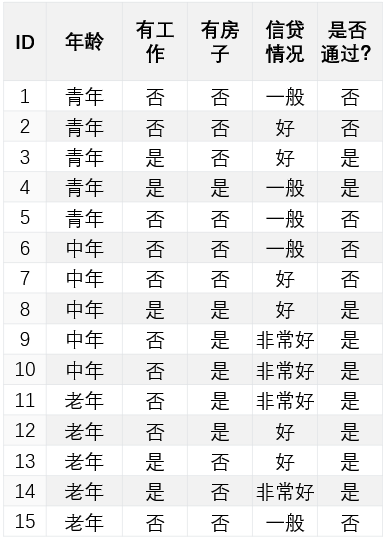
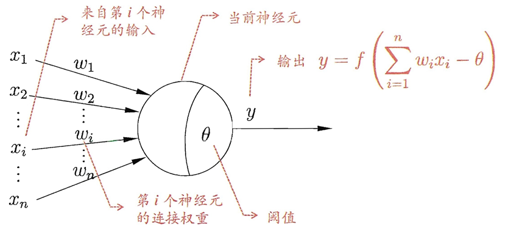
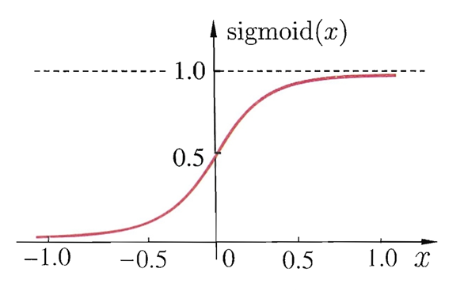
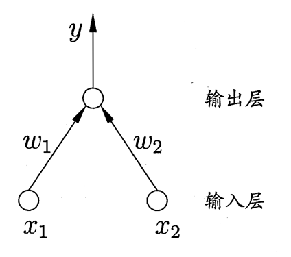
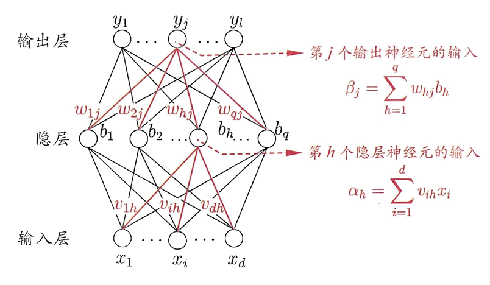
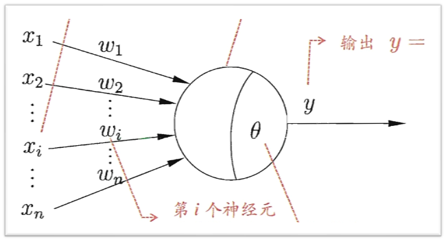
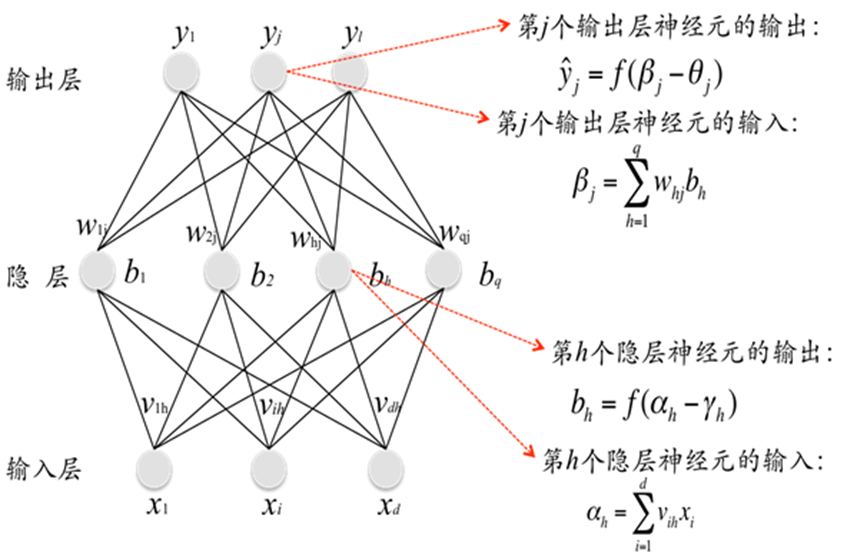

# 决策树和神经网络

[TOC]


## 决策树

### 1. 例子——网购电脑

我看到某台笔记本：

1. **先看价格：**价格还可以，7000 多，没超过 8000 ，在我的可接受范围内

2. **再看品牌：**牌子是 戴尔，名牌值得信赖。。

3. **接着看看配置：**i7，固态+机械，显存 8G，内存16G。这个配置一看就是游戏本，我喜欢。看看评价如何?

4. **看一下评论：**这么多差评，差评率也太高了……算了


### 2. 什么是决策树

- 一种机器学习的方法（属于监督学习）。

- 一种**树形结构**，其中每个内部节点表示一个属性上的判断，每个分支代表一个判断结果的输出，最后每个叶节点代表一种分类结果。

- 可以将决策树看成一个If-Else规则的集合。

- 决策树在概率论的角度解释就是每次选择一个特征，然后根据该特征的不同取值对特征空间进行划分，把特征空间划分为一个个子区域，对于落在这个子区域上的样本，我们可以用条件概率分布P(Y|X)来表示这些样本的概率分布，最终把条件概率最大的类别作为该子区域中的样本的类别。

### 3. 决策树的学习

- 决策树学习的目标就是根据给定的训练数据集构建一个决策树模型，使它能够对实例进行正确的分类。

- 本质上就是从训练数据集中归纳出一组分类规则，并要求这个规则具有很好的泛化能力。

- 从概率论角度，决策树学习是由训练数据集估计条件概率模型。

> - 下列为贷款申请人的4个特征（属性）对贷款申请是否通过的样本数据表
>
> - 希望通过所给的训练数据学习一个贷款申请的决策树，当新的客户提出贷款时，根据申请人的特征利用决策树来帮助决定是否通过该贷款。
>
> - | **ID** | **年龄** | **有工作** | **有房子** | **信贷情况** | **是否通过？** |
>   | ------ | -------- | ---------- | ---------- | ------------ | -------------- |
>   | 1      | 青年     | 否         | 否         | 一般         | 否             |
>   | 2      | 青年     | 否         | 否         | 好           | 否             |
>   | 3      | 青年     | 是         | 否         | 好           | 是             |
>   | 4      | 青年     | 是         | 是         | 一般         | 是             |
>   | 5      | 青年     | 否         | 否         | 一般         | 否             |
>   | 6      | 中年     | 否         | 否         | 一般         | 否             |
>   | 7      | 中年     | 否         | 否         | 好           | 否             |
>   | 8      | 中年     | 是         | 是         | 好           | 是             |
>   | 9      | 中年     | 否         | 是         | 非常好       | 是             |
>   | 10     | 中年     | 否         | 是         | 非常好       | 是             |
>   | 11     | 老年     | 否         | 是         | 非常好       | 是             |
>   | 12     | 老年     | 否         | 是         | 好           | 是             |
>   | 13     | 老年     | 是         | 否         | 好           | 是             |
>   | 14     | 老年     | 是         | 否         | 非常好       | 是             |
>   | 15     | 老年     | 否         | 否         | 一般         | 否             |

#### 3.1 决策树学习的算法

- 选择最优特征和决策树生成

  - 递归地选择最优特征，根据这个特征对数据集进行分割，使得对各个子数据及有一个最好的分类过程。
  
- 决策树的修建
  
  - 为避免可能发生的过拟合，对生成的树进行修建，去掉过于细分的叶节点，使树变得简单，从而使它具有更好的泛化能力。
  
- 决策树学习的生成算法

  - 主要有ID3、C4.5、CART等

  - 以ID3算法为例进行介绍

#### 3.2 决策树的学习——以ID3算法为例

##### 特征的选择

- 关键的问题——特征的选择

  - 决策树由许多属性和分支组成，那么如何决定哪个属性在前，哪个在后呢？比如根节点应该选哪一个属性？
  - 我们会希望决策树的分支结点所包含的样本尽可能属于同一类别，即结点的“纯度”越来越高。

##### 信息增益

- **信息熵**

  - 信息熵是度量样本集合纯度的一种指标，是一种对**信息不确定性**的度量。

  - 熵在化学中是表示分子的混乱程度，分子越混乱，它的熵就越大，而若分子越有序，熵值就越小。

  - 信息熵也是一样的，它能对信息的不确定性进行恒量，**如果某个信息让我们的判断更加有序、清晰，则它信息熵越小**，反之越大

  - 如果一个数据集D有N个类别，则该数据集的熵为：

    $$\operatorname{Ent}(D)=-\sum_{i=1}^{N} p_{i} \log _{2} p_{i}$$

    - $p_i$ 表示第i类样本的概率值，或者说第i类样本在数据集中的占比。

  - > 如上一个例子中，有两个类别{通过，不通过}，通过一共有9次，不通过一共有6天，则
    >
    > •P(通过) = 9 / 15
    >
    > •P(不通过) = 6 / 15
    >
    > •信息熵为：
    >
    > $-(9 / 15) \log _{2}(9 / 15)-(6 / 15) \log _{2}(6 / 15)=0.971$

- **条件熵**

  - 条件熵表示已知一个属性在取值的情况下结果分布的不确定性。

  - 定义为属性A给定条件下D的条件概率分布的熵对属性A的数学期望

    $\operatorname{Ent}(D \mid \mathrm{A})=\sum_{i=1}^{n} p_{i} \operatorname{Ent}\left(D_{i}\right)$

    - 其中，$𝐷_𝑖 $表示数据集D在属性A取值为$x_i$时的数据集； 
    - $p_i $表示在D中属性A取值为$x_i$ 的概率，即$p_{i}=\frac{\left|D_{i}\right|}{|D|}$ 。

  - 简而言之，就是计算数据集在某个属性加持的条件下的混乱程度（熵），从而分析某个属性对数据集混乱程度的影响。

  - 比如，计算有了年龄属性后样本的混乱程度（熵）是怎么样的，再跟没有这个属性加持的样本混乱程度去比较。

- 信息增益

  - 属性A对训练数据集D的信息增益𝑔(𝐷, 𝐴)，定义为集合D的熵𝐸𝑛𝑡(𝐷)  与属性A给定条件下D的条件熵𝐸𝑛𝑡(𝐷|𝐴)之差，即

    $𝑔(𝐷,𝐴)=𝐸𝑛𝑡(𝐷)−𝐸𝑛𝑡(𝐷|A)$

    - $\operatorname{Ent}(D \mid \mathrm{A}) &=\sum_{i=1}^{n} p_{i} \operatorname{Ent}\left(D_{i}\right) \\$
    - $\operatorname{Ent}(D) &=-\sum_{i=1}^{N} p_{i} \log _{2} p_{i}\\$

  - 给定训练数据集D和特征A：

    - 熵𝐸𝑛𝑡(𝐷)表示对数据集D进行分类的不确定性。
    - 条件熵𝐸𝑛𝑡(𝐷|A)表示特征A给定条件下对数据集D进行分类的不确定性。
    - 它们的差——信息增益𝑔(𝐷,𝐴)，就表示由于特征A而使得对数据集D的分类的不确定性减少的程度。

##### 根据信息增益进行特征选择



- 首先计算数据集的熵：

  $\operatorname{Ent}(D)=-\left(\frac{9}{15}\right) \log _{2}\left(\frac{9}{15}\right)-\frac{6}{15} \log _{2}\left(\frac{6}{15}\right)=0.971$

- 然后计算各特征对数据集的信息增益。
  分别以$𝐴_1$、$𝐴_2$、$𝐴_3$、$𝐴_4$表示年龄、有工作、有自己房子、信贷情况等4个特征，则

  - 对于年龄$A_1$：

    - 青年：通过记录2条，不通过记录3条

      $\operatorname{Ent}\left(D_{\text {青 }}\right)=-\sum_{i=1}^{N} p_{i} \log _{2} p_{i}=-\frac{2}{5} \log _{2}\left(\frac{2}{5}\right)-\frac{3}{5} \log _{2}\left(\frac{3}{5}\right)=0.971$

    - 中年：通过记录3条，不通过记录2条

      $\operatorname{Ent}\left(D_{\text {中 }}\right)=-\frac{3}{5} \log _{2}\left(\frac{3}{5}\right)-\frac{2}{5} \log _{2}\left(\frac{2}{5}\right)=0.971$

    - 老年：通过记录4条，不通过记录1条

      $\operatorname{Ent}\left(D_{\text {老 }}\right)=-\frac{4}{5} \log _{2}\left(\frac{4}{5}\right)-\frac{1}{5} \log _{2}\left(\frac{1}{5}\right)=0.721$

    - 所以年龄属性的条件熵：

      $\begin{aligned}
      \operatorname{Ent}\left(D \mid A_{1}\right) &=\sum_{i=1}^{n} p_{i} \operatorname{Ent}\left(D_{i}\right) \\
      &=\frac{5}{15} \times \operatorname{Ent}\left(D_{\text {青 }}\right)+\frac{5}{15} \times \operatorname{Ent}\left(D_{\text {中 }}\right)+\frac{5}{15} \times \operatorname{Ent}\left(D_{\text {老 }}\right) \\
      &=\frac{5}{15} \times 0.971+\frac{5}{15} \times 0.971+\frac{5}{15} \times 0.721=0.888
      \end{aligned}$

    - 则年龄属性对数据集的信息增益为：

      $\begin{aligned}
      g\left(D, A_{1}\right) &=\operatorname{Ent}(D)-\operatorname{Ent}\left(D \mid \mathrm{A}_{1}\right) \\
      &=0.971-0.888=0.083
      \end{aligned}$

  - 有工作对数据集的信息增益为：
    $𝑔(𝐷,𝐴_2 )=𝐸𝑛𝑡(𝐷)−𝐸𝑛𝑡(𝐷│A_2 )=0.324$

  - 有房子对数据集的信息增益为：
    $𝑔(𝐷,𝐴_3 )=𝐸𝑛𝑡(𝐷)−𝐸𝑛𝑡(𝐷│A_3 )=0.420$

  - 信贷情况对数据集的信息增益为：
    $𝑔(𝐷,𝐴_4 )=𝐸𝑛𝑡(𝐷)−𝐸𝑛𝑡(𝐷│A_4 )=0.363$

- **由于特征$𝑨_𝟑$（有房子）的信息增益值最大，所以选择特征$𝑨_𝟑$作为最优特征。**

##### ID3算法建立决策树

- 由于特征𝐴_3（有房子）的信息增益值最大，所以选择特征𝐴_3作为根节点的特征。
- 它将数据集D划分为D1（有房子）和D2（没房子）
- 由于D1中，只有同一类的样本点，所以它成为一个叶节点。
- 对D2则需从特征𝐴_1（年龄）、𝐴_2（有工作）、𝐴_4（信贷情况）中选新的特征。
  - 计算信息增益：
    $𝑔(𝐷_2,𝐴_1 )=𝐸𝑛𝑡(𝐷_2 )−𝐸𝑛𝑡(𝐷_2│A_1 )=0.918−0.667=0.251 $
    $𝑔(𝐷_2,𝐴_2 )=𝐸𝑛𝑡(𝐷_2 )−𝐸𝑛𝑡(𝐷_2│A_2 )=0.918 $
    $𝑔(𝐷_2,𝐴_4 )=𝐸𝑛𝑡(𝐷_2 )−𝐸𝑛𝑡(𝐷_2│A_4 )=0.474 $

- 根据结果，选择𝐴_2（有工作）作为选择的特征进行拆分，直接引出了两个叶节点。
  （容易过拟合）

##### ID3算法不足之处

- D3采用信息增益大的特征优先建立决策树的结点。很快就被人发现，在相同条件下，取值比较多的特征比取值少的特征信息增益大。 
- ID3算法只能处理离散属性，对于连续型的属性，在分类前需要对其进行离散化。

####  3.3 常用的特征选择准则

- 信息增益（ID3）
- 信息增益比（C4.5）
- 基尼指数（CART）

### 4. 常见的决策树算法

| **决策树算法** | **算法描述**                                                 |
| -------------- | ------------------------------------------------------------ |
| ID3算法        | 其核心是在决策树的各级节点上，使用信息增益作为属性的选择标准，来帮助确定每个节点所应采用的合适属性。 |
| C4.5算法       | C4.5决策树生成算法相对于ID3算法的重要改进是使用**信息增益率**来选择节点属性。C4.5算法既能够处理离散的描述属性，也可以处理连续的描述属性。 |
| C5.0算法       | C5.0是C4.5算法的修订版，适用于处理大数据集，采用Boosting方式提高模型准确率，根据能够带来的最大信息增益的字段拆分样本，占用的内存资源较少。  【商业的】 |
| CART算法       | CART决策树是一种十分有效的非参数分类和回归方法，通过**构建树、修剪树、评估树**来构建一个二叉树。当终结点是连续变量时，该树为回归树；当终结点是分类变量，该树为分类树。 |

### 5. 参考书目

- 李航《统计学习方法》
- 周志华《机器学习》


## 人工神经网络

### 1. 神经元

- 神经网络是由具有适应性的**简单单元**组成的广泛并行互联的网络，它的组织能够模拟生物神经系统对真实世界物体所作出的交互反应。

- 神经网络中最基本的成分是神经元模型，即上述定义中的“简单单元”。

- M-P神经元：

  

  - 接收来自n个其他神经元传递过来的输入信号
  - 这些输入信号通过带权重的连接进行传递
  - 神经元接收到的总输入值与神经元的阈值进行比较
  - 然后通过“激活函数”处理，产生神经元的输出

- 神经元的激活函数

  - 常用Sigmoid函数作为激活函数，它把可能在较大范围内变化的输入值挤压到（0，1）输出值范围内。

    $f(x)=\operatorname{sigmoid}(x)=\frac{1}{1+e^{-x}}$

    

### 2. 感知机

#### 2.1 感知机的介绍

- 感知机是由两层神经元组成。

- 输入层接受外界信号后传递给输出层，输出层为M-P神经元。

- 如图

  

  其输出$𝑦=𝑓(𝑤_1∗𝑥_1+𝑤_2∗𝑥_2−𝜃)$

- 由此可知，我们想要调整输出值，需要调整权重𝑤_𝑖和阈值𝜃。

#### 2.2 感知机的训练

- 输出$𝑦=𝑓(𝑤_1∗𝑥_1+𝑤_2∗𝑥_2−𝜃)$
- 我们想要调整输出值，需要调整权重$𝑤_𝑖$和阈值𝜃。
- 将权重项和偏置项初始化为某数，然后，利用下面的感知器规则迭代修改：
  $𝑤_𝑖←𝑤_𝑖+∆𝑤_𝑖$
  $𝜃←𝜃+ ∆𝜃$
  - 其中，
    $∆𝑤_𝑖=𝜂(𝑦−𝑦 ̂ ) 𝑥_𝑖$
    $∆𝜃 = 𝜂(𝑦−𝑦 ̂ )$
    $𝑦 ̂$为当前感知机的输出， 𝑦为样本的正确输出值，𝜂为学习速率，控制每一次调整的幅度。
  - 通常也会把𝜃当作一个输入值固定为-1的权重，相当于$𝑤_{𝑖+1}$ 。
-  若感知机对训练样例(x,y)预测正确，即𝑦 ̂ = 𝑦，那么感知机就不会发生变化，否则就根据错误的程度进行权重调整。
- 每次从训练数据中取出一个样本的输入向量，使用感知机计算其输出，再根据上面的规则来调整权重。
- 每处理一个样本就调整一次权重。经过多轮迭代后（即全部的训练数据被反复处理多轮），就可以训练出感知器的权重，使之实现目标函数。

#### 2.3 感知机的局限

- 感知机只有输出层神经元进行激活函数处理，即只拥有一层功能神经元，其学习能力非常有限。

- 为此，可以考虑使用多层功能神经元。

- 如图的两层感知机，输出层与输入层之间的一层神经元，被称为隐层，隐层和输出层神经元都是拥有激活函数的功能神经元。

  

### 3. BP神经网络

#### 3.1 基本介绍

- 简单感知机的学习规则对于多层网络的训练显然不足。

- 误差逆传播（error BackPropagation,简称BP）可更杰出地完成神经网络的训练。

- 

- 隐层和输出层的每一个神经元都是拥有激活函数的功能神经元

  

- 隐层和输出层的每一个神经元都是拥有激活函数的功能神经元

- 假设激活函数都为Sigmoid函数

- 输出层和隐层中的每一个神经元都拥有激活函数进行处理。

- 隐层和输出层的每一个神经元都将其上一层所有结点加权求和作为输入。

- 连接的每一根线，都拥有独立的权值。

- 隐层和输出层的每个神经元都设有一个独立的阈值。

- 隐层和输出层的每个神经元将输入值与阈值进行对比之后，通过激活函数计算输出结果。

- 

- 影响输出的几个关键值： 

  - 输出层阈值$𝛉_𝐣 $
  - 输出层输入的权重值$𝐰_{𝐡𝐣}$

  - 隐层阈值$ 𝛄_𝐡$
  - 隐层输入的权重值$𝐯_{𝐢𝐡}$

#### 3.2 网络中参数的修正

- 神经网络的输出为$\hat{y}_{1},\hat{y}_{2},…,\hat{y}_{j},…,\hat{y}_{h}$。

- 利用均方误差构建出误差项

  $E=\frac{1}{2} \sum_{j=1}^{l}\left(\hat{y}_{j}-y_{j}\right)^{2}$

- 网络的训练目标：找出合适的权值和阈值，使得误差$ E $最小

  - 输出层阈值$𝛉_𝐣$ 
  - 隐层到输出层的权重值$𝐰_{𝐡𝐣}$
  - 隐层阈值$ 𝛄_𝐡 $
  - 输入层到隐层的权重值$𝐯_{𝐢𝐡}$

- 总共有$𝑑×𝑞+𝑞×𝑙+𝑞+𝑙 $ 个参数需要确定。
  输入层到隐层权值 𝑑×𝑞 个
  隐层到输出层的权值 𝑞×𝑙 个
  隐层神经元的阈值q个
  输出层神经元的阈值l个

- BP是一个迭代学习算法，在迭代的每一轮也是采用类似感知机的参数修正规则进行参数的更新，对于任意参数v的更新估计式为
  $𝑣←𝑣+∆𝑣$

- 我们现在有

  - 激活函数$f(x)=\operatorname{sigmoid}(x)=\frac{1}{1+e^{-x}}$
  - 对其进行求导，有$f^{\prime}(x)=f(x)(1-f(x))$
  - 又有输出 
    $\hat{y}_{j}=f\left(\beta_{j}-\theta_{j}\right)$
  - 误差项  $E=\frac{1}{2} \sum_{j=1}^{l}\left(\hat{y}_{j}-y_{j}\right)^{2}$
  - 要使E最小，需要优化上述提到的相关参数。

- BP算法基于梯度下降策略，以目标的负梯度方向对参数进行调整。

- 基于梯度下降算法，对于给定的误差E，给定的学习速率η，有

  $\Delta w_{h j}=-\eta \frac{\partial E}{\partial w_{h j}}$

  - 注意到$𝑤_{ℎ𝑗} $先影响到$𝛽_𝑗$，再影响到$\hat{y}_{j}$，然后影响到$𝐸$，于是由链式法则我们有

     $\frac{\partial E}{\partial w_{h j}}=\frac{\partial E}{\partial \hat{y}_{j}} \cdot \frac{\partial \hat{y}_{j}}{\partial \beta_{j}} \cdot \frac{\partial \beta_{j}}{\partial w_{h j}}$

    - 其中, $\beta_{j}=\sum_{h=1}^{q} w_{h j} b_{h}$,于是有$\frac{\partial \beta_{j}}{\partial w_{h j}}=b_{h}$

    - 对于误差项 $E=\frac{1}{2} \sum_{j=1}^{l}\left(\hat{y}_{j}-y_{j}\right)^{2}$ ,有$\frac{\partial E}{\partial \hat{y}_{j}}=\hat{y}_{j}-y_{j}$

    - 因为$\hat{y}_{j}=f\left(\beta_{j}-\theta_{j}\right)$ 、$f^{\prime}(x)=f(x)(1-f(x))$

      所以：

      $\begin{array}{l}
      \frac{\partial \hat{y}_{j}}{\partial \beta_{j}}=f^{\prime}\left(\beta_{j}-\theta_{j}\right) \\
      =f\left(\beta_{j}-\theta_{j}\right)\left(1-f\left(\beta_{j}-\theta_{j}\right)\right) \\
      =\hat{y}_{j}\left(1-\hat{y}_{j}\right)
      \end{array}$ 

  - 所以得到$w_{h j}$的调整量：

    $\begin{array}{l}
    \Delta w_{h j}=-\eta \frac{\partial E}{\partial w_{h j}} \\
    =-\eta \frac{\partial E}{\partial \hat{y}_{j}} \cdot \frac{\partial \hat{y}_{j}}{\partial \beta_{j}} \cdot \frac{\partial \beta_{j}}{\partial w_{h j}} \\
    =\eta \hat{y}_{j}\left(1-\hat{y}_{j}\right)\left(y_{j}-\hat{y}_{j}\right) b_{h}
    \end{array}$

- 

- 我们设：

  $\begin{array}{l}
  g_{j}=-\frac{\partial E}{\partial \hat{y}_{j}} \cdot \frac{\partial \hat{y}_{j}}{\partial \beta_{j}} \\
  =-\left(\hat{y}_{j}-y_{j}\right) \hat{y}_{j}\left(1-\hat{y}_{j}\right) \\
  =\hat{y}_{j}\left(1-\hat{y}_{j}\right)\left(y_{j}-\hat{y}_{j}\right)
  \end{array}$

  可如上方法求得：

  - 输出层阈值 $\theta_{j}$ 的调整量:

    $\begin{array}{l}
    \Delta \theta_{j}=-\eta g_{j} \\
    =-\eta \hat{y}_{j}\left(1-\hat{y}_{j}\right)\left(y_{j}-\hat{y}_{j}\right)
    \end{array}$

  - 输入层到隐层的权重值$v_{i h}$ 的调整量:

    $\begin{array}{l}
    \Delta v_{i h}=\eta e_{h} x_{i} \\
    =-\eta \frac{\partial E}{\partial b_{h}} \cdot \frac{\partial b_{h}}{\partial \alpha_{h}} x_{i} \\
    =\eta b_{h}\left(1-b_{h}\right) \sum_{j=1}^{l} w_{h j} g_{j} x_{i}
    \end{array}$ 

  - 隐层阈值\gamma_{h}$ 的调整量:

    $\begin{array}{l}
    \Delta \gamma_{h}=-\eta e_{h} \\
    =\eta \frac{\partial E}{\partial b_{h}} \cdot \frac{\partial b_{h}}{\partial \alpha_{h}} \\
    =-\eta b_{h}\left(1-b_{h}\right) \sum_{j=1}^{l} w_{h j} g_{j}
    \end{array}$

- 所以阈值和权值的调整量各为：

  - $\Delta w_{h j}=\eta \hat{y}_{j}\left(1-\hat{y}_{j}\right)\left(y_{j}-\hat{y}_{j}\right) b_{h}$
  - $\Delta \theta_{j}=-\eta \hat{y}_{j}\left(1-\hat{y}_{j}\right)\left(y_{j}-\hat{y}_{j}\right)$
  - $\Delta v_{i h}=\eta b_{h}\left(1-b_{h}\right) \sum_{j=1}^{l} w_{h j} g_{j} x_{i}$
  - $\Delta \gamma_{h}=-\eta b_{h}\left(1-b_{h}\right) \sum_{j=1}^{l} w_{h j} g_{j}$

#### 3.3 BP网络训练过程

- 输入：训练集数据、学习速率*yita*

- 过程：
  - 在(0,1)范围内随机初始化网络中所有连接权和阈值
  - repeat
    - 根据网络输入和当前参数计算网络输出值$y$
    - 计算输出层神经元梯度项$g_j$
    - 计算隐层神经元梯度项$e_h$
    - 更新连接权值和阈值
  - until达到停止条件(误差足够小 或 训练达到最大迭代次数)
- 输出：连接权值和阈值

#### 3.4 神经网络实现过程

- 用bp神经网络实现$ y= x_1^2+x_2^2$

  - 训练集数据：BPdata_tr.txt （见附录）
  - 测试集数据：BPdata_te.txt （见附录）

- 网络结构：

  - 为2-4-1结构的神经网络，-1为阈值

  

  

  


- 单样本训练

  - **（单样本会导致过拟合）**

  ```python
  import  pandas as pd
  import numpy as np
  
  # 定义激活函数：sigmoid函数; 
  def sigmoid(x):
      return 1/(1 + np.exp(-x))
  #Exp 函数 返回 e(自然对数的底)的幂次方。
  
  
  # 导入训练数据集
  data_tr = pd.read_csv('BPdata_tr.txt')
  
  yita = 0.5 #设置的学习速率的常量
  
  net_in = np.array([0.0499853495508432, 0.334657078469172, -1])# 网络输入
  
  real = 0.114493895339242 # 真实输出值
  
  out_in = np.array([0.0, 0, 0, 0, -1]) # 输出层的输入
  
  w_mid = np.zeros([3, 4]) # 隐层神经元的权值&阈值,一列代表一个隐层神经元的各项权值&阈值
  
  w_out = np.zeros([5]) # 输出层神经元的权值&阈值
  
  delta_w_out = np.zeros([5]) # 输出层权值&阈值的修正量
  
  delta_w_mid = np.zeros([3, 4]) # 隐层权值&阈值的修正量
  
  for it in range(100):
      # 从输入层到隐层的传输过程
  
      for i in range(4):
          b_in = sum(net_in * w_mid[:, i]) # 隐层神经元bi的输入：各项加权求和
          out_in[i] = sigmoid(b_in) # 将加权求和结果放进隐层激活函数中，并将其输出传送至输出层的输入
      
      # 隐层到输出层
      res = sigmoid( sum(out_in * ｗ_out) )
      print(it, '次训练的模型输出：', res, ' real:', real)
      
      # 求修正量
      delta_w_out = yita * res * (1 - res) * (real - res) * out_in # 输出层权值的修正量
      delta_w_out[4] = -yita * res * (1 - res) * (real - res) # 输出层阈值的修正量
      # 权重&阈值调整更新
      w_out = w_out + delta_w_out
  
      for i in range(4):
          # 隐层神经元的权值修正量
          delta_w_mid[:, i] = yita * out_in[i] * ( 1 - out_in[i]) * (w_out[i] * res * (1-res) * (real - res) * net_in)
          # 中间层阈值的权重修正量
          delta_w_mid[2, i] = -yita*out_in[i]*(1-out_in[i])*w_out[i]*res*(1-res)*(real-res)
  
      # 隐层权重&阈值调整更新
      w_mid = w_mid + delta_w_mid
  ```

- 多样本训练

  ```python
  import  pandas as pd
  import numpy as np
  import matplotlib.pyplot as plt
  # 定义激活函数：sigmoid函数; 
  def sigmoid(x):
      return 1/(1 + np.exp(-x))
  #Exp 函数 返回 e(自然对数的底)的幂次方。
  
  
  # 导入训练数据集
  data_tr = pd.read_csv('BPdata_tr.txt')
  
  n = len(data_tr) # 获得样本数
  
  yita = 0.5 #设置的学习速率的常量
  
  
  out_in = np.array([0.0, 0, 0, 0, -1]) # 输出层的输入
  
  w_mid = np.zeros([3, 4]) # 隐层神经元的权值&阈值,一列代表一个隐层神经元的各项权值&阈值
  
  w_out = np.zeros([5]) # 输出层神经元的权值&阈值
  
  delta_w_out = np.zeros([5]) # 输出层权值&阈值的修正量
  
  delta_w_mid = np.zeros([3, 4]) # 隐层权值&阈值的修正量
  
  Err = [] # 记录每轮误差平均值
  
  for j in range(100): #训练100轮
      errors = [] # 记录每次误差
      for it in range(n):
  
          net_in = np.array([data_tr.iloc[it, 0], data_tr.iloc[it,1], -1])# 网络输入
          real = data_tr.iloc[it, 2] # 真实输出值
  
          # 从输入层到隐层的传输过程
  
          for i in range(4):
              b_in = sum(net_in * w_mid[:, i]) # 隐层神经元bi的输入：各项加权求和
              out_in[i] = sigmoid(b_in) # 将加权求和结果放进隐层激活函数中，并将其输出传送至输出层的输入
  
          # 隐层到输出层
          res = sigmoid( sum(out_in * ｗ_out) )
          
          errors.append(abs(real-res)) # 计算误差绝对值并记录
          
          
          
          # print(it, '个样本训练的模型输出：', res, ' real:', real )
  
          # 求修正量
          delta_w_out = yita * res * (1 - res) * (real - res) * out_in # 输出层权值的修正量
          delta_w_out[4] = -yita * res * (1 - res) * (real - res) # 输出层阈值的修正量
          # 权重&阈值调整更新
          w_out = w_out + delta_w_out
  
          for i in range(4):
              # 隐层神经元的权值修正量
              delta_w_mid[:, i] = yita * out_in[i] * ( 1 - out_in[i]) * (w_out[i] * res * (1-res) * (real - res) * net_in)
              # 中间层阈值的权重修正量
              delta_w_mid[2, i] = -yita*out_in[i]*(1-out_in[i])*w_out[i]*res*(1-res)*(real-res)
  
          # 隐层权重&阈值调整更新
          w_mid = w_mid + delta_w_mid
      Err.append(np.mean(errors))
  plt.plot(Err) # 画出一个训练过程中误差变化的图像
  plt.show()
  
  ```

  输出误差结果：

  

- 测试模型性能

  ```python
  # 将测试集放入测试好的模型中
  
  data_te = pd.read_csv('BPdata_te.txt')
  error_te = []
  for it in range(len(data_te)):
  
      net_in = np.array([data_te.iloc[it, 0], data_te.iloc[it,1], -1])# 网络输入
      real = data_te.iloc[it, 2] # 真实输出值
      
      for i in range(4):
          out_in[i] = sigmoid( sum(net_in * w_mid[:, i]) ) # 输入层到隐层
      res = sigmoid( sum(out_in * ｗ_out) ) # 隐层到输出
      error_te.append(abs(real - res))
      
  
  plt.plot(error_te)
  plt.show()
  print('误差的均值', np.mean(error_te))
  ```

  输出：

  

  ```
  误差的均值 0.041685360810866705
  ```

#### 3.5调用sklearn实现神经网络

- https://scikit-learn.org/stable/modules/generated/sklearn.neural_network.MLPRegressor.html#sklearn.neural_network.MLPRegressor

- ```python
  # 调用sklearn实现神经网络算法
  
  from sklearn.neural_network import MLPRegressor
  import numpy as np
  
  # 导入训练数据集
  data_tr = pd.read_csv('BPdata_tr.txt')
  # 导入测试集
  data_te = pd.read_csv('BPdata_te.txt')
  '''
  1. hidden_layer_sizes ：隐层数目
  2. activation{‘identity’, ‘logistic’, ‘tanh’, ‘relu’}, default=’relu’激活函数
  3. max_iter 最大的迭代数量
  4. learning_rate_init： double, default=0.001
  '''
  model = MLPRegressor(hidden_layer_sizes=(10,), random_state=10, max_iter=800, learning_rate_init=0.1)# 构建模型
  
  model.fit(data_tr.iloc[:, :2], data_tr.iloc[:, 2])# 模型训练
  
  pre = model.predict(data_te.iloc[:, :2]) # 模型预测
  
  err = np.abs(pre- data_te.iloc[:, 2])
  
  print('误差平均值：', np.mean(err))
  ```

  输出：

  ```text
  误差平均值： 0.03791643890848102
  ```


### 4. 参考

- https://www.zybuluo.com/hanbingtao/note/448086 《零基础入门深度学习》-神经网络和反向传播算法
- Mitchell，T.M.《机器学习》（曾华军译）
- 周志华《机器学习》


## 附录

### BPdata_tr.txt

```text
"x1","x2","y"
0.0657351901289076,0.0442229966167361,0.00627678865104747
0.0499853495508432,0.334657078469172,0.114493895339242
0.541524568665773,0.0276099216891453,0.294011166244332
0.0381816698005423,0.284810660174116,0.0825749520575737
0.262401180109009,0.19824571213685,0.108155741703247
0.620098191639408,0.105699139018543,0.395694075263726
0.30395305971615,0.271721982350573,0.166220298203335
0.682496639713645,0.697764949314296,0.952677587711999
0.187692089681514,0.545605613593943,0.332913806114237
0.642366454796865,0.384675557422452,0.560609946726567
0.352205451135524,0.622086534369737,0.511040336053727
0.0337685826001689,0.520758061576635,0.272329275867878
0.309909053845331,0.102772492193617,0.106605806806995
0.537161837355234,0.343793417653069,0.406736753532428
0.063537127757445,0.10979325750377,0.0160915259969551
0.106773312599398,0.234322455478832,0.066307553425078
0.0896694273455068,0.618726476840675,0.390863059344145
0.181814773054793,0.615110062691383,0.411417000925163
0.375373466755264,0.0285532348556444,0.141720526764586
0.306713165249676,0.316288537508808,0.194111404696935
0.527346073812805,0.413423218554817,0.449012639206005
0.695489962794818,0.306299274833873,0.577525534112094
0.475834773271345,0.513541955174878,0.490144071179028
0.454556309664622,0.336447791359387,0.319818554966529
0.397891596774571,0.227448232821189,0.210050421397299
0.641202886216342,0.252596626593731,0.474946197058701
0.292717661894858,0.54393759444356,0.381551736234239
0.559180970001034,0.0341637365054339,0.31385051810331
0.680078061646782,0.156101835821755,0.486873953080166
0.683654912700877,0.315467704739422,0.566903912393602
0.308578636101447,0.651849431241862,0.520128455668569
0.441347364406101,0.455211581639014,0.402005080126505
0.036513406666927,0.439012042805552,0.194064802594729
0.482114776480012,0.366870146873407,0.367028362367287
0.616190146794543,0.128213548497297,0.396129011024949
0.30798206271138,0.253136850288138,0.158931215925756
0.669900751137175,0.189497388759628,0.484676276720868
0.497858435334638,0.202612121775746,0.288914693524324
0.576033573388122,0.557900681439787,0.643067848021268
0.263352477410808,0.0611375130712986,0.0730923228629534
0.116350576095283,0.115624952851795,0.026906586279684
0.179567353054881,0.499725162936375,0.281969672754922
0.200330895511433,0.698877515131608,0.528562248852943
0.336332369036973,0.216619500447996,0.160043470436362
0.322369085485116,0.61833768133074,0.486263315429986
0.313675923505798,0.0253996769431978,0.099037728576034
0.0705203902209178,0.00386367298197001,0.00498805340582212
0.607059985911474,0.369747179700062,0.505234803390988
0.00976744801737368,0.111863555619493,0.0126088581166075
0.63144936284516,0.295311762834899,0.485937335106214
0.571923789777793,0.224520412529819,0.377506236956353
0.506963698845357,0.653223306685686,0.683712880344347
0.0804489680565894,0.60371423587203,0.370942915055919
0.55825253687799,0.567648772313259,0.633871023639462
0.260073871002533,0.63515868652612,0.471064975447827
0.250630971533246,0.24219774948433,0.121475633746973
0.618356904992834,0.395504459622316,0.538789039533457
0.3278474021703,0.545522011769935,0.405078184435332
0.524658124078996,0.292649203329347,0.360909703371393
0.178007731074467,0.200806778529659,0.0720101146257393
0.51799641456455,0.525755661050789,0.544739300628681
0.315195289230905,0.50286964669358,0.35222595191908
0.107106709247455,0.561347805615514,0.326583206035172
0.691276506194845,0.200665581668727,0.5181298836834
0.378340170183219,0.37489792550914,0.283689738925324
0.487231455906294,0.598022709786892,0.595025653045424
0.475459630554542,0.304764301842079,0.318943139964351
0.189344950742088,0.355256958538666,0.162059016961668
0.329406619304791,0.632532340846956,0.508605883059141
0.48508564310614,0.319667692552321,0.337495514809423
0.697941139596514,0.553622948378324,0.79362020331239
0.345484222751111,0.185459054261446,0.153754408977489
0.614416372729465,0.0602846409194171,0.381141717008816
0.684891034755856,0.604458518372849,0.834445829922446
0.443096540006809,0.298815364809707,0.285625166012364
0.446755700442009,0.599467224976979,0.55895160969903
0.30010321342852,0.495403981138952,0.335487043238447
0.507379716169089,0.15032552597113,0.280031940138322
0.361549556953833,0.487474926561117,0.368349886159279
0.0213075437350199,0.058366310945712,0.00386063767343133
0.540721872798167,0.451354272593744,0.496100823110985
0.388396926247515,0.32190991898533,0.254478168259659
0.330574519769289,0.180282732914202,0.141781376907709
0.496814531320706,0.627671783021651,0.640796545732991
0.241549744689837,0.457335754251108,0.267502271276155
0.0498919929610565,0.357063405984081,0.129983486854579
0.0669418174307793,0.187560018477961,0.039659967452389
0.585323537420481,0.366194943897426,0.476702380394465
0.384506524959579,0.463770028040744,0.362927906645404
0.351870187534951,0.380534908710979,0.268619445623554
0.410680314735509,0.633832011325285,0.570401339491913
0.356171172508039,0.493464546371251,0.370365162651136
0.0580229905201122,0.575249185715802,0.33427829309559
0.495210641133599,0.632844288647175,0.645725472765299
0.250344331003725,0.0490709589095786,0.0650802430740084
0.644535095593892,0.192545193387195,0.45249914094874
0.3861403263174,0.116557877417654,0.162690090396617
0.256415335275233,0.474374198541045,0.290779704405769
0.0930092559428886,0.140127900312655,0.028286550137083
0.699455557367764,0.389399443892762,0.640870003636642
0.527964383224025,0.435193461901508,0.468139739234945
0.0320753358770162,0.205768738524057,0.0433696009254051
0.374278927990235,0.258029353618622,0.206663863266364
0.387825868907385,0.43106890451163,0.336229305030625
0.246097123716027,0.135672713862732,0.07897087958818
0.41449544581119,0.286436687153764,0.25385245034584
0.638496213336475,0.255409501772374,0.47291142804063
0.681103517790325,0.258461881778203,0.530704546278685
0.671148418146186,0.653477532975376,0.87747308528371
0.159983951458707,0.534379397984594,0.311156205714719
0.426225253893062,0.440571049205027,0.375770816453824
0.0851047377334908,0.440045534260571,0.200882888607358
0.208341362094507,0.473555886768736,0.267661301052718
0.0802927086129785,0.577579348790459,0.34004482320562
0.120990646420978,0.0856730507919565,0.0219786081533673
0.0500732245855033,0.468762056482956,0.22224519341852
0.063739971537143,0.227057918487117,0.0556180823192579
0.0327781135216355,0.528138979058713,0.280005185927217
0.0447689411230385,0.0491521601798013,0.00442019293961893
0.587671942031011,0.273423045990057,0.420118473528981
0.476769590051845,0.447973776538856,0.427989746464689
0.47906737702433,0.354203939298168,0.354965982343312
0.525674476567656,0.376863695145585,0.418359900033463
0.392179071344435,0.314671281049959,0.252822439118206
0.0523353262804449,0.636681645503268,0.408102504097629
0.383429764374159,0.204392577265389,0.188794709849211
0.672527584293857,0.264940663520247,0.52248690682268
0.105137540958822,0.184974430222064,0.0452694423548452
0.0227684353012592,0.369527208036743,0.137068759125498
0.556967397173867,0.418008266668767,0.484943592518058
0.406831964943558,0.0589365181745961,0.168985760874381
0.490222142543644,0.215530327195302,0.286771070980994
0.416593543509953,0.128397739701904,0.190036160054737
0.444035265408456,0.277514042402618,0.274181360657
0.677091787732206,0.434491638839245,0.647236273235608
0.574288124032319,0.216273631807417,0.37658113321973
0.0308865441242233,0.481263739499263,0.232568765564752
0.0299205726245418,0.330990154412575,0.110449722984241
0.525573115143925,0.643344693258405,0.69011949370584
0.260254952684045,0.0931010307976976,0.0764004423321682
0.339221844519489,0.682296571834013,0.58060007173565
0.0963973676320165,0.500191215402447,0.259483704452159
0.451220112130977,0.630223401705734,0.600781125649039
0.334376789978705,0.682404683460481,0.577483989685263
0.406228928687051,0.614267316740006,0.542346278917196
0.645232615456916,0.270468721492216,0.489478457355007
0.607868687482551,0.411937583470717,0.539196913897453
0.0828278373228386,0.563316724053584,0.32418618223404
0.156732988823205,0.423784704622813,0.204158705657699
0.319512546760961,0.300151010346599,0.19217889654976
0.12887744512409,0.358535802247934,0.145157317355282
0.593222913239151,0.183527535339817,0.385595781019853
0.21054208856076,0.159760762867518,0.0698514724075382
0.553717851010151,0.222198738344014,0.355975737848971
0.402277892269194,0.11731827063486,0.1755910792333
0.657097656745464,0.504565844358876,0.686364021793965
0.154962385236286,0.317344644269906,0.124720964084912
0.0342591658933088,0.575146522885188,0.331967213234628
0.54043375630863,0.289863170054741,0.37608930231204
0.0215115784201771,0.415204285387881,0.172857346610588
0.29440099298954,0.0729087200714275,0.091987626135681
0.0799371272558346,0.237798921694048,0.0629382714727673
0.327002802304924,0.287193680577911,0.18941104287916
0.519658317998983,0.0954753258265555,0.279160305307219
0.581482735951431,0.423949148831889,0.517855053004845
0.630760710150935,0.433133476111107,0.585463681598202
0.333632129360922,0.308451900584623,0.206452972716169
0.3194901491981,0.128774106083438,0.118656725832213
0.140417368407361,0.0948922023177147,0.0287215674111547
0.669162281043827,0.51584926515352,0.713878622731205
0.695628360938281,0.686369487573393,0.955001890013441
0.137746979761869,0.0458387495717034,0.021075421395814
0.649782879743725,0.694353811279871,0.90434500604693
0.542601893981919,0.544702482363209,0.591117609645407
0.226210385281593,0.00784231242723763,0.051232640273453
0.666469697421417,0.0967540786135942,0.45354320930936
0.129342901241034,0.232703167293221,0.0708803501697446
0.409745687665418,0.385940873040818,0.316841886043915
0.465323181613348,0.202010487974621,0.257333900598514
0.599887076113373,0.208633577241562,0.403392473640463
0.545722138974816,0.0394612635718659,0.299369844289936
0.0565352946985513,0.468478082329966,0.222667953170215
0.52707273256965,0.468876611418091,0.497650942153349
0.264305907487869,0.459393427171744,0.280899933661587
0.051614424935542,0.137242159550078,0.0214994592193958
0.2563857028028,0.248195451218635,0.127334610607307
0.612706949934363,0.618987746699713,0.758555637062259
0.473558739433065,0.197899922216311,0.263422258906656
0.450094527192414,0.679239958222024,0.66395200425402
0.238562391512096,0.565128174377605,0.376281868119336
0.463092557177879,0.507551670237444,0.472063414474366
0.39729372409638,0.359283006354235,0.286926581861308
0.525523683521897,0.0539683326147497,0.279087722867639
0.28166321683675,0.119631028105505,0.0936457506044064
0.551838728669099,0.1519953323761,0.327628563523249
0.358884342154488,0.147647528047673,0.150597763582248
0.677879124553874,0.388777650264092,0.610668168850795
0.580879708169959,0.329256133316085,0.445830836689877
0.440766663779505,0.203757165232673,0.23579223428297
0.239460888202302,0.661103991954587,0.494400005156927
0.628636805154383,0.0940116811776534,0.404022428992559
0.0857742591761053,0.279027785430662,0.0852137285795494
0.308711012732238,0.195339098665863,0.133459852849756
0.241118279821239,0.425176692358218,0.238913244588628
0.548840925772674,0.458045960590243,0.511032463816045
0.673133385693654,0.536853635846637,0.741320381257156
0.420294495322742,0.125360456504859,0.192362706853705
0.662186217796989,0.136867120000534,0.457223195577522
0.377082903729752,0.630448153126054,0.539656390065313
0.476502930722199,0.528555463976227,0.506425921485969
0.287591356621124,0.547944979416206,0.382952488870605
0.516674109385349,0.263050203374587,0.336147544804555
0.0549548112554476,0.641281813406385,0.414262395485904
0.345999911869876,0.418010418186896,0.294448648726745
0.489489102340303,0.116049249796197,0.253067009688176
0.0656919017666951,0.354714364768006,0.130137706530495
0.384039726690389,0.592187929200009,0.498173055166623
0.301821247674525,0.671582554280758,0.542119192762074
0.538706550118513,0.208899460127577,0.333843731582184
0.0652973916381597,0.371563214855269,0.14232297198833
0.185945337614976,0.644152003456838,0.449507472138206
0.329247092572041,0.676276655727997,0.565753763049786
0.0527090706164017,0.163128833542578,0.0293892624582069
0.215464190137573,0.411565966857597,0.215811362307069
0.420412931172177,0.477236743457615,0.404501942002812
0.144942048517987,0.106338363676332,0.0323160450179504
0.306240792199969,0.507889739400707,0.351735410195783
0.203469425719231,0.45451854604762,0.247986915903757
0.135904305125587,0.266245172917843,0.0893564722537206
0.0099289720878005,0.0385568609228358,0.00158521601094322
0.344107819139026,0.471239409735426,0.34047677248041
0.441615481115878,0.0247464437037706,0.195636619637192
0.0437890348723158,0.122259981813841,0.0168649827281695
0.42384296185337,0.115729997004382,0.193036288519272
0.56762123464141,0.387145849666558,0.47207577492988
0.429073671088554,0.131130157620646,0.201299333459024
0.37552379546687,0.545208152360283,0.438270050361957
0.289566123322584,0.276973118050955,0.160562647898938
0.387392216012813,0.44067853204906,0.344270297636232
0.216243490343913,0.570879329834133,0.372664456347987
0.443188958149403,0.604700734885409,0.562079431396508
0.194940748205408,0.543509073834866,0.333404008651719
0.546264801849611,0.680812291777693,0.761910610375389
0.500412749568932,0.0732883028918877,0.255784095271912
0.683323762752116,0.55962573888246,0.780112332361449
0.511061726277694,0.681341513572261,0.725410346182876
0.667626734031364,0.636854485212825,0.851309091329079
0.553281184425577,0.42702251856681,0.488468300402511
0.229586116084829,0.351315347338095,0.176132257974203
0.271521994494833,0.125234612007625,0.0894079015391526
0.497435972909443,0.015442986600101,0.247681032979495
0.322829381120391,0.602760781673714,0.467539369238482
0.170402950583957,0.654607464140281,0.457548097675888
0.467593125975691,0.501484003011137,0.470129536735793
0.0915337884565815,0.0789545893436298,0.0146122616076354
0.146525994827971,0.396373238926753,0.178581611697612
0.295114021189511,0.487452305224724,0.324702035371541
0.23716956328135,0.429031735961325,0.240317632209055
0.344750794977881,0.598818904813379,0.477437191399776
0.65893012189772,0.29271462506149,0.519870757269032
0.262498852936551,0.0344200124498457,0.0700903850500525
0.435471488861367,0.0294729184824973,0.190504070535012
0.606811904348433,0.454970163409598,0.575218536851928
0.425258722389117,0.614455965650268,0.558401114691227
0.149586161435582,0.303357180790044,0.114401598829916
0.623834346467629,0.0204506421927363,0.389587520598789
0.622466098610312,0.29147680522874,0.472422771905495
0.0744155150372535,0.610763318068348,0.378569499576118
0.654832923715003,0.645907462970354,0.846002608701937
0.394347223034129,0.679739083698951,0.617554954222618
0.154668998415582,0.609834948345087,0.395821163293935
0.48732717523817,0.533648452744819,0.522268446842553
0.142142783431336,0.0809620018815622,0.0267594166302778
0.300299789756536,0.182618691283278,0.123529550133837
0.683793541463092,0.581770444009453,0.806030456869593
0.0712500060210004,0.122959877294488,0.0201956947822682
0.557165064173751,0.394734449195676,0.466248194117553
0.469548721658066,0.0486392932478338,0.222841782858373
0.385329960542731,0.601628611632623,0.51043616482686
0.0467602615244687,0.0527089897776023,0.00496475966121208
0.572803009999916,0.046289948397316,0.33024604758759
0.410338924336247,0.212705762987025,0.213621774433321
0.0880892830668017,0.27822435402777,0.0851685129653933
0.119595152791589,0.36795790984761,0.149696023990665
0.370171339414082,0.104413523245603,0.147929004360176
0.287106942338869,0.139316479233094,0.10183947772508
0.0897803409490734,0.269306439487264,0.080586467970239
0.591903193760663,0.59217758232262,0.701023679789536
0.426152760884725,0.305135959200561,0.27471412920692
0.146036913897842,0.423116235714406,0.200354129145934
0.396541286818683,0.0595416128868237,0.160790195816981
0.167456135945395,0.539400752168149,0.318994728905327
0.288223863835447,0.276261029276065,0.159393151980905
0.648815251211636,0.222541835159063,0.470486098600782
0.147974932845682,0.146084233443253,0.0432371840113868
0.504091636301018,0.00569464017171413,0.254140806715323
0.466982917394489,0.137954031233676,0.23710435987189
0.155188705353066,0.249823631672189,0.0864953812110422
0.614698315807618,0.336588474176824,0.491145820405405
0.20918926820159,0.682124353572726,0.509053783667726
0.0660283921286464,0.0913260705536231,0.0127001997298596
0.128419544990174,0.0703707036562264,0.0214436154685559
0.171820623381063,0.306798372766934,0.123647568151496
0.563824007404037,0.537097369553521,0.606371095706459
0.698624497349374,0.26834306542296,0.560084189057256
0.0995922731235623,0.040812103706412,0.0115842486748612
0.276255604438484,0.524587159673683,0.351508847078174
0.574008490890265,0.506833510077558,0.586365954551657
0.238106787297875,0.598462442867458,0.414852137680201
0.598595470935106,0.423655855888501,0.53780082205264
0.503399626840837,0.670361615740694,0.702795880161968
0.51112523493357,0.530339808366261,0.54250931812386
0.264633787050843,0.455151888052933,0.277194282447021
0.450037021469325,0.318962485832162,0.304270388061214
0.0500408167019486,0.0345835775369778,0.00370010717145418
0.216722673573531,0.11364304642193,0.0598834592409163
0.0837895294185728,0.414260474639013,0.178632426088327
0.569822182436474,0.433984749740921,0.513040082604356
0.529138549999334,0.586365460068919,0.623812057857232
0.526736370148137,0.495462230872363,0.522934025857854
0.608862274722196,0.13309884625487,0.388428572454265
0.409101818036288,0.43376645303797,0.355517633301737
0.345188740477897,0.49499674232211,0.364177041462218
0.435713101853617,0.531649843649939,0.472497463379904
0.548409225232899,0.427045190590434,0.483120273126969
0.366567450715229,0.35483970369678,0.26028291124348
0.200822466798127,0.154638100555167,0.0642426053141945
0.662985981628299,0.668246923922561,0.886104363167604
0.126524272165261,0.382696760189719,0.162465201706657
0.48728402084671,0.459350056829862,0.448448191682134
0.566401733271778,0.226248065126128,0.371999110426591
0.437960036005825,0.439132694061846,0.384646516132238
0.141503630322404,0.6666465601651,0.464440913574379
0.0879371494986117,0.618868286348879,0.39073089811034
0.122485985420644,0.317810373054817,0.116006249845708
0.0701854762155563,0.43357610325329,0.192914238383912
0.477655601059087,0.667043103813194,0.673101375567856
0.450391043256968,0.489861374464817,0.44281625803866
0.509127529733814,0.232935392390937,0.313469738561175
0.226773424912244,0.44295804570429,0.247638016500593
0.618347020167857,0.580140279582702,0.718915781344764
0.449402278964408,0.147691509244032,0.223775190241183
0.585257266229019,0.0703051622956991,0.347468883519289
0.643648755038157,0.419987307232805,0.590673058098832
0.0651756766019389,0.0893671120749786,0.0122343495411423
0.093318931129761,0.354397337324917,0.134305895610192
0.124258302431554,0.181991141312756,0.0485609012394908
0.519080716464668,0.162275967909954,0.295778279966586
0.533415795257315,0.257836577692069,0.351012111425952
0.679003985854797,0.147140420065261,0.482696716023683
0.440813931822777,0.530281009222381,0.475514871230962
0.398709197458811,0.0424078521551564,0.160767450062663
0.686864705896005,0.656002637022175,0.902122583985653
0.431094125076197,0.252348089497536,0.249521702948268
0.286622427497059,0.210106851975434,0.126297305191334
0.480597938597202,0.146732674865052,0.252504856456933
0.635631426121108,0.475907892454416,0.630515631973157
0.0430786688113585,0.438155987788923,0.193836441341846
0.123737609945238,0.0372953610261902,0.0167019400690336
0.431682052463293,0.0408856412628666,0.188021030080397
0.438471206952818,0.388048078631982,0.342838310656634
0.621978542208672,0.47865963280201,0.615972351042179
0.073307541385293,0.467318781744689,0.223760839395296
0.252956695156172,0.335393535578623,0.176475913332262
0.0380147704388946,0.137051040981896,0.0202281106057433
0.449835170572624,0.442897179466672,0.398509592263635
0.643536447617225,0.680110318935476,0.876689205334313
0.341036120452918,0.521727887913585,0.388505624480347
0.506248499406502,0.172025129571557,0.285880188355446
0.0812276860931888,0.605363454134203,0.373062848589347
0.164412791468203,0.345535678439774,0.146426471073201
0.56004587393254,0.522285944386385,0.586433988612441
0.668467913405038,0.0556000786134973,0.449940719993913
0.371255094674416,0.138471302739345,0.157004647004041
0.542916366201825,0.514922142075375,0.559902993089287
0.605513389245607,0.238634040602483,0.423592669889969
0.332752658636309,0.175749152549542,0.141612096451414
0.524292517569847,0.486426517087966,0.511493400506058
0.394542009173892,0.287751157651655,0.23846412573284
0.0611790819792077,0.543669558572583,0.299319468990326
0.139718139683828,0.0569628352997825,0.0227659231620997
0.185183241404593,0.430726463696919,0.219818119425965
0.0671310245525092,0.382012367341667,0.150440023259455
0.543090370250866,0.51222540193703,0.557322012648775
0.368924082140438,0.349020000034943,0.257919938807557
0.200909756240435,0.48146561125759,0.272173864976236
0.412522819056176,0.646605553105474,0.58827381754889
0.217406238638796,0.273996885260567,0.122339765731561
0.608161446987651,0.300085065932944,0.459911392398093
0.411627076752484,0.217038658587262,0.216542629637153
0.328877484053373,0.588490301556885,0.45448123454379
0.151259255013429,0.58252558466047,0.36221541901124
0.281224386510439,0.36700831130147,0.213782256132529
0.38898352093529,0.247569539700635,0.212598856546799
0.0271461555268615,0.00693841942120343,0.000785055423953089
0.318830707506277,0.397436944860965,0.259609145189371
0.547328964457847,0.160680883610621,0.325387341692389
0.265103347366676,0.609302990254946,0.441529918718635
0.477099401759915,0.420520130265504,0.404461019118185
0.518814662937075,0.233958305208944,0.323905143054752
0.00613604951649904,0.263434464414604,0.0694353681450782
0.689533341513015,0.236040691332892,0.531171437023014
0.561371922958642,0.171139236399904,0.344427074121826
0.243575469823554,0.53774286492262,0.348496398274953
0.519109968538396,0.193006716109812,0.306726751899428
0.368028948898427,0.0787945795338601,0.141653892991199
0.537356829666533,0.547805485059507,0.588843211850549
0.210858331574127,0.503932690923102,0.298409392975223
0.229340834380127,0.116732282564044,0.0662236441067849
0.106045679794624,0.489331976650283,0.250691469575577
0.635937585309148,0.202642764896154,0.445480702573588
0.444328271015547,0.368164242408238,0.332972521811698
0.476073319278657,0.0233308404451236,0.227190133444874
0.205436070566066,0.181259985989891,0.075059161610681
0.390821285103448,0.655665483814664,0.582638503555828
0.287282928242348,0.224227519868873,0.132809461526044
0.27890848480165,0.401187325525098,0.238741213056333
0.263100815145299,0.514970783074386,0.334416946350367
0.124339793645777,0.597243544855155,0.372160236155026
0.442038212134503,0.287455318286084,0.278028340998021
0.00510693460237235,0.476562623656355,0.227138015047261
0.13320296141319,0.562682904838584,0.334355080326831
0.316457743383944,0.106989276711829,0.111592208678978
0.103730431804433,0.266636555432342,0.0818550551751586
0.0884780008345842,0.580368318175897,0.344655741374004
0.403320566099137,0.467792694806121,0.381497484352501
0.304661423061043,0.398211249196902,0.251390781688537
0.580336898448877,0.0752128524007276,0.342447888867516
0.214585284958594,0.267316132993437,0.117504759479326
0.59775057004299,0.642475900426507,0.77008102661557
0.698471876140684,0.605361145501956,0.854325078242927
0.545158908492886,0.0960424072341993,0.306422379496494
0.433424798771739,0.291162188770249,0.272632476359805
0.0719973359489813,0.67790359116625,0.464736895299849
0.125158993666992,0.353675582772121,0.140751191544933
0.219162434991449,0.182586027844809,0.0813698304755265
0.691692037181929,0.440664608217776,0.672623171236613
0.0246184493182227,0.189037959044799,0.0363414180066571
0.533552847499959,0.256775819766335,0.350612462691988
0.0158032768173143,0.533258041762747,0.284613882662804
0.535165026271716,0.446162325888872,0.485462426386974
0.0356708351057023,0.273219751892611,0.0759214413013983
0.155341269518249,0.440374350151978,0.218060478287318
0.136450511054136,0.208503382280469,0.0620924023893302
0.557455281005241,0.662079829373397,0.749106090783738
0.607281335745938,0.314289139257744,0.467568283800744
0.406154659506865,0.671202739211731,0.615474724564468
0.48089706171304,0.611808309983462,0.605571392129055
0.646712666470557,0.364596019918099,0.551167530713577
0.505574974813499,0.582521541253664,0.594937401182213
0.199645650270395,0.274074148898944,0.114975024766569
0.0659537407569587,0.634794130595401,0.407313484158207
0.122345939208753,0.165908358967863,0.0424941124162813
0.132882755179889,0.451303184102289,0.221332390605063
0.0279736045282334,0.527303785993718,0.27883180527361
0.550836677802727,0.652488200203516,0.729161897017568
0.302453699475154,0.116134980646893,0.104965574056061
0.423999368632212,0.376991340587847,0.321897935478737
0.422126505430788,0.486071997880936,0.414456773711173
0.152372037759051,0.560099648032337,0.336928853616794
0.62189038391225,0.283432055171579,0.467081379501311
0.557179482816718,0.694029919872992,0.792126505750817
0.343183396174572,0.465999643458053,0.334930511112946
0.312821219931357,0.383546421607025,0.244964973166896
0.0538611881202087,0.567286198562942,0.324714658665715
0.388261476275511,0.496617569215596,0.397375984013246
0.424470992293209,0.419807799300179,0.356414211651641
0.291924260859378,0.169502329919487,0.113950813926429
0.505478699062951,0.656755825644359,0.686836929724177
0.131943749613129,0.41403737438377,0.188836100448578
0.31051424080506,0.594018362299539,0.449276908491769
0.46356534420047,0.0161861833184958,0.21515482087412
0.630400199745782,0.460746569256298,0.60969181292097
0.532673101173714,0.00914212518837303,0.283824211166981
0.548490073974244,0.00298793436959386,0.300850289000069
0.666991183138452,0.578414144180715,0.779440160572741
0.42051095799543,0.619088066020049,0.560099499282679
0.525210162298754,0.270056082773954,0.348776002425096
0.576563986577094,0.547380135091953,0.632051042910955
0.284006595751271,0.613852791674435,0.457474996276723
0.567351778387092,0.128043561941013,0.338283194193538
0.191477509727702,0.62835431266576,0.431492778977182
0.643278524908237,0.478232197160833,0.642513295009395
0.178279449022375,0.201750965276733,0.0724870139338152
0.614666091115214,0.10349629460834,0.388525886564513
0.111326822661795,0.241485554771498,0.0707089346072688
0.628004235192202,0.198718784376979,0.433878474683607
0.458291482692584,0.476167856017128,0.436766910212515
0.292478538118303,0.21282761101611,0.130839287270644
0.519398577068932,0.0401960372459143,0.271390603271507
0.220523414690979,0.00118420887738466,0.0486319787776347
0.655298278457485,0.433919474040158,0.617701943700631
0.291006962954998,0.597325866948813,0.441483243814443
0.295142987393774,0.0221680453745648,0.0876008052434502
0.191842804290354,0.0361725591588765,0.0381121155940896
0.343548181583174,0.50028394353576,0.368309377228797
0.259262138465419,0.558470520330593,0.379106178519986
0.297696550446562,0.123911091964692,0.103977194859665
0.507975600310601,0.304444810934365,0.350725853415777
0.396284222044051,0.607127854321152,0.525645416133664
```

###  BPdata_te.txt

```text
"x1","x2","y"
0.568928884039633,0.379569493792951,0.467753075712819
0.18660102779977,0.494717022636905,0.279564876062655
0.349270526971668,0.00457207087893039,0.122010804843189
0.67510288793128,0.678426259965636,0.916026099504115
0.543882097140886,0.577186718652956,0.628952243779735
0.00762512839864939,0.678681322187185,0.460666479668842
0.171075740619563,0.475367443519644,0.255241115386934
0.501409585680813,0.617229805304669,0.632384205169043
0.272046431154013,0.353274408332072,0.198812068286011
0.118480070540681,0.000160365598276258,0.01403755283245
0.349203569465317,0.358844743366353,0.250712682768982
0.136445473460481,0.606410271930508,0.386350785130688
0.325005866866559,0.277682251972146,0.182736246558006
0.558577250200324,0.170769114000723,0.341170634737947
0.42559386130888,0.316620756778866,0.281378838407024
0.332139352266677,0.294874303019606,0.197267403905426
0.667843906977214,0.592821948719211,0.797453346969832
0.0219233440468088,0.66003575513605,0.436127831072211
0.621118589490652,0.23573358473368,0.441358625182248
0.517393345548771,0.197241305210628,0.306600006499342
0.0431057661073282,0.0751987841678783,0.00751296421202684
0.192955326591618,0.284400917147286,0.118115639734296
0.34778616069816,0.663772564334795,0.561549230736756
0.123175931209698,0.392230288754217,0.169016909445593
0.572813578695059,0.21388171131257,0.373860782371434
0.411420076782815,0.538838832709007,0.459613767215183
0.31900493777357,0.516841890802607,0.368889690412333
0.479517814726569,0.435486136493273,0.419585509717982
0.521819847100414,0.341684485273436,0.389044240304472
0.124796956614591,0.488153729308397,0.253868343817959
0.62987365834415,0.214237334881909,0.442638461133146
0.220944363507442,0.103615782014094,0.059552642048101
0.191431070282124,0.695647582807578,0.520571414135386
0.664594315504655,0.555538743664511,0.750308899913444
0.165446671471,0.57243697126396,0.355056687170689
0.59240633379668,0.469304766785353,0.571192228449878
0.00332592481281608,0.696161285345443,0.484651596989679
0.319305562111549,0.344996700412594,0.220978765290949
0.53408592690248,0.418372655869462,0.460283456494549
0.265035777864978,0.37344420789741,0.209704539960618
0.126366169564426,0.642793412739411,0.429151780271564
0.627952588489279,0.653086283616722,0.820846147238687
0.0306934115942568,0.608578097331338,0.371309386066725
0.684116512676701,0.623563243937679,0.856846522107012
0.245080582005903,0.076845408254303,0.0659697084461227
0.216801643138751,0.0562321166042238,0.0501650034054535
0.611092281132005,0.521795757301152,0.6457045883966
0.151457248954102,0.014184843795374,0.0231405080542441
0.157917022006586,0.128041504137218,0.0413324126211498
0.545269509009086,0.491237161355093,0.538632786151219
0.264180030068383,0.606122888531536,0.437176044288744
0.4659087871667,0.579093985608779,0.552420842127406
0.0255047994898632,0.594377713417634,0.353935361004594
0.0782538737403229,0.507405254710466,0.263583761263159
0.294099635723978,0.195162214734592,0.124582885793088
0.607458967436105,0.543545174878091,0.664447754251793
0.50511095977854,0.160040486464277,0.28075003899612
0.667694450868294,0.107993458234705,0.457478466741803
0.462718040635809,0.0506656853016466,0.216674996796928
0.225268491194583,0.317884113197215,0.151796202548264
0.23236959266942,0.131389733450487,0.0712588896535422
0.485664407513104,0.311729689803906,0.333045316230294
0.122662571747787,0.0401978463400155,0.0166619733581566
0.152739661978558,0.233604425378144,0.0779004318975768
0.368096404802054,0.292928372626193,0.221301994717627
0.481520951446146,0.293569066561759,0.318045223523544
0.424783517210744,0.0355633538914844,0.181705788633942
0.362997162761167,0.164579285332002,0.158853281333049
0.684406768949702,0.478173235524446,0.697062268556088
0.117460281588137,0.359070628322661,0.142728633874795
0.23254476187285,0.452497697807848,0.258831232795904
0.210501649766229,0.251427115220577,0.107526538822445
0.266733311815187,0.431511073838919,0.257348466477515
0.101359866769053,0.0110218891873956,0.0103953046326994
0.153514058561996,0.556152452924289,0.332872117069879
0.525309743150137,0.337249215156771,0.389687359372321
0.630518985190429,0.236826487979852,0.453640976094439
0.0340943826828152,0.529093280108646,0.281102125986648
0.13763370309025,0.051490485528484,0.0215943063262942
0.418936369591393,0.643266552290879,0.58929953906261
0.209732412849553,0.0444274801528081,0.0459614859924235
0.301682394323871,0.654599591810256,0.519512892643137
0.51788957354147,0.171689618239179,0.297686935394081
0.592610872420482,0.669801985030062,0.799822345261177
0.140424303268082,0.31419539868366,0.11843773350231
0.601184418075718,0.138357717054896,0.380565562405682
0.122799943434075,0.189801369700581,0.0511043860476285
0.516051433701068,0.451178892003372,0.469871474814319
0.645022951881401,0.681110806320794,0.879966538940758
0.00593865062110126,0.451542321895249,0.203925736033752
0.197364047681913,0.124647660716437,0.0544896066394683
0.259636714332737,0.364891908178106,0.200557328083359
0.441266198828816,0.556593360123224,0.504512026762094
0.242199199367315,0.516016590385698,0.324933573727449
0.539235584810376,0.503276283782907,0.544062033744121
0.44361960159149,0.63510469191242,0.600156320605362
0.335067732562311,0.639613008359447,0.521375185867071
0.343439725087956,0.602386214118451,0.480819995728451
0.456778554571792,0.104036939446814,0.219470332686156
0.0574793253093958,0.180817906628363,0.0359989881954867
```


