# 特征工程

[TOC]


## 1. 特征工程概况

### 1.1 特征工程是什么

- 将数据转换为能更好地表示潜在问题的特征，从而提高机器学习的性能。
- 冗余属性的影响：
  - 模型过拟合
  - 时间成本高

- >  有这么一句话在业界广泛流传：数据和特征决定了机器学习的上限，而模型和算法只是逼近这个上限而已。那特征工程到底是什么呢？顾名思义，其本质是一项工程活动，目的是最大限度地从原始数据中提取特征以供算法和模型使用。通过总结和归纳，人们认为特征工程包括以下方面：
  >
  > - 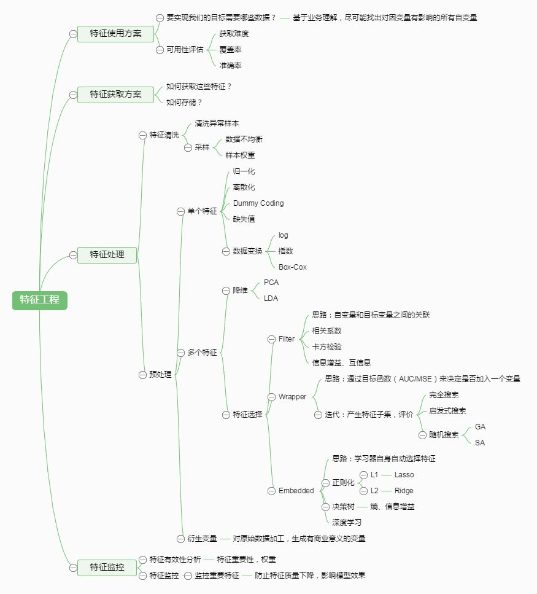
  > - 作者：城东
  >   链接：https://www.zhihu.com/question/29316149/answer/110159647

### 1.2 特征工程的效果评估

1. 在应用特征工程之前，得到机器学习模型的基准性能；

2. 在机器学习流水线中应用一种或多种特征工程；

3. 将应用特征工程后的模型性能与基准性能进行对比。

### 1.3 数据的四个等级

- 定量

  - 定量数据本质上是数值，应该是衡量某样东西的数量（准确率：0.98）。

- 定性

  - 定性数据本质上是类别，应该是描述某样东西的性质（性别：男、女）。

- 定量还是定性？

  - > 评分（1～5星），是定量还是定性？
    >
    > - 定量：有4.71星这样的平均分则是定量的。
    >
    > - 定性：讨厌、还行、喜欢、喜爱还是特别喜爱。

  - **定性和定量之间存在模糊界限**

- 数据的四个等级

  - 定类等级（nominal level）

  - 定序等级（ordinal level）

  - 定距等级（interval level）

  - 定比等级（ratio level）

  - | 等级 | 属性         | 样例         | 描述性统计量 |
    | ---- | ------------ | ------------ | ------------ |
    | 定类 | 离散、无序   | 性别         | 频次         |
    | 定序 | 离散、有序   | 考试成绩等级 | 分位数       |
    | 定距 | 连续、有间距 | 摄氏度       | 频次、均值   |
    | 定比 | 连续、有比值 | 增长率       | 全部         |

#### 1.3.1 定类等级（nominal level）

- 定类等级是数据的第一个等级，只按名称分类。
- 血型（A、B、O和AB型）、性别（男、女）动物物种和人名。
- 可以执行的数学操作：统计众数（频次）、不能执行任何定量数学操作。

#### 1.3.2 定序等级（ordinal level）

- **类别数据**，定序等级的数据可以自然排序。
- 李克特量（比如1～10的评分）；考试的成绩（F、D、C、B、A）。
- 可以执行的数学操作： 计数、比较和排序、计算中位数和百分位数

#### 1.3.3 定距等级（interval level）

- **定量数据**，值之间的差异有意义，无绝对零点。
- 例：温度：32℃， 4℃，可以计算出32 - 4 = 28℃的温差。
- 可以做加减运算，不能做乘除运算。

#### 1.3.4 定比等级（ratio level）

- 定量数据，最高级别的控制和数学运算，有了一个绝对零点的概念，可以做乘除运算。
- 如模型准确率、国民生产总值。

## 2. 数据预处理

### 2.1 探索性数据分析

- 空准确率

  - 空准确率是指当模型总是预测频率较高的类别时达到的正确率。
- 不同类别样本的各项特征对比
- 缺失值探索

  - 进行探索性数据分析（EDA，exploratory data analysis）来识别缺失的值。
  - 其他非合理取值


### 2.2 缺失值处理

- 删除缺失值

  

- 对缺失值进行填充

  - 0填充
  - 均值填充等等

### 2.3 标准化和归一化

- 标准化

  - 标准化的作用：提升模型性能；加速学习效率

  - 常用标准化方法：

    - Z分数标准化/特征标准化/方差缩放； 

      - 通过缩放特征、统一化均值和方差（标准差的平方）
      - Z分数标准化的输出会被重新缩放，使均值为0、标准差为1。
      - z=(x-μ)/σ

    - min-max标准化/min-max缩放 ；

      - min-max标准化和Z分数标准化类似，因为它也用一个公式替换列中的每个值。
      - m=(x-x_min)/(x_max-x_min)

    - 行归一化

      - 这个标准化方法是关于行的。行归一化不是计算每列的统计值（均值、最小值、最大值等），而是会保证每行有单位范数（unit norm），意味着每行的向量长度相同。

      - $𝑥=(𝑥_1,𝑥_2, ……𝑥_𝑛)$

      - 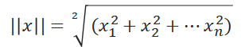

      - 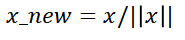

- 机器学习流水线

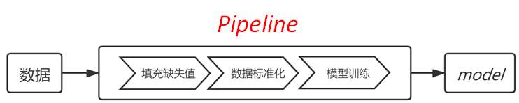

> 受尺度影响的算法：
>
> - KNN：因为依赖欧几里得距离；
> - 均值聚类：和KNN的原因一样；
> - 逻辑回归、支持向量机、神经网络：如果使用梯度下降来学习权重；
> - 主成分分析：特征向量将偏向较大的列。

## 3. 特征构建

### 3.1 填充分类特征

- Imputer：只能处理整数型的分类数据

- 自定义转换器，来填充每列缺失值

  - 利用scikit-learn的TransformerMixin基类创建自定义分类填充器。

    ```python
    from sklearn.base import TransformerMixin
    class CustomCategoryImputer(TransformerMixin):   # 自定义分类填充器
        def __init__(self, cols=None):
            self.cols = cols
    
        def transform(self, df):
            X = df.copy()
            for col in self.cols:
                X[col].fillna(X[col].value_counts().index[0], inplace=True)
            return X
    
        def fit(self, *_):
            return self
    ```

### 3.2 编码分类变量

- 任何机器学习算法，需要的输入特征都必须是数值。

  - 定类等级的编码

  - 定序等级的编码

#### 3.2.1 定类等级的编码

- 主要方法是将分类数据转换为虚拟变量（dummy variable），有两种选择：

  1. 用Pandas自动找到分类变量并进行编码；

  2. 创建自定义虚拟变量编码器，在流水线中工作。

  - 虚拟变量的取值是1或0，代表某个类别的有无，是定性数据的代理。

- pd.get_dummies：可以找到所有的分类变量，并将其转换为虚拟变量：

- 自定义虚拟变量编码器

  ```python
  class CustomDummifier(TransformerMixin):   # 自定义虚拟变量编码器
      def __init__(self, cols=None):
          self.cols = cols
  
      def transform(self, X):
          return pd.get_dummies(X, columns=self.cols)
  
      def fit(self, *_):
          return self
      
      
  cd = CustomDummifier(cols=['boolean', 'city'])
  cd.fit_transform(X)
  ```

#### 3.2.2 定序等级的编码

- 标签编码器：顺序数据的每个标签都会有一个相关数值。

- dislike、somewhat like和like 用0、1、2来表示。

- `X['ordinal_column'].map(lambda x: ordering.index(x))`

- ```
  ordering = ['dislike', 'somewhat like', 'like']               # 0是dislike，1是somewhat like，2是like
  print(X['ordinal_column'].map(lambda x: ordering.index(x)))   # 将ordering映射到顺序列
  ```

- 将自定义标签编码器放进流水线中：

  ```python
  class CustomEncoder(TransformerMixin):  # 还是将自定义标签编码器放进流水线中：
      def __init__(self, col, ordering=None):
          self.ordering = ordering
          self.col = col
  
      def transform(self, df):
          X = df.copy()
          X[self.col] = X[self.col].map(lambda x: self.ordering.index(x))
          return X
  
      def fit(self, *_):
          return self
      
      
   ce = CustomEncoder(col='ordinal_column', ordering=['dislike', 'somewhat like', 'like'])
  ce.fit_transform(X)
  ```


### 3.3 连续特征分箱

- 有时需要将数值数据转换为分类变量，如年龄段可能比具体年龄更有用。

- `pd.cut(X['quantitative_column'], bins=3)`

  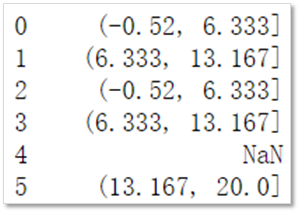

- 自定义CustomCutter类

  ```python
  class CustomCutter(TransformerMixin):
      def __init__(self, col, bins, labels=False):
          self.labels = labels
          self.bins = bins
          self.col = col
  
      def transform(self, df):
          X = df.copy()
          X[self.col] = pd.cut(X[self.col], bins=self.bins, labels=self.labels)
          return X
  
      def fit(self, *_):
          return self
  
  # 注意，labels的默认值是False。我们可以初始化CustomCutter，输入需要转换的列和分箱数：
  
  cc = CustomCutter(col='quantitative_column', bins=3)
  cc.fit_transform(X)
  ```

- 创建流水线

  - 先是imputer 填充缺失值

  - 然后是虚拟变量（编码定类变量）

  - 接着编码顺序列（编码定序变量）

  - 最后分箱定量列

  - 拟合流水线

  ```
  pipe = Pipeline([("imputer", imputer), ('dummify', cd), ('encode', ce), ('cut', cc)])
  pipe.fit(X)
  pipe.transform(X)
  ```


### 3.4 扩展数值特征

- 例子：胸部加速度计识别动作数据集

  - 15名参与者的7种动作：序号；轴加速度；轴加速度；轴加速度；标签。

  - 数据集按参与者划分，标签是数字，每个数字代表一种动作（activity）。

  - 根据智能手机等设备上加速度计的x、y、z读数识别用户的当前动作。

  - > activity列的数字有如下意义。
    >
    > 1：在电脑前工作
    >
    > 2：站立、走路和上下楼梯
    >
    > 3：站立
    >
    > 4：走路
    >
    > 5：上下楼梯
    >
    > 6：与人边走边聊
    >
    > 7：站立着讲话

- poly = PolynomialFeatures(degree=2, include_bias=False, interaction_only=False)

- 根据原有列的乘积创建新列，用于捕获特征交互，[a, b] —>[1, a, b, a^2, ab, b^2]

## 4. 特征选择

- 选择特征是为了提高预测能力，降低时间成本

- 特征选择的方法：

  - 基于统计的特征选择

  - 基于模型的特征选择

### 4.1 基于统计的特征选择

#### 4.1.1 皮尔逊相关系数（Pearson correlations）

- 取值范围[-1, 1],和响应变量相关系数越大，则特征越有用（看绝对值）。

- 相关系数绝对值小，则说明作用低，且容易在训练时产生过拟合。

- 发现并删除冗余变量是降低过拟合的一个关键方法

- ```python
  corr = data.corr() # 计算相关系数
  # 通过设置相应的相关系数阈值，可以实现特征筛选的目的
  index = corr['default payment next month'].abs() > 0.1
  high_corr_features = corr['default payment next month'].index[index]   # 找出相关系数大的属性
  X_subset = X.loc[:, high_corr_features.tolist()]
  X_subset.drop('default payment next month', axis=1, inplace=True)
  
  ```

- 比较特征选择前后的模型性能

#### 4.1.2 假设检验

- 假设：“某个特征与响应变量没有关系”（零假设）。

- 假设为真还是假？

- P检验：p值介于0、1之间，p值越小则拒绝假设的概率就越大。

- ```python
  from sklearn.feature_selection import SelectKBest, chi2, f_classif
  
  select_model = SelectKBest(score_func=f_classif, k=7)# 选择最优的k个特征，假设检验的方法为F分布
  select_model.fit_transform(X, y)# 执行假设检验，计算出p值，选择出最小的k个特征
  select_model.get_support() # 查看选择出的最优特征
  
  res = pd.DataFrame({'features': X.columns, 'pvalue': select_model.pvalues_}) # 构建出一个数据框，显示出每个特征计算出的p值
  
  res.sort_values('pvalue', ascending=False) # 按升序对p值进行排序
  ```

- 比较特征选择前后的模型性能

- 可通过网络搜索优化去找更好的参数

### 4.2 基于模型的特征选择

#### 4.2.1 基于树的特征选择

- 生成树时会选择优化节点的纯净度指标（基尼系数/信息增益/信息增益率）

- ```python
  dct = DecisionTreeClassifier().fit(iris.data, iris.target)
  dct.feature_importances_    # array([0., 0.01333333, 0.06405596, 0.92261071])
  {'importance': dct.feature_importances_, 'features': X.columns}
  
  ```

- 


#### 4.2.2 基于线性模型的特征选择

```
from sklearn.feature_selection import SelectFromModel
from sklearn.linear_model import LinearRegression

model = SelectFromModel(LinearRegression(), threshold=0.01)
model.fit_transform(X, y)
index = model.get_support()
X.columns[index]   # 所选出来的属性

```

```
from sklearn.feature_selection import SelectFromModel
from sklearn.pipeline import Pipeline
from sklearn.svm import LinearSVC
clf = Pipeline([
  ('feature_selection', SelectFromModel(LinearSVC(penalty="l2"))),
  ('classification', RandomForestClassifier())
])
clf.score(X, y)    #  0.82433，历史最高值

```

### 4.3 小结

- 

> 前人经验，可以在判断特征选择方法的优劣时参考
>
> 1.如果特征是分类的，那么从SelectKBest开始，用卡方或基于树的选择器。
>
> 2.如果特征基本是定量的，用线性模型和基于相关性的选择器一般效果更好。
>
> 3.如果是二元分类问题，考虑使用SelectFromModel和SVC。
>
> 4.在手动选择前，探索性数据分析会很有益处。
>
> 5.不能低估领域知识的重要性。

- 特征选择的局限性
  - 单变量特征选择方法在大量特征上表现不佳。
  - 如果从很多特征（超过100种）中选择，那么会很麻烦。

## 5. 降维与特征转换

- 维度缩减：特征转换、特征选择与特征构建

  - 特征选择仅限于从原始列中选择特征；

  - 特征转换算法则将原始列组合起来，从而创建可以更好的特征。

    

  - 特征选择的降维原理是隔离信号列和忽略噪声列。

  - 特征转换是使用原始数据集建新的列，生成一个全新的数据集。

### 5.1 主成分分析

- 主成分分析（PCA，principal components analysis）

- 将高维数据投影至低维空间，低维空间中的新特征叫**主成分**/超级列。

- 只需要几个主成分就可以准确解释整个数据集。

- 转换示意：

  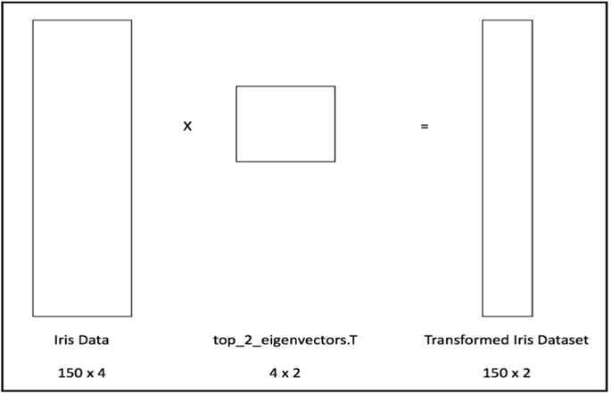

- 工作流程：

  1. 创建数据集的协方差矩阵；
  2. 计算协方差矩阵的特征值；
  3. 保留前n个特征值&特征向量（按特征值降序排列）；
  4. 用保留的特征向量转换新的数据点。

  ```python
  # 创建数据集的协方差矩阵
  X, y = load_iris(return_X_y=True)
  plt.scatter(X[:, 0], X[:, 1], c=y)
  
  # 计算协方差矩阵的特征值和特征向量
  eig_val_cov, eig_vec_cov = np.linalg.eig(cov_mat)   # 计算特征值和特征向量
  top_2_vec = eig_vec_cov[:, :2]    # 保留前两个特征向量
  
  # 保留前两个特征值
  X_new = np.dot(X, top_2_vec)      # 数据转换
  
  # 用保留的特征向量转换新的数据点
  cov_mat = np.cov(X.T)      # 协方差矩阵
  eig_val_cov, eig_vec_cov = np.linalg.eig(cov_mat)   # 计算特征值和特征向量
  top_2_vec = eig_vec_cov[:, :2]    # 保留前两个特征向量
  X_new = np.dot(X, top_2_vec)      # 数据转换
  
  ```

  - 前后对比：

    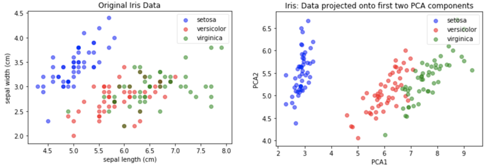

#### 深入解释主成分

- 很多机器学习模型会假设输入的特征是互相独立的，所以消除相关特征好处很大。
- PCA中所有主成分都互相垂直，意思是彼此线性无关。
- 原始特征间的相关性：`np.corrcoef(iris_X.T) `
- 主成分/超级列间的相关性：`np.corrcoef(pca_iris.T)`
- 中心化和缩放对PCA的影响
  - 数据中心化（ iris_X-mean_vector ）不影响特征向量。
  - 因为原始矩阵和中心化后矩阵的协方差矩阵相同
- 注意
  - 在特征工程或机器学习中，特征缩放一般来说都是好的。
  - 在实践和生产环境下建议进行缩放，但需进行性能对比。
- 每个主成分/超级列都是特征向量的线性组合。
- 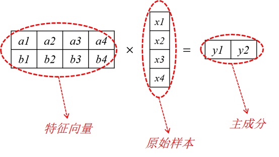
- 深入解释主成分：线性变换
  - 原始坐标系的特征向量不是垂直的，指向数据自然遵循的方向。
  - 新坐标系中的特征向量相互垂直，也就是新的x轴和y轴。
  - PCA是一种特征转换工具，以原始特征的线性组合构建出全新的超级特征。
  - 主成分会产生新的特征，最大化数据的方差，并按方差大小来排序。

### 5.2 线性判别分析（LDA）

- 线性判别分析（LDA，linear discriminant analysis）

- 线性判别分析是特征变换算法，也是有监督分类器。

- LDA的目标是提取一个新的坐标系，将原始数据集投影到一个低维空间中。

- 在低维空间中获得最佳的类别可分性。

- 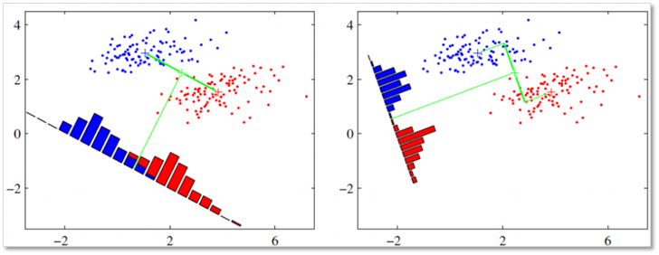

- LDA的工作流程

  1. 计算每个类别的均值向量；
  2. 计算类内和类间的散布矩阵；
  3. 计算散布矩阵的特征值和特征向量；
  4. 降序排列特征值，保留前个特征向量；
  5. 使用前几个特征向量将数据投影到新空间。

  ```python
  from sklearn.datasets import load_iris
  import numpy as np
  
  iris = load_iris()
  iris_X, iris_y = iris.data, iris.target    # 创建X和y变量，存储特征和响应列
  label_dict = {i: k for i, k in enumerate(iris.target_names)}
  
  mean_vectors = []     # 存储每个类别的均值向量
  for cl in [0, 1, 2]:
      class_mean_vector = np.mean(iris_X[iris_y == cl], axis=0)  # 计算每类样本均值
      mean_vectors.append(class_mean_vector)         # 存储均值向量
      print(label_dict[cl], class_mean_vector)
  
  # 计算类内散布矩阵
  S_W = np.zeros((4, 4))   # 初始类内散步矩阵
  for cl, mv in zip([0, 1, 2], mean_vectors):  # 从0开始，计算每个类别的散布矩阵
      class_sc_mat = np.zeros((4, 4))          # 每个类别的散步矩阵
      for row in iris_X[iris_y == cl]:         # 访问该类的每个样本
          row, mv = row.reshape(4, 1), mv.reshape(4, 1)  # 列向量
          class_sc_mat += (row-mv).dot((row-mv).T)       # 4 x 4的矩阵
      S_W += class_sc_mat   # 散布矩阵的和
  
  # 类计算间散布矩阵
  overall_mean = np.mean(iris_X, axis=0).reshape(4, 1)   # 数据集的均值
  S_B = np.zeros((4, 4))                                 # 初始化类间散布矩阵
  for i, mean_vec in enumerate(mean_vectors):
      n = iris_X[iris_y == i, :].shape[0]                # 每种花的数量
      mean_vec = mean_vec.reshape(4, 1)                  # 每种花的列向量
      S_B += n * (mean_vec - overall_mean).dot((mean_vec - overall_mean).T)
  
  # 计算矩阵的特征值和特征向量
  eig_vals, eig_vecs = np.linalg.eig(np.dot(np.linalg.inv(S_W), S_B))
  eig_vecs = eig_vecs.real
  eig_vals = eig_vals.real
  
  for i in range(len(eig_vals)):
      eigvec_sc = eig_vecs[:,i]
      print('Eigenvector {}: {}'.format(i+1, eigvec_sc))
      print('Eigenvalue {:}: {}'.format(i+1, eig_vals[i]))
  ```

- sk-learn 实现LDA

  ```python
  from sklearn.discriminant_analysis import LinearDiscriminantAnalysis
  X, y = load_iris(return_X_y=True)
  
  lda = LinearDiscriminantAnalysis(n_components=2)  # 实例化LDA模块
  X_new_lda = lda.fit_transform(iris_X, iris_y)    # 拟合并转换鸢尾花数据
  pld.scatter([;, 0],X[:, 1], c =y)# 绘制原始数据分布图
  plt.grid()# 显示出网格
  
  # 新画一张处理后的数据图
  plt.figure()
  plt.scatter(X_new_lda[;, 0], X_new_lda[;, 1], c=y)
  plt.grid()
  ```

  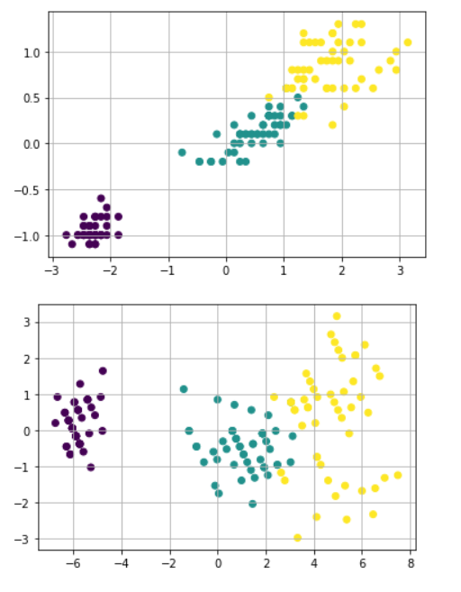

  ```python
  lda.scallings_ # # 特征向量
  
  lda.explained_variance_ratio_   # 类似解释方差
  ```

- 解读LDA
  - 注意判别式并不与数据的方差一致，而是基本与之垂直：符合类别的分离情况。
  - 判别式与左右两侧鸢尾花之间的间隔几乎平行，LDA在试图捕捉两个类别的分离情况。

### 5.3 应用特征转换

- 任务：构建iris分类模型

- 不同条件下模型性能比较

  - 基线模型
  - 单判别式模型
  - 单主成分模型
  - 综合优化模型

- ```python
  from sklearn.neighbors import KNeighborsClassifier
  from sklearn.datasets import load_iris
  from sklearn.model_selection import cross_val_score
  from sklearn.pipeline import Pipeline
  
  X, y = load_iris(return_X_y=True) # 导入数据
  
  # 模型性能基线
  knn = KNeighborsClassifier()
  cross_val_score(knn, X, y, cv=5).mean()  #不用特征转换，用KNN进行交叉检验
  ```

  输出：0.9733333333333334

- ```python
  # 单判别式模型
  from sklearn.discriminant_analysis import LinearDiscriminantAnalysis
  
  lda_pipeline = Pipeline([('lda', LinearDiscriminantAnalysis(n_components=1)), ('knn', KNeighborsClassifier())])
  cross_val_score(lda_pipeline, X, y,cv=5).mean()
  ```

  输出：0.96666666666666666

- ```python
  # 两个判别式LDA
  from sklearn.discriminant_analysis import LinearDiscriminantAnalysis
  
  lda_pipeline = Pipeline([('lda', LinearDiscriminantAnalysis(n_components=1)), ('knn', KNeighborsClassifier())])
  cross_val_score(lda_pipeline, X, y,cv=5).mean()
  ```

  输出：0.97333333……

- ```python
  # 单主成分模型
  from sklearn.decomposition import PCA
  pca_pipeline = Pipeline([('pca', PCA(n_components=1)), ('knn', KNeighborsClassifier())])
  cross_val_score(pca_pipeline, X, y).mean()
  ```

  输出：0.9272875816993463

- 综合调优

  - 进一步联合使用LDA和PCA，并使用GridSearch找到下列参数的最佳组合：
    - 缩放数据：用或不用均值/标准差
    - PCA主成分
    - LDA判别式
    - KNN邻居

  ```python
  from sklearn.preprocessing import StandardScaler
  from sklearn.model_selection import GridSearchCV
  
  pipeline = Pipeline([
      ('scale', StandardScaler()),
      ('pca', PCA()),
      ('lda', LinearDiscriminantAnalysis()),
      ('clf', KNeighborsClassifier())
  ])
  
  pipeline_params = {
      'scale__with_std': [True, False],
      'scale__with_mean': [True, False],
      'pca__n_components': [1, 2, 3, 4],
      'lda__n_components': [1, 2],
      'knn__n_neighbors': range(1, 9)
  }
  
  grid = GridSearchCV(pipeline, pipeline_params)
  grid.fit(X, y)
  
  grid.best_estimator_, #  最优模型
  grid.best_score_ # 最优的参数
  ```

### 5.4 小结

1. PCA和LDA都是特征转换工具，用于找出最优的新特征。
2. LDA属于有监督学习，PCA属于无监督学习。
3. LDA特别为类别分离进行了优化，而PCA是无监督的，尝试用更少的特征表达方差。
4. 一般来说，这两个算法在流水线中会一同使用。
5. PCA和LDA都是很强大的工具，但也有局限性，这两个工具都是线性转换。

## 6. 特征学习

- PCA和LDA存在缺陷：只能线性变换。

- 特征学习：

  - 从输入的数据中学习新特征，不需要假设。
  - 利用深度神经网络实现高级别的特征工程。

  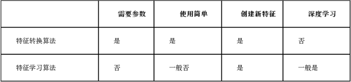

### 6.1 受限玻尔兹曼机（RBM）

- 一种简单的深度学习架构，根据数据的概率模型学习一定数量的新特征。

- RBM是一个浅层（两层）的神经网络，属于深度信念网络（DBN，deep belief network）的一种。

- 网络向前传输

  - 层间连接，层内不连接；节点独立地创造权重和偏差；最终获取独立特征。

  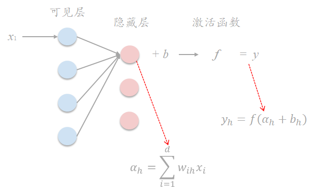

- 数据重建

  - 输出变输入；从后往前传；权值与前向传输一致

    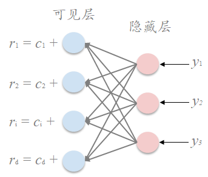

  - 学习过程：调整权值、阈值，使得重建输出与原始输入尽可能相等

    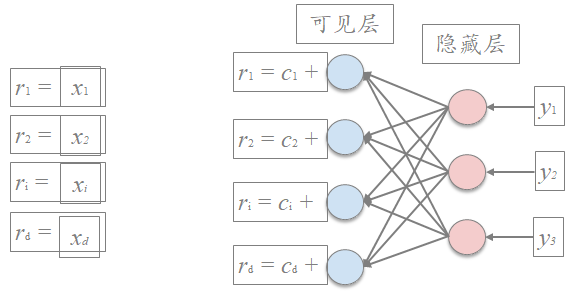

  - > - RBM通过将激活信息进行反向传导获取原始输入的近似值，在训练开始时，权重是随机初始化的（标准做法），近似值有可能相差很大。通过反向传播调整权重，最小化原始输入和近似值的距离。我们重复这个过程，**直到近似值尽可能接近原始的输入**
    > - 这个过程的最终结果是一个网络，网络**输出结果就是新的特征**。

  - 训练完成后，网络前向输出值即为样本特征。

    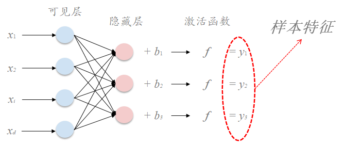

### 6.2 MNIST手写数字识别

- 加入特征转换

  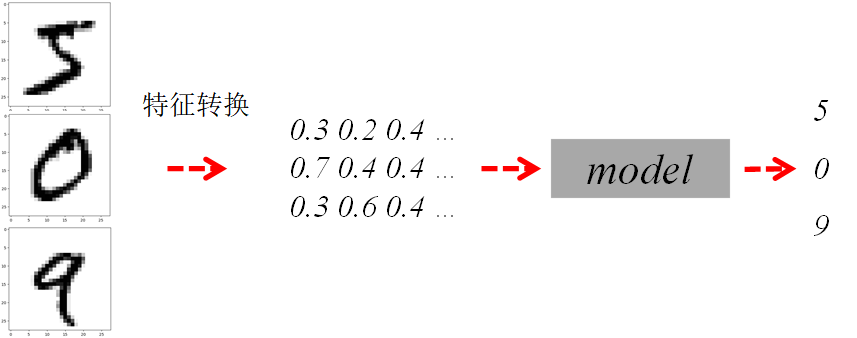

- Scikit-learn实现

  - 伯努利受限玻尔兹曼机：BernoulliRBM
  - 该模型假定输入是二进制的值，或者是0~1的数。

- 修改一下原始数据集，只考虑硬编码的黑白像素强度：

  1.将像素的值缩放到0～1；

  2.如果超过0.5，将值变成真，否则为假。

```python
import numpy as np
import matplotlib.pyplot as plt
# 读取数据
images = np.genfromtxt('data/mnist_train.csv', delimiter=',')
images.shape # (6000, 785)

# MNIST数据集包括6000个0～9的手写数字图像，每张图像包括784个像素值及一个标签。
images_X, images_y = images[:, 1:], images[:, 0]

# 查看前5张照片
for i in range(5):
    plt.figure()
    plt.imshow(images_X[i].reshape(28, 28), cmap=plt.cm.gray_r)# cmap参数调整成灰度
    
# 归一化操作，形成二分像素（黑或白）
images_X = (images_X/255 >= 0.5).astype(float)
# 查看二分像素的图片
for i in range(5):
    plt.figure()
    plt.imshow(images_X[i].reshape(28, 28), cmap=plt.cm.gray_r)
    
```

- PCA特征转化

  ```python
  # PCA特征探索
  # 利用PCA进行特征探索
  from sklearn.decomposition import PCA
  pca = PCA(n_components=784)
  pca.fit(images_X)
  
  # 绘制前一百个特征向量的图
  plt.figure(figsize=(10, 10))
  for i, comp in enumerate(pca.components_):
      plt.subplot(10, 10, i + 1)
      plt.imshow(comp.reshape((28, 28)), cmap=plt.cm.gray_r)
      plt.xticks(())
      plt.yticks(())
  plt.suptitle('100 components extracted by PCA')
  plt.show()# 可以看出100个特征向量逐渐慢慢模糊（随着信息量的减少),可以推测主要是前面几个的信息量比较有作用。PCA的主成分会很快变得扭曲。
  
  full_pca = PCA(n_components=784)
  full_pca.fit(images_X)
  plt.plot(np.cumsum(full_pca.explained_variance_ratio_))
  plt.grid()
  ```

  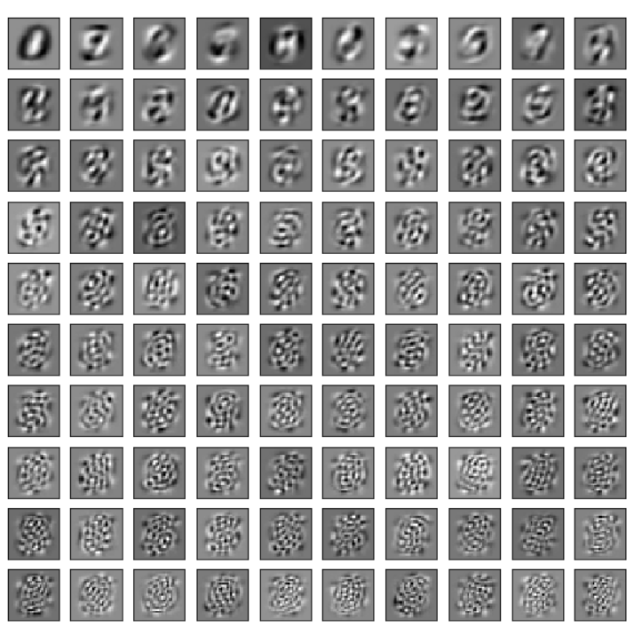

  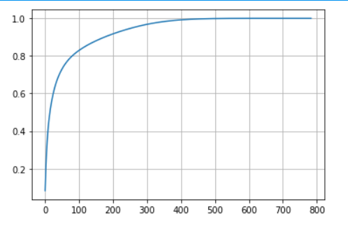

  - 可以看到前400个特征已经基本覆盖所有。

- 从MNIST中提取RBM特征

  ```python
  from sklearn.neural_network import BernoulliRBM
  
  rbm = BernoulliRBM(n_components=100, random_state=10) 
  rbm.fit(images_X)
  rbm.components_.shape #(100, 784)
  
  # 绘制RBM组件（权值向量的表示）
  plt.figure(figsize=(10, 10))
  for i, comp in enumerate(rbm.components_):
      plt.subplot(10, 10, i + 1)
      plt.imshow(comp.reshape((28, 28)), cmap=plt.cm.gray_r)
      plt.xticks(())
      plt.yticks(())
  plt.suptitle('100 components extracted by RBM')
  plt.show()# 画的是权值特征，不是新特征
  # RBM特征好像在提取不同的形状和笔划。
  images_X_New = rbm.transform(images_X) # 新特征
  
  
  ```

  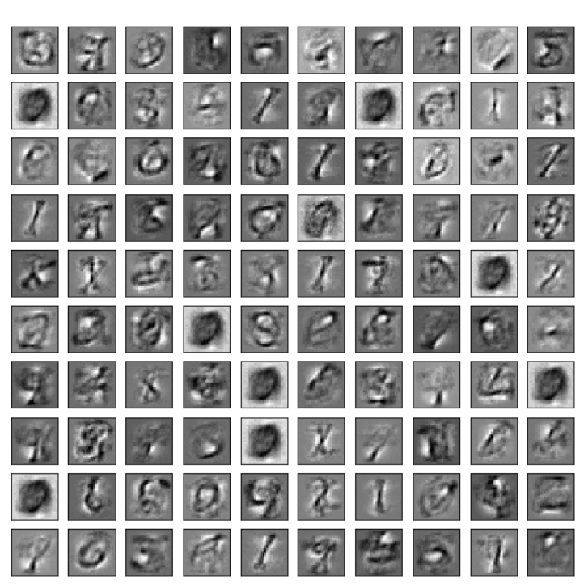

- 构建模型

  - 以原始像素值作为输入应用线性模型
  - 加入PCA特征转换
  - 加入RBM特征转换

  > - 在原始像素上运行逻辑回归，获取一个基线模型。
  >
  > - 再看PCA和RBM能否让同一个线性分类器表现得更好。

- 构建基线模型

  ```python
  from sklearn.linear_model import LogisticRegression
  from sklearn.model_selection import GridSearchCV
  
  lr = LogisticRegression()  # 创建逻辑回归
  params = {'C': [0.1, 1, 100]}  
  # 参数设置
  
  grid = GridSearchCV(lr, params)              
  # 实例化网格搜索类
  
  grid.fit(images_X, images_y)                
  # 拟合数据
  
  print(grid.best_params_, grid.best_score_)   # 最佳参数：{'C': 0.1} 0.8908333333333334
  ```

- 加入PCA进行模型优化

  ```python
  from sklearn.pipeline import Pipeline
  
  pca_parms = {'pca__n_components': [50, 100, 200, 300], 'clf__C': [0.1, 1, 10]}
  
  pca_pipeline = Pipeline(steps=[('pca', PCA(n_components=100)), ('clf', LogisticRegression())])
  
  grid = GridSearchCV(pca_pipeline, pca_parms)
  grid.fit(images_X, images_y)
  
  grid.best_score_, grid.best_estimator_
  # 0.886666 有所下降
  ```

- 加入RBM进行模型优化

  ```python
  from sklearn.neural_network import BernoulliRBM
  
  bm_params = {'rbm__n_components': [50, 100, 200], 'clf__C': [0.1, 1, 10]}
  
  rbm_pipeline = Pipeline([('rbm', BernoulliRBM()), ('clf', LogisticRegression())])
  
  grid = GridSearchCV(rbm_pipeline, rbm_params)
  grid.fit(images_X, images_y)                              
  grid.best_score_, grid.best_estimator_
  #0.9206, BernoulliRBM(batch_size=10, learning_rate=0.1,n_components=200, n_iter=10, random_state=None,verbose=0))
  ```

### 6.3 多层受限玻尔兹曼机

……


