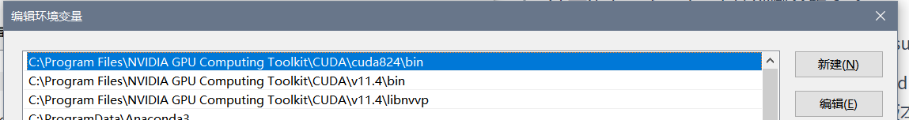

1. 下载安装 CUDA https://developer.nvidia.cn/cuda-downloads 

   - 注意先看一下cudnn支持到哪个版本了
   - 选自定义安装，在CUDA下拉里取消勾选Visual Studio…
   - 在Driver components下拉里，检查Display driver 的版本是否比当前本机安装的显卡驱动高，如果本机显卡驱动版本更高，则取消勾选。
   - 检验安装：cmd命令行，输入`nvcc -V` 查看CUDA的版本信息。

2. 下载cudnn包https://developer.nvidia.com/rdp/cudnn-download

   - NVIDA账号`1462468257@qq.com`密码`8510514gH`
   - 解压，并将cuda文件夹重命名为`cuda824`, 并将文件夹复制到`C:\Program Files\NVIDIA GPU Computing Toolkit\CUDA`之中。

3. 环境变量配置

   - 编辑系统变量path，新建变量`C:\Program Files\NVIDIA GPU Computing Toolkit\CUDA\cuda824\bin`,并上移置顶。

   - 此时系统变量path中包含以下三个值：

     - `C:\Program Files\NVIDIA GPU Computing Toolkit\CUDA\cuda824\bin`
  - `C:\Program Files\NVIDIA GPU Computing Toolkit\CUDA\v11.4\bin`
     - `C:\Program Files\NVIDIA GPU Computing Toolkit\CUDA\v11.4\libnvvp`

4. 安装TensorFlow gpu版本：

   `pip install -U tensorflow-gpu`

5. 可通过如下检验TensorFlow上GPU是否可行：

   - `tf.config.list_physical_devices('GPU')`

     打印出`[PhysicalDevice(name='/physical_device:GPU:0', device_type='GPU')]`即可

   - 判断tf运行在cpu还是gpu上：

     `sess = tf.compat.v1.Session(config=tf.compat.v1.ConfigProto(log_device_placement=True))`

     打印出gpu信息如下即可：

     ```text
     Device mapping:
     /job:localhost/replica:0/task:0/device:GPU:0 -> device: 0, name: NVIDIA GeForce GTX 1050, pci bus id: 0000:01:00.0, compute capability: 6.1
     
     ```

     

